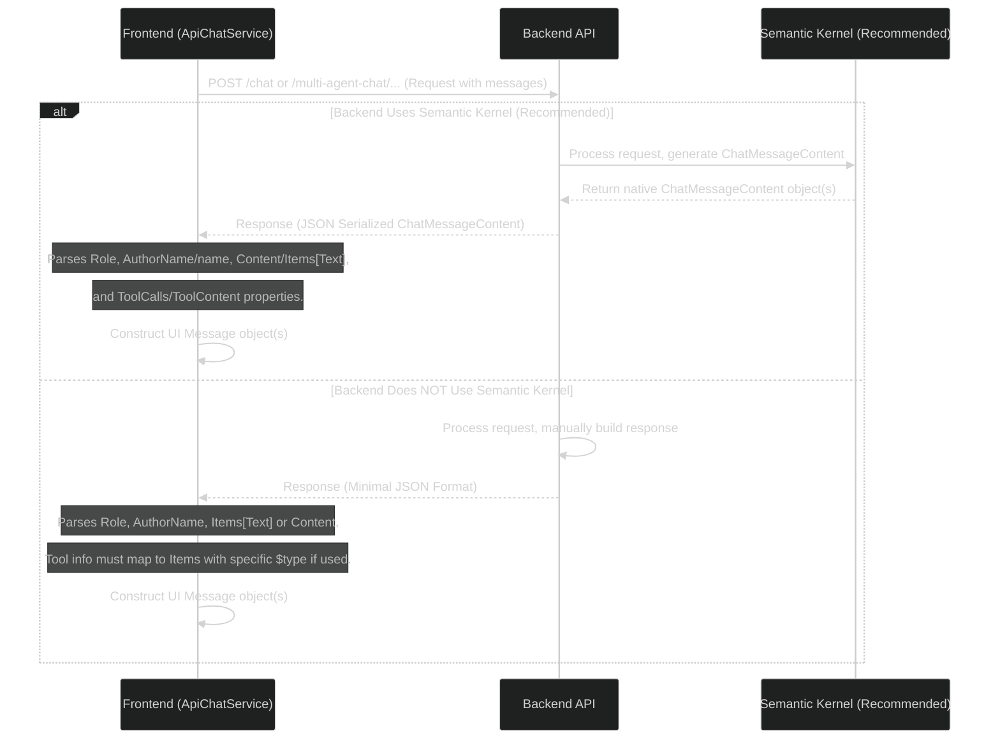

# API Communication Flow (Response Formats)

This diagram illustrates how the frontend (`ApiChatService`) interacts with the backend API and handles the two primary response approaches: native Semantic Kernel objects or a minimal fallback format.



## Key Points
- **Semantic Kernel Priority:** Returning native `ChatMessageContent` objects (serialized) is the recommended approach for backend simplicity and richer data.
- **Frontend Parsing:** `ApiChatService` is designed to parse the necessary fields (Role, AuthorName/name, Content/Items[Text], tool calls/content) from the native `ChatMessageContent` structure.
- **Minimal Format:** If not using SK, the backend must adhere to the defined minimal format (see `docs/api/response-formats.md`). `AuthorName` is required for multi-agent, and tool information needs careful mapping within the `Items` array.
- **UI Message Construction:** The frontend service always constructs the internal `Message` object (with `id`, `timestamp`, etc.) used by the UI, regardless of the API format received.

## Example API Response Structure

The frontend expects an array of objects, where each object represents a message. Key fields used by the frontend:

*   `content`: (String) The main text content of the message.
*   `authorRole`: (String, e.g., "ASSISTANT") The role of the message author.
*   `authorName`: (String, Optional) The name of the specific agent in multi-agent mode. *Note: The exact location of this field in the response needs confirmation, it might be at the root level or within `metadata`.*
*   `metadata`: (Object, Optional) Contains additional information, potentially including usage stats or agent identifiers.

```json
[
    {
        "innerContent": null,
        "metadata": { // Example nested metadata
            "metadata": { /* ... */ },
            "id": "chatcmpl-...",
            "usage": { /* ... */ },
            "createdAt": "..."
            // Potential location for authorName if not at root
        },
        "authorRole": "ASSISTANT", // Used for role
        "content": "Hello! How can I assist you today?", // Primary content field
        "items": null,
        "encoding": "UTF-8",
        "contentType": "TEXT",
        "toolCall": null
        // Potential location for authorName if not in metadata
    }
]
``` 