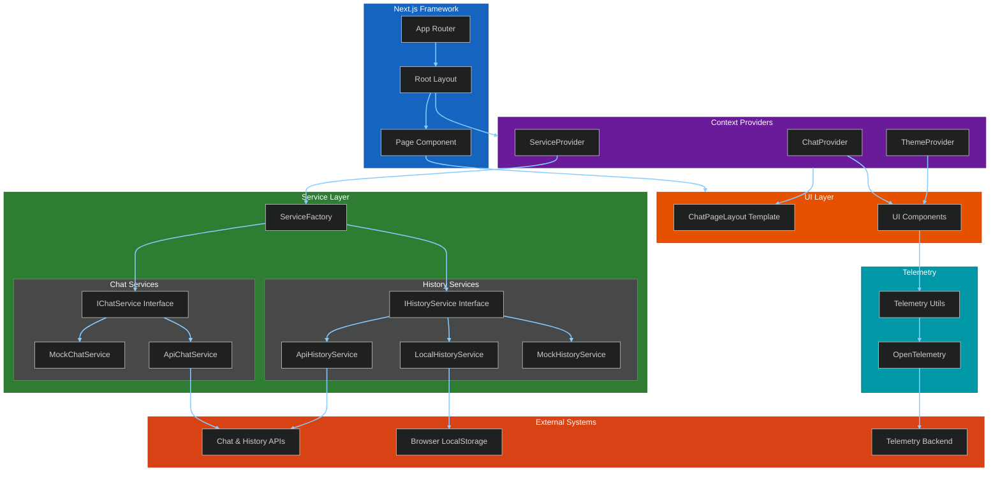

# Application Architecture

This diagram provides a high-level overview of the application's structure, including the Next.js framework, context providers, UI layer, service layer, telemetry, and external systems.

