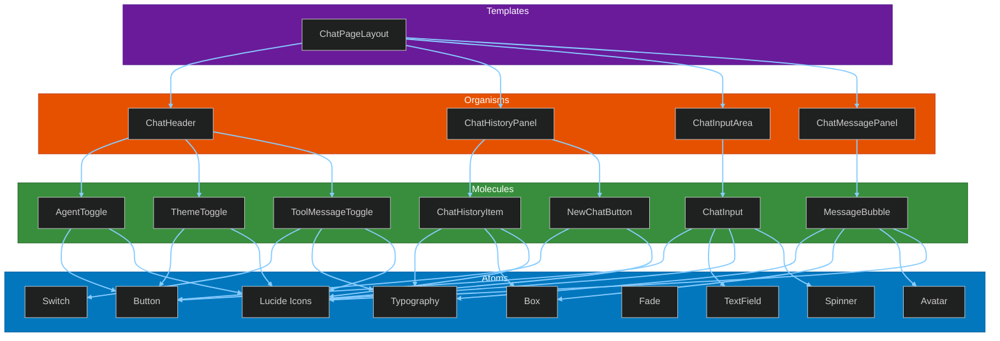

# Component Architecture (Atomic Design)

This diagram illustrates the atomic design structure used for UI components.

```mermaid
%%{init: {'theme':'dark'}}%%
flowchart TD
    subgraph Templates
        TPL[ChatPageLayout]
    end
    
    subgraph Organisms
        O1[ChatHeader]
        O2[ChatHistoryPanel]
        O3[ChatInputArea]
        O4[ChatMessagePanel]
    end
    
    subgraph Molecules
        M1[MessageBubble]
        M2[ChatInput]
        M3[AgentToggle]
        M4[ThemeToggle]
        M5[ChatHistoryItem]
        M6[NewChatButton]
        M7[ToolMessageToggle]
    end
    
    subgraph Atoms
        A1[Button]
        A2[Typography]
        A3[TextField]
        A4[Box]
        A5[Avatar]
        A6[Fade]
        A7[Lucide Icons]
        A8[Spinner]
        A9[Switch]
    end
    
    TPL --> O1
    TPL --> O2
    TPL --> O3
    TPL --> O4
    
    O1 --> M3
    O1 --> M4
    O1 --> M7
    O2 --> M5
    O2 --> M6
    O3 --> M2
    O4 --> M1
    
    M1 --> A2
    M1 --> A4
    M1 --> A5
    M1 --> A7
    
    M2 --> A1
    M2 --> A3
    M2 --> A7
    M2 --> A8
    
    M3 --> A1
    M3 --> A7
    
    M4 --> A1
    M4 --> A7
    
    M5 --> A2
    M5 --> A4
    M5 --> A7
    
    M6 --> A1
    M6 --> A7
    
    M7 --> A9
    M7 --> A2
    M7 --> A7
    
    style Atoms fill:#0277bd,stroke:#01579b,color:#ffffff
    style Molecules fill:#388e3c,stroke:#1b5e20,color:#ffffff
    style Organisms fill:#e65100,stroke:#bf360c,color:#ffffff
    style Templates fill:#6a1b9a,stroke:#4a148c,color:#ffffff
    
    linkStyle default stroke:#88ccff,stroke-width:2px
``` 