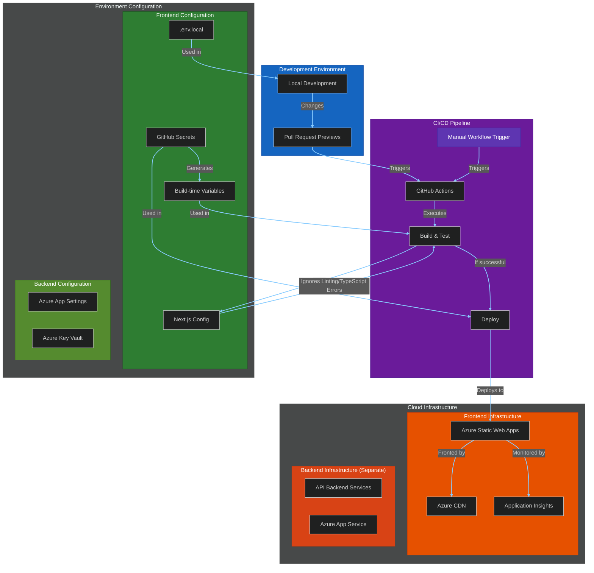

# Deployment Architecture

This diagram shows the deployment flow from development environments through CI/CD to the cloud infrastructure (Azure Static Web Apps), including configuration sources.

```mermaid
%%{init: {'theme':'dark'}}%%
flowchart TD
    subgraph Development["Development Environment"]
        Local[Local Development]
        PR[Pull Request Previews]
    end
    
    subgraph CI_CD["CI/CD Pipeline"]
        GHA[GitHub Actions]
        BuildTest[Build & Test]
        Deploy[Deploy]
        ManualTrigger[Manual Workflow Trigger]
    end
    
    subgraph Infrastructure["Cloud Infrastructure"]
        subgraph FrontendInfra["Frontend Infrastructure"]
            AzureStaticWebApps[Azure Static Web Apps]
            CDN[Azure CDN]
            Monitoring[Application Insights]
        end
        
        subgraph BackendInfra["Backend Infrastructure (Separate)"]
            API_Backend[API Backend Services]
            AppService[Azure App Service]
        end
    end
    
    subgraph Configuration["Environment Configuration"]
        subgraph FrontendConfig["Frontend Configuration"]
            EnvLocal[.env.local]
            GitHubSecrets[GitHub Secrets]
            BuildEnv[Build-time Variables]
            NextConfig[Next.js Config]
        end
        
        subgraph BackendConfig["Backend Configuration"]
            AppSettings[Azure App Settings]
            KeyVault[Azure Key Vault]
        end
    end
    
    Local -->|Changes| PR
    PR -->|Triggers| GHA
    ManualTrigger -->|Triggers| GHA
    
    GHA -->|Executes| BuildTest
    BuildTest -->|If successful| Deploy
    
    BuildTest -->|Uses| NextConfig
    NextConfig -->|Ignores Linting/TypeScript Errors| BuildTest
    
    Deploy -->|Deploys to| AzureStaticWebApps
    AzureStaticWebApps -->|Fronted by| CDN
    AzureStaticWebApps -->|Monitored by| Monitoring
    
    EnvLocal -->|Used in| Local
    GitHubSecrets -->|Generates| BuildEnv
    BuildEnv -->|Used in| BuildTest
    GitHubSecrets -->|Used in| Deploy
    
    style Development fill:#1565c0,stroke:#0d47a1,color:#ffffff
    style CI_CD fill:#6a1b9a,stroke:#4a148c,color:#ffffff
    style FrontendInfra fill:#e65100,stroke:#bf360c,color:#ffffff
    style BackendInfra fill:#d84315,stroke:#bf360c,color:#ffffff
    style FrontendConfig fill:#2e7d32,stroke:#1b5e20,color:#ffffff
    style BackendConfig fill:#558b2f,stroke:#33691e,color:#ffffff
    style ManualTrigger fill:#5e35b1,stroke:#4527a0,color:#ffffff
    
    linkStyle default stroke:#88ccff,stroke-width:2px
``` 