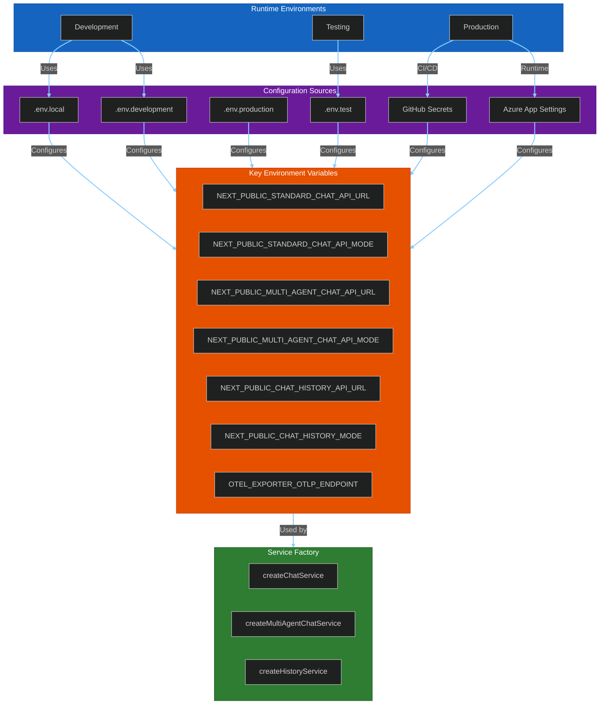

# Environment Configuration

This diagram outlines the sources of configuration for different runtime environments and how they influence the Service Factory.

```mermaid
%%{init: {'theme':'dark'}}%%
flowchart TD
    subgraph Runtime_Environments["Runtime Environments"]
        Dev[Development]
        Prod[Production]
        Test[Testing]
    end
    
    subgraph Configuration_Sources["Configuration Sources"]
        EnvLocal[.env.local]
        EnvDevelopment[.env.development]
        EnvProduction[.env.production]
        EnvTest[.env.test]
        GHSecrets[GitHub Secrets]
        AzureSettings[Azure App Settings]
    end
    
    subgraph Service_Factory["Service Factory"]
        CreateChat[createChatService]
        CreateMultiAgent[createMultiAgentChatService]
        CreateHistory[createHistoryService]
    end
    
    subgraph Environment_Variables["Key Environment Variables"]
        SC_URL[NEXT_PUBLIC_STANDARD_CHAT_API_URL]
        SC_MODE[NEXT_PUBLIC_STANDARD_CHAT_API_MODE]
        MA_URL[NEXT_PUBLIC_MULTI_AGENT_CHAT_API_URL]
        MA_MODE[NEXT_PUBLIC_MULTI_AGENT_CHAT_API_MODE]
        CH_URL[NEXT_PUBLIC_CHAT_HISTORY_API_URL]
        CH_MODE[NEXT_PUBLIC_CHAT_HISTORY_MODE]
        OTEL[OTEL_EXPORTER_OTLP_ENDPOINT]
    end
    
    Dev -->|Uses| EnvLocal
    Dev -->|Uses| EnvDevelopment
    Test -->|Uses| EnvTest
    Prod -->|CI/CD| GHSecrets
    Prod -->|Runtime| AzureSettings
    
    EnvLocal -->|Configures| Environment_Variables
    EnvDevelopment -->|Configures| Environment_Variables
    EnvProduction -->|Configures| Environment_Variables
    EnvTest -->|Configures| Environment_Variables
    GHSecrets -->|Configures| Environment_Variables
    AzureSettings -->|Configures| Environment_Variables
    
    Environment_Variables -->|Used by| Service_Factory
    
    style Runtime_Environments fill:#1565c0,stroke:#0d47a1,color:#ffffff
    style Configuration_Sources fill:#6a1b9a,stroke:#4a148c,color:#ffffff
    style Service_Factory fill:#2e7d32,stroke:#1b5e20,color:#ffffff
    style Environment_Variables fill:#e65100,stroke:#bf360c,color:#ffffff
    
    linkStyle default stroke:#88ccff,stroke-width:2px
``` 