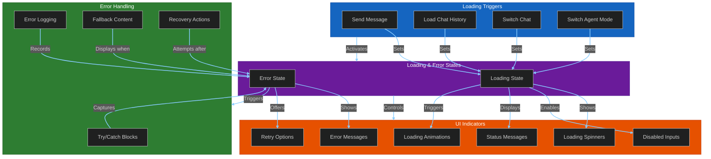
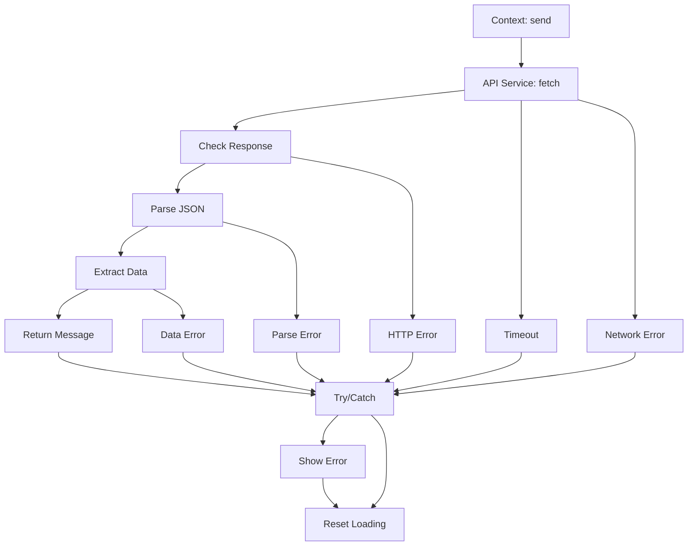

# Loading and Error Handling System

This diagram covers the triggers for loading/error states, the UI indicators used, and the error handling mechanisms.

## Loading/Error State Triggers & UI

## Frontend Error Handling Flow

This diagram details the flow of handling errors originating from API service calls within the frontend context.

