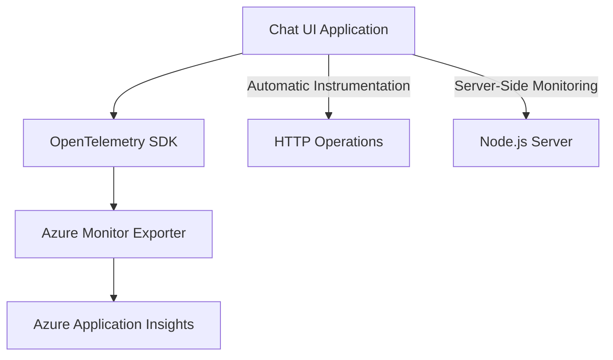

# OpenTelemetry Observability in Chat UI

This document describes the implementation of OpenTelemetry in the Chat UI application for monitoring and observability.

## Overview

OpenTelemetry is an open-source observability framework that provides standardized ways to collect and export telemetry data such as traces, metrics, and logs. In Chat UI, we use OpenTelemetry to:

1. Monitor application performance
2. Track server-side operations
3. Measure HTTP request performance
4. Diagnose issues in production
5. Understand application behavior patterns

## Implementation

### Architecture

The application uses the OpenTelemetry SDK directly with Azure Monitor Application Insights:



### Core Components

1. **instrumentation.ts**: Root file that initializes OpenTelemetry SDK with Azure Monitor
2. **Azure Monitor Trace Exporter**: Sends telemetry to Azure Application Insights

### Configuration

OpenTelemetry is configured via environment variables in `.env.local`:

```
# Required: Azure Application Insights connection string
NEXT_PUBLIC_APPLICATIONINSIGHTS_CONNECTION_STRING=InstrumentationKey=your-key;IngestionEndpoint=https://your-region.in.applicationinsights.azure.com/

# Optional: Log level for OpenTelemetry (default: info)
OTEL_LOG_LEVEL=info  # Options: error, warn, info, debug, trace
```

## Implementation Details

The OpenTelemetry implementation focuses on server-side telemetry with Azure Monitor integration:

### Server-Side Setup

```typescript
// Key parts of instrumentation.ts
export async function register() {
  // Only set up OpenTelemetry in server environment
  if (process.env.NEXT_RUNTIME === 'nodejs') {
    try {
      const { AzureMonitorTraceExporter } = await import('@azure/monitor-opentelemetry-exporter');
      
      // Create Azure Monitor exporter
      const traceExporter = new AzureMonitorTraceExporter({
        connectionString: process.env.NEXT_PUBLIC_APPLICATIONINSIGHTS_CONNECTION_STRING,
      });
      
      // Define service resource
      const resource = new Resource({
        [SemanticResourceAttributes.SERVICE_NAME]: 'chat-ui',
        [SemanticResourceAttributes.SERVICE_VERSION]: '1.0.0',
        [SemanticResourceAttributes.DEPLOYMENT_ENVIRONMENT]: process.env.NODE_ENV || 'production'
      });
      
      // Create SDK
      sdk = new NodeSDK({
        resource,
        traceExporter,
        instrumentations: [
          getNodeAutoInstrumentations({
            '@opentelemetry/instrumentation-http': { enabled: true },
          }),
        ],
      });
      
      // Start SDK
      await sdk.start();
    } catch (error) {
      console.error('Failed to initialize Azure Monitor OpenTelemetry:', error);
    }
  }
}
```

### Webpack Configuration

The Next.js webpack configuration is modified to handle Node.js specific modules:

```typescript
// next.config.ts webpack configuration
webpack: (config, { isServer }) => {
  if (isServer) {
    // Required for @azure/monitor-opentelemetry-exporter to work
    config.resolve = config.resolve || {};
    config.resolve.fallback = config.resolve.fallback || {};
    config.resolve.fallback.os = false;
    config.resolve.fallback.fs = false;
    config.resolve.fallback.child_process = false;
    config.resolve.fallback.path = false;
  }
  return config;
},
```

### Graceful Shutdown

The implementation includes proper handling of shutdown events:

```typescript
// Handle graceful shutdown
process.on('SIGTERM', () => {
  sdk?.shutdown()
    .then(() => console.log('OpenTelemetry SDK shut down'))
    .catch(err => console.error('Error shutting down OpenTelemetry SDK', err))
    .finally(() => process.exit(0));
});
```

## Azure Application Insights Integration

The telemetry data is sent to Azure Application Insights, where you can:

1. View distributed traces for HTTP requests
2. Monitor server-side performance
3. Set up alerts for performance degradation
4. Create custom dashboards for monitoring

To access the telemetry data, go to the Azure Portal and navigate to your Application Insights resource.

## Custom Instrumentation

The application provides custom instrumentation for chat-specific operations:

### API Calls

```typescript
// Example of API call instrumentation
function sendApiRequest() {
  return trackApiCall(
    'chat_completion',
    async () => {
      // Actual API call...
      return response;
    },
    {
      'agent.mode': currentMode,
      'messages.count': messages.length
    }
  );
}
```

### User Interactions

```typescript
// Example of user interaction tracking
function handleSendMessage(content: string) {
  trackUserAction('send_message', {
    'content.length': content.length,
    'agent.mode': currentMode
  });
  
  // Actual message sending logic...
}
```

### Component Rendering

```typescript
// Example of component render tracking
function ChatMessagePanel() {
  // Track component render and get cleanup function
  const endTracking = trackComponentRender('ChatMessagePanel', {
    'messages.count': messages.length
  });
  
  // Call the cleanup function when component unmounts
  useEffect(() => endTracking, []);
  
  // Render component...
}
```

## Automatic Instrumentation

The Next.js framework automatically instruments several operations:

- Page load and navigation
- API routes execution
- Server-side rendering operations
- Data fetching operations
- Component lifecycle events

## Best Practices

1. **Be selective with what you track**: Too much telemetry can be overwhelming and costly
2. **Use meaningful span names**: Make sure span names describe the operation clearly
3. **Add relevant attributes**: Add context to spans with attributes that help with analysis
4. **Clean up resources**: Always end spans when operations complete
5. **Handle errors gracefully**: Record errors but ensure telemetry doesn't affect the user experience

## Troubleshooting

If telemetry data doesn't appear in Azure Application Insights:

1. Check that the Connection String is correct
2. Set `OTEL_LOG_LEVEL=debug` to see detailed logs
3. Verify that the application is running in production mode
4. Check that the Azure Monitor Exporter is properly configured
5. Allow 2-3 minutes for data to appear in the Azure Portal

## Resources

- [OpenTelemetry Documentation](https://opentelemetry.io/docs/)
- [Azure Monitor OpenTelemetry](https://learn.microsoft.com/en-us/azure/azure-monitor/app/opentelemetry-overview)
- [Next.js OpenTelemetry](https://nextjs.org/docs/app/building-your-application/optimizing/open-telemetry)
- [@vercel/otel Documentation](https://vercel.com/docs/observability/otel-overview) 