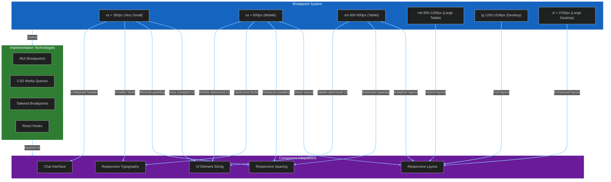

# Responsive Design System

This diagram outlines the breakpoint system, component adaptations, and implementation technologies used to achieve responsive design.

```mermaid
%%{init: {'theme':'dark'}}%%
flowchart TD
    subgraph Breakpoints["Breakpoint System"]
        XXS["xs < 360px (Very Small)"]
        XS["xs < 600px (Mobile)"]
        SM["sm 600-900px (Tablet)"]
        MD["md 900-1200px (Large Tablet)"]
        LG["lg 1200-1536px (Desktop)"]
        XL["xl > 1536px (Large Desktop)"]
    end
    
    subgraph Component_Adaptations["Component Adaptations"]
        Layout[Responsive Layout]
        Spacing[Responsive Spacing]
        Typography[Responsive Typography]
        UI_Elements[UI Element Sizing]
        Chat_Interface[Chat Interface]
    end
    
    subgraph Implementation["Implementation Technologies"]
        MUI_BP[MUI Breakpoints]
        Media_Queries[CSS Media Queries]
        TW_BP[Tailwind Breakpoints]
        React_Hooks[React Hooks]
    end
    
    Breakpoints -->|Define| Implementation
    Implementation -->|Applied to| Component_Adaptations
    
    XXS -->|Very compact UI| UI_Elements
    XXS -->|Minimal padding| Spacing
    XXS -->|Smaller fonts| Typography
    XXS -->|Collapsed header| Chat_Interface
    
    XS -->|Stack layout| Layout
    XS -->|Reduced padding| Spacing
    XS -->|Optimized fonts| Typography
    XS -->|Mobile optimized UI| UI_Elements
    
    SM -->|Adaptive layout| Layout
    SM -->|Balanced spacing| Spacing
    SM -->|Tablet-optimized UI| UI_Elements
    
    MD -->|Hybrid layout| Layout
    LG -->|Full layout| Layout
    XL -->|Enhanced layout| Layout
    
    style Breakpoints fill:#1565c0,stroke:#0d47a1,color:#ffffff
    style Component_Adaptations fill:#6a1b9a,stroke:#4a148c,color:#ffffff
    style Implementation fill:#2e7d32,stroke:#1b5e20,color:#ffffff
    
    linkStyle default stroke:#88ccff,stroke-width:2px
``` 