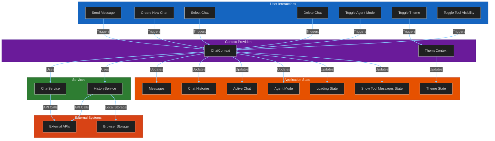

# State Management and Data Flow

This diagram illustrates how application state is managed and flows between contexts, services, and external systems in response to user interactions.

```mermaid
%%{init: {'theme':'dark'}}%%
flowchart TD
    subgraph User_Interactions["User Interactions"]
        SendMsg[Send Message]
        CreateChat[Create New Chat]
        SelectChat[Select Chat]
        DeleteChat[Delete Chat]
        ToggleAgent[Toggle Agent Mode]
        ToggleTheme[Toggle Theme]
        ToggleToolVisibility[Toggle Tool Visibility]
    end
    
    subgraph Context["Context Providers"]
        ChatCtx[ChatContext]
        ThemeCtx[ThemeContext]
    end
    
    subgraph Services["Services"]
        ChatSvc[ChatService]
        HistorySvc[HistoryService]
    end
    
    subgraph State["Application State"]
        Messages[Messages]
        Histories[Chat Histories]
        ActiveChat[Active Chat]
        AgentMode[Agent Mode]
        Loading[Loading State]
        Theme[Theme State]
        ShowToolMsgs[Show Tool Messages State]
    end
    
    subgraph External["External Systems"]
        APIs[External APIs]
        Storage[Browser Storage]
    end
    
    SendMsg -->|Triggers| ChatCtx
    CreateChat -->|Triggers| ChatCtx
    SelectChat -->|Triggers| ChatCtx
    DeleteChat -->|Triggers| ChatCtx
    ToggleAgent -->|Triggers| ChatCtx
    ToggleTheme -->|Triggers| ThemeCtx
    ToggleToolVisibility -->|Triggers| ChatCtx
    
    ChatCtx -->|Uses| ChatSvc
    ChatCtx -->|Uses| HistorySvc
    
    ChatSvc -->|API Calls| APIs
    HistorySvc -->|API Calls| APIs
    HistorySvc -->|Local Storage| Storage
    
    ChatCtx -->|Updates| Messages
    ChatCtx -->|Updates| Histories
    ChatCtx -->|Updates| ActiveChat
    ChatCtx -->|Updates| AgentMode
    ChatCtx -->|Updates| Loading
    ChatCtx -->|Updates| ShowToolMsgs
    ThemeCtx -->|Updates| Theme
    
    style User_Interactions fill:#1565c0,stroke:#0d47a1,color:#ffffff
    style Context fill:#6a1b9a,stroke:#4a148c,color:#ffffff
    style Services fill:#2e7d32,stroke:#1b5e20,color:#ffffff
    style State fill:#e65100,stroke:#bf360c,color:#ffffff
    style External fill:#d84315,stroke:#bf360c,color:#ffffff
    
    linkStyle default stroke:#88ccff,stroke-width:2px
``` 