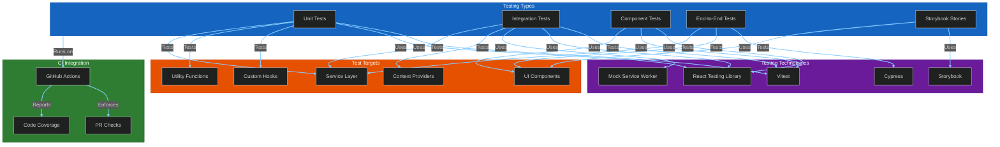

# Testing Architecture

This diagram provides an overview of the testing strategy, including types of tests, technologies used, target areas, and CI integration.

```mermaid
%%{init: {'theme':'dark'}}%%
flowchart TD
    subgraph Testing_Types["Testing Types"]
        Unit[Unit Tests]
        Integration[Integration Tests]
        Component[Component Tests]
        E2E[End-to-End Tests]
        Storybook[Storybook Stories]
    end
    
    subgraph Testing_Technologies["Testing Technologies"]
        Vitest[Vitest]
        RTL[React Testing Library]
        MSW[Mock Service Worker]
        Cypress[Cypress]
        SB[Storybook]
    end
    
    subgraph Test_Targets["Test Targets"]
        Components[UI Components]
        Hooks[Custom Hooks]
        Context[Context Providers]
        Services[Service Layer]
        Utils[Utility Functions]
    end
    
    subgraph CI_Integration["CI Integration"]
        GHA[GitHub Actions]
        PR_Checks[PR Checks]
        Coverage[Code Coverage]
    end
    
    Unit -->|Uses| Vitest
    Unit -->|Uses| RTL
    Unit -->|Tests| Hooks
    Unit -->|Tests| Utils
    Unit -->|Tests| Services
    
    Integration -->|Uses| Vitest
    Integration -->|Uses| RTL
    Integration -->|Uses| MSW
    Integration -->|Tests| Context
    Integration -->|Tests| Services
    
    Component -->|Uses| RTL
    Component -->|Uses| Vitest
    Component -->|Tests| Components
    
    E2E -->|Uses| Cypress
    E2E -->|Tests| Components
    E2E -->|Tests| Services
    
    Storybook -->|Uses| SB
    Storybook -->|Tests| Components
    
    Testing_Types -->|Runs on| GHA
    GHA -->|Enforces| PR_Checks
    GHA -->|Reports| Coverage
    
    style Testing_Types fill:#1565c0,stroke:#0d47a1,color:#ffffff
    style Testing_Technologies fill:#6a1b9a,stroke:#4a148c,color:#ffffff
    style Test_Targets fill:#e65100,stroke:#bf360c,color:#ffffff
    style CI_Integration fill:#2e7d32,stroke:#1b5e20,color:#ffffff
    
    linkStyle default stroke:#88ccff,stroke-width:2px
``` 