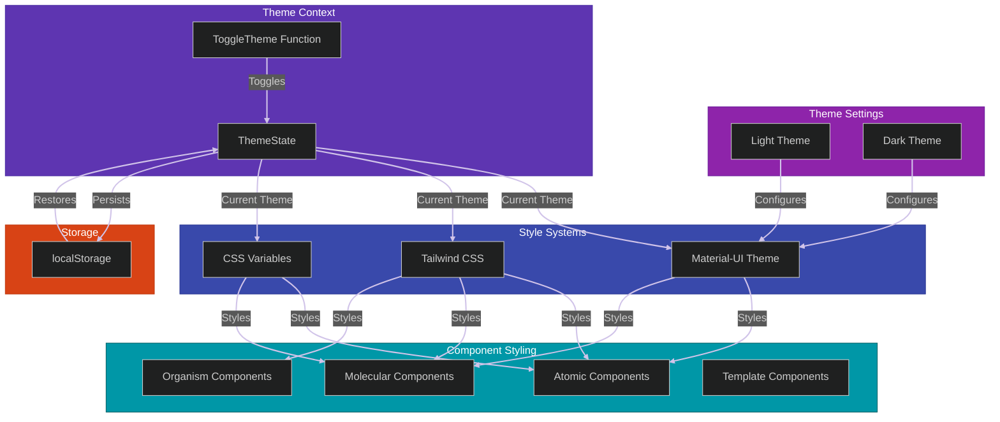

# Theming System

This diagram shows how theme settings (light/dark) flow through the Theme Context, configure different style systems (MUI, CSS Variables), and are applied to components, with persistence in localStorage.

