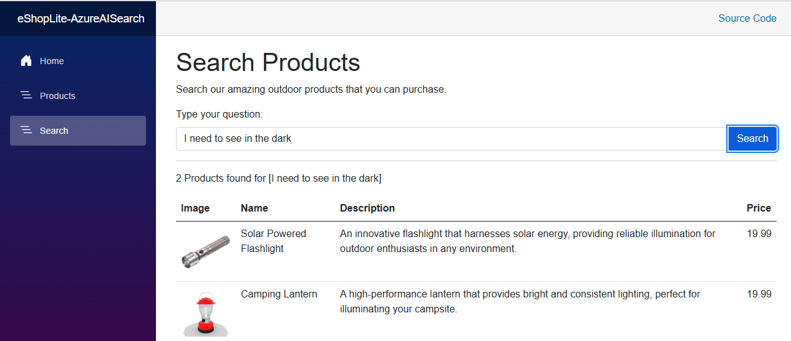
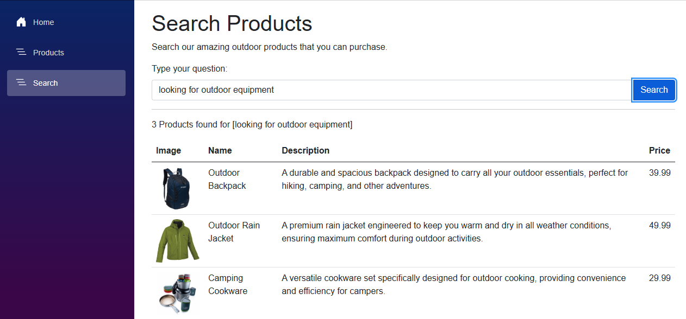

[< Previous Challenge](./Challenge-08.md) - [**Home**](../README.md) - [Next Challenge >](./Challenge-10.md)

# Challenge-09 - Infuse Apps with AI Using Semantic Kernel

## Introduction

In this challenge, you will enhance the eShop Lite application by integrating Semantic Kernel to improve the Product Search service. The current product search relies on a simple keyword matching system. When a user searches for a product, the word they use must match a word in the product name. For instance, if a user searches for "light," they will find a *Flashlight* but not a *Lantern*.


The goal of this challenge is to replace the keyword search with a Semantic Search using the Azure AI Search vector database and the Azure Embedding model created in [Challenge 05](./Challenge-05.md).

## Description

TODO: Show the limits of keyword searching by searching for "light" and "I need to see in the dark".

## Prerequisites

1. Complete the [Getting Familiar With eShop Lite](./Resources/Supporting%20Challenges/Challenge-09-Reference-App.md) guide.
1. Complete [Challenge 05 - Retrieval-Augmented Generation (RAG)](./Challenge-05.md).

## Challenges

Update the eShop Lite application to use Semantic Kernel to infuse AI into the eShop Lite application.

You will need to update the **Products** project to replace the existing keyword search with a Semantic Search. Use the Azure AI Search vector database and the Azure Embedding model created in previous challenges.

1. Open the the ```eShopLite.sln``` solution file in Visual Studio or VS Code located in the ***src/eShopLite*** folder. Make sure the **eShopAppHost** project is set as the startup project.

    

1. Update the `appsettings.json` file and copy the same names and values used in the previous challenges.

    ```json
    // appsettings.json

    "AI_SEARCH_URL": "Replace with your AI Search URI",
    "AI_SEARCH_KEY": "Replace with your AI Search API Key",
    "AOI_DEPLOYMODEL": "Replace with your Azure Open AI Deployment model",
    "AOI_ENDPOINT": "Replace with your Azure Open AI Endpoint",
    "AOI_API_KEY": "Replace with your Azure OpenAI API Key"
    ```

1. Create AI Search index from the database

    1. Once the **AI_SEARCH_URL** and **AI_SEARCH_KEY** configurations are set, run the application and navigate to [https://localhost:7130/api/Product/initaisearch](https://localhost:7130/api/Product/initaisearch) to populate the AI Search index and embeddings from the database.

        

    1. Verify that the AI Search index was created successfully by navigating to the [Azure Portal](https://portal.azure.com) and locating the AI Search resource. Click on Index and verify that the **products** index was created.

        

    1. Next, click on the **products** index then **Fields** and verify that the  Id, Name, Description, Price, ImageURL and Vector fields were created.

        

1. Add the NuGet packages `Microsoft.SemanticKernel`, `Microsoft.SemanticKernel.Connectors.AzureOpenAI`, and `Microsoft.SemanticKernel.Connectors.AzureAISearch` to the **Products** project.

1. Follow the tutorial [Semantic Kernel overview for .NET](https://learn.microsoft.com/en-us/dotnet/ai/semantic-kernel-dotnet-overview) to add and configure the Semantic Kernel object.

    :pushpin: **Note:** Add the code after the comment `//Challenge 9 - Configure the Kernel in an ASP.NET Core app:` in the **program.cs** file.

1. Using the *text-embedding-ada-002* AI model created in Challenge 05, register it with Semantic Kernel by updating the **Program.cs** file.

    :pushpin: **Note:** Add the code after the comment `//Challenge 9 - Register the Azure AI Embedding model` in the **program.cs** file.

1. Register the Azure AI Search vector database with Semantic Kernel by updating the **Program.cs** file. The code will be very similar to Challenge 05.

    :pushpin: **Note:** Add the code after the comment `//Challenge 9 - Register the Azure AI Search Resource` in the **program.cs** file.

1. Update the **"/search/{search}"** endpoint in the **ProductEndpoints** class to use Semantic Kernel to search for products.

    :pushpin: **Note:** The new search endpoint should use Semantic Kernel to search for products using the Azure AI Search vector database, similar to the Contoso Search plugin created in Challenge 05.

    :heavy_check_mark: The search results should include no more than 3 products.

    :heavy_check_mark: The search results should include only products that have a relevance **score** greater than or equal to 0.80.

1. Test the plugin by running the application and searching for products using the following questions:
    * **Type your question:** `light`
        
    * **Type your question:** `I need to see in the dark`
        
    * **Type your question:** `looking for outdoor equipment`

        :warning: **Warning:** Should display only 3 results.

        

## Success Criteria

1. Verify the semantic search implementation is working by finding products that are semantically similar to the search term.
    * When searching for `I need shelter?` the search results should include at least the **Tent**.
    * When searching for `What can I use for cooking?` the search results should include the **Cookware** and **Camping Stove** products.
1. Verify the search results include no more than 3 products.
1. Verify the search results include **only** products that have a [relevance score](https://learn.microsoft.com/en-us/azure/search/vector-search-ranking#scores-in-a-vector-search-results) >= 0.80.

## Learning Resources

* [Semantic Search](https://en.wikipedia.org/wiki/Semantic_search)
* [AI Search Connector](https://learn.microsoft.com/en-us/semantic-kernel/concepts/vector-store-connectors/out-of-the-box-connectors/azure-ai-search-connector?pivots=programming-language-csharp)
* [Relevance in vector search](https://learn.microsoft.com/en-us/azure/search/vector-search-ranking)

[< Previous Challenge](./Challenge-08.md) - [**Home**](../README.md) - [Next Challenge >](./Challenge-10.md)
