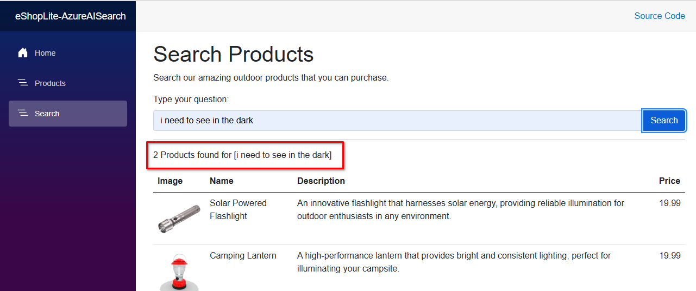
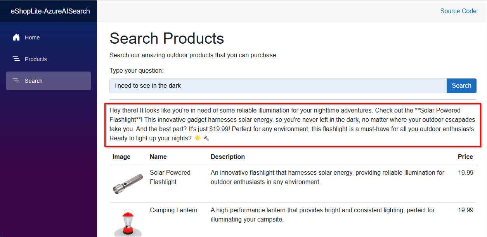

[< Previous Challenge](./Challenge-09.md) - [**Home**](../README.md) - [Next Challenge >](./Challenge-11.md)

# Challenge-10 - Enrich user experience with Semantic Kernel

## Introduction

In this challenge, you will further enhance the Product search page by having the AI model generate a creative response to the users query and the products returned from the Semantic Search. a Chat Completion AI model will be used to replace the generic response message when the search completes

## Description

The current search response simply tells the user how many products were found and lists the products.



The goal of this challenge is to replace the current search response with a creative response generated by an AI model.



## Prerequisites

1. Complete the [Getting Familiar With eShop Lite](./Resources/Supporting%20Challenges/Challenge-09-Reference-App.md) guide.
1. Complete [Challenge 09 - Infuse Apps with AI Using Semantic Kernel](./Challenge-09.md).

## Challenges

1. Add the Azure OpenAI ChatCompletion model to the **Products.cs** file.

    :pushpin: **Note:** Add the code after the comment `//Challenge 10 - Register a Chat Completion Model` in the **program.cs** file.

1. Update the generic response in the **ProductEndpoints.cs** file to use the ChatCompletion model to generate a creative response to the user.

    Replace the following code with a call to a Chat Completion AI model.

    ```csharp
    response.Response = products.Count > 0 ?
        $"{products.Count} Products found for [{search}]" :
        $"No products found for [{search}]";
    ```

    Construct a prompt that directs the AI model to generate a creative and engaging response for the user. The prompt should emphasize that the user is searching for camping products and should produce a catchy and friendly message incorporating the user's search query and details, including price, of the first product from the search results.


## Success Criteria

1. Verify the Chat Completion model was registered correctly.
1. Verify the AI model generates a response based on the users search query.
1. Verify the response includes information about the first product in the search results including price.

---

[< Previous Challenge](./Challenge-09.md) - [**Home**](../README.md) - [Next Challenge >](./Challenge-11.md)
