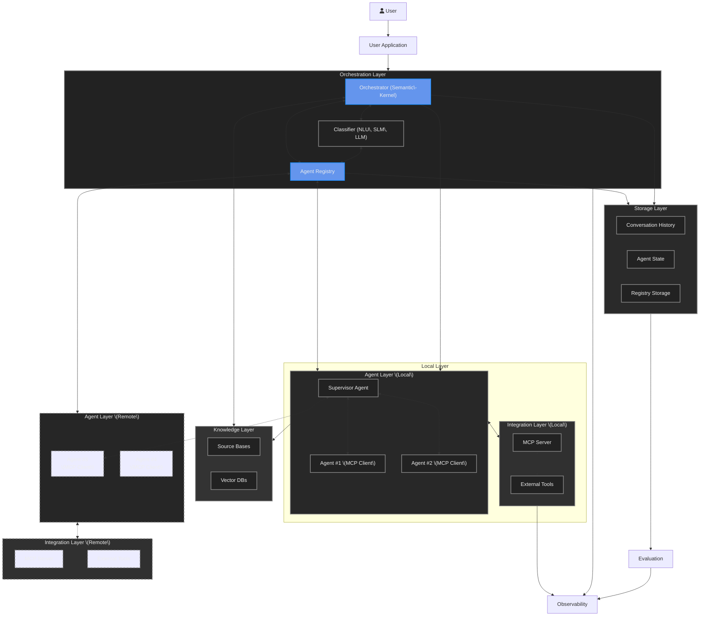

[< Previous Challenge](./Challenge-10.md) - [**Home**](../README.md) - [Next Challenge >](./Challenge-12.md)

# Challenge 11 - Building a "Real World" Multi-Agent Solution

**Estimated Time:** 90-120 minutes  
**Difficulty:** Advanced  
**Prerequisites:** Complete Challenge 10 - Enrich user experience with Semantic Kernel

## Introduction

In this challenge, you will implement the foundation for a production-ready multi-agent AI system. You'll build the orchestration layer and agent registry that will coordinate multiple specialized AI agents working together to complete complex workflows.

This challenge focuses on implementing enterprise-grade patterns for multi-agent coordination, including agent registration, workflow orchestration, and inter-agent communication.

## Architecture Overview

You'll be implementing the highlighted components in this multi-agent architecture:

## Learning Objectives

By completing this challenge, you will understand:
- How to implement agent registry patterns for multi-agent systems
- Group chat orchestration using Semantic Kernel
- Agent specialization and tool integration
- Enterprise patterns for AI workflow coordination

## Challenges

### 1. Implement the Agent Registry

In the `Agents` project, locate `AgentRegistry.cs` and implement a registration system for the following specialized agents:

- **DataImportAgent** - Handles email and spreadsheet parsing
- **MarketAnalystAgent** - Analyzes market data and pricing
- **ContentCreatorAgent** - Generates product descriptions and images  
- **DatabaseSpecialistAgent** - Manages database operations with user approval
- **MarketingAgent** - Creates and sends marketing communications

**Implementation Requirements:**
- Use the static `Dictionary<string, Agent> _agents` as the in-memory agent registry
- Implement the `SetupAgentsAsync` method to register all agents
- Implement the individual agent creation methods for each agent type
- Each agent requires proper tool registration from the `Agents.Tools` namespace
- Use the public `Agents` property to access the registered agents

Research the Semantic Kernel documentation to understand agent creation patterns and plugin registration using `KernelPluginFactory.CreateFromType<T>()`.

> [!TIP]
> See the [Agent Specifications](./Resources/Agent-Specifications.md) document for detailed requirements for each agent.

### 2. Configure Group Chat Orchestration

In the `Store` project, implement the orchestration logic in `MultiAgentImport.razor.cs`:

- **Initialization**: Set up agent registration and runtime configuration
- **Orchestration**: Configure `GroupChatOrchestration` with `RoundRobinGroupChatManager`
- **Workflow Execution**: Implement the group chat workflow execution pattern

Research the Semantic Kernel Group Chat documentation to understand orchestration patterns and runtime management.

### 3. Implement Workflow Coordination

Design and implement the workflow that:
- Processes uploaded email and spreadsheet files
- Coordinates agent execution in the correct sequence
- Handles agent-to-agent communication
- Manages workflow state and progression

## Technical Requirements

### Agent Registry Pattern
- Use in-memory `Dictionary<string, Agent>` collection for this demonstration
- Implement proper agent lifecycle management
- Ensure thread-safe access to the registry
- Include agent name constants for consistent referencing

### Orchestration Implementation
- Configure agents with appropriate tools and plugins
- Implement proper error handling and logging
- Design the initial message format for workflow initiation
- Use `InProcessRuntime` for agent execution management

### Integration Points
- File processing for email (.eml) and spreadsheet (.xlsx) formats
- Background task queue for async workflow execution
- UI state management for workflow progress

> [!IMPORTANT]
> This implementation uses an in-memory collection since this is a demonstration. In a production application, you would likely want to set up a solution like Redis with a persistence layer, along with a registration system where agents could register with the server when they're online.

## Success Criteria

✅ **Agent Registry Complete**: All five specialized agents are properly registered in the static `Dictionary<string, Agent>` collection  
✅ **Registry Methods Implemented**: `SetupAgentsAsync` method and individual agent creation methods are functional  
✅ **Tool Integration**: Each agent has appropriate plugins registered from `Agents.Tools` namespace  
✅ **Orchestration Functional**: Group chat orchestration successfully coordinates agent execution  
✅ **Workflow Operational**: End-to-end product import workflow executes from file upload to completion  
✅ **Error Handling**: Proper exception handling and logging throughout the system  
✅ **State Management**: Workflow state is properly tracked and reported to the UI  

## Resources

- [Semantic Kernel Agent Framework Documentation](https://learn.microsoft.com/en-us/semantic-kernel/frameworks/agent/?pivots=programming-language-csharp)
- [Group Chat Orchestration Guide](https://learn.microsoft.com/en-us/semantic-kernel/frameworks/agent/agent-orchestration/group-chat?pivots=programming-language-csharp)
- [Agent Specifications Reference](./Resources/Agent-Specifications.md)
- [Plugin Registration Patterns](https://learn.microsoft.com/en-us/semantic-kernel/concepts/plugins/?pivots=programming-language-csharp)

## Next Steps

In Challenge 12, you'll enhance this system with real-time callback mechanisms to provide live updates as agents execute their tasks, laying the foundation for human-in-the-loop workflows.

---

[< Previous Challenge](./Challenge-10.md) - [**Home**](../README.md) - [Next Challenge >](./Challenge-12.md)
