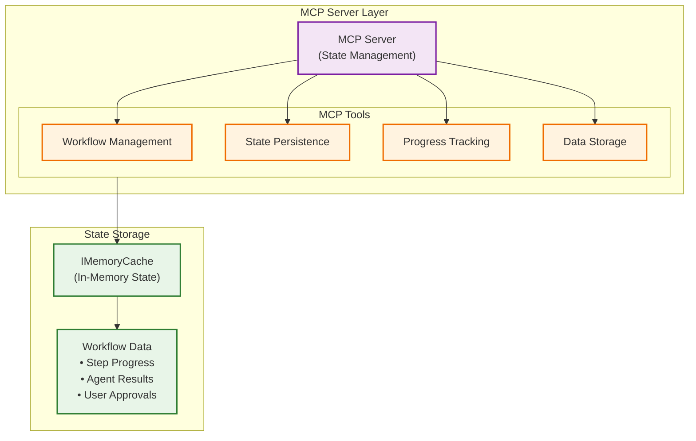

[< Previous Challenge](./Challenge-12.md) - [**Home**](../README.md) - [Next Challenge >](./Challenge-14.md)

# Challenge 13 - Build Your Own MCP Server

**Estimated Time:** 45-60 minutes  
**Difficulty:** Advanced  
**Prerequisites:** Complete Challenge 12 - Adding Real-time Agent Response Callbacks

## Introduction

In this challenge, you'll solve a critical issue that you're likely experiencing with your multi-agent system: **state tracking and persistence**. Multi-agent workflows need reliable ways to maintain state across agent interactions, track progress, and coordinate complex workflows.

You'll implement a **Model Context Protocol (MCP) server** that provides state tracking capabilities for your multi-agent workflow. This will dramatically increase the reliability and observability of your AI solution.

## What is MCP?

The Model Context Protocol is an open standard that enables AI systems to securely connect to external data sources and tools. MCP servers expose tools and resources that AI agents can use, creating a bridge between your agents and external systems.

In this challenge, you'll build an MCP server that provides workflow state management tools, allowing your agents to:
- Track workflow progress across agent handoffs
- Store and retrieve workflow data reliably
- Coordinate complex multi-step processes
- Maintain state persistence across system restarts

## Learning Objectives

By completing this challenge, you will understand:
- How to implement MCP servers using the .NET MCP SDK
- State management patterns for multi-agent systems
- Tool registration and exposure via MCP protocols
- Configuration and deployment of MCP services

## Architecture Context

Your MCP server will act as a centralized state store that agents can query and update:

## Challenges

### 1. Research MCP Implementation Patterns

Before implementing your solution, research the following:

- **MCP SDK Documentation**: Study the [official MCP C# SDK](https://github.com/modelcontextprotocol/csharp-sdk/) and examine the [SSE server sample](https://github.com/modelcontextprotocol/csharp-sdk/tree/main/samples/AspNetCoreSseServer)
- **Tool Registration Patterns**: Understand how MCP tools are defined, registered, and exposed
- **State Management**: Consider what workflow state needs to be tracked and how to structure it

### 2. Design Your Workflow State Management

Analyze your multi-agent workflow and design a state management system that can:

- **Track Workflow Progress**: Monitor which steps have been completed
- **Store Agent Data**: Persist data passed between agents
- **Manage Workflow Lifecycle**: Handle workflow initiation, progression, and completion
- **Provide Data Retrieval**: Allow agents to query previous workflow steps

Consider what data structures and operations will be needed to support your workflow.

### 3. Implement the MCP Server

Using the `eShopMcpTool` project, implement your MCP server:

**Core Requirements:**
- Create MCP tools for workflow state management
- Use `IMemoryCache` for in-memory state storage
- Implement proper HTTP transport configuration
- Register tools with appropriate descriptions for AI consumption

**Key Design Considerations:**
- Tool naming and descriptions should be clear for AI agents
- State operations should be atomic and consistent
- Error handling for invalid workflow states
- Proper workflow ID management

Research the MCP SDK documentation to understand tool creation patterns, attributes, and registration methods.

### 4. Test Server Implementation

Validate your implementation by:
- Testing MCP server tool exposure using [MCP Inspector](https://github.com/modelcontextprotocol/inspector)
- Verifying tool registration and availability
- Testing state management operations
- Validating error handling and edge cases

## Technical Requirements

### MCP Server Implementation
- Use ASP.NET Core with HTTP transport
- Implement proper tool attribution and registration
- Include comprehensive error handling and validation
- Support concurrent workflow state management

### State Management
- Design workflow state schema that supports your use cases
- Implement CRUD operations for workflow data
- Handle workflow lifecycle events appropriately

## Success Criteria

✅ **MCP Server Functional**: Server exposes workflow management tools via HTTP transport  
✅ **Tool Registration Complete**: All necessary tools are properly registered and discoverable  
✅ **State Management Working**: Workflow state can be created, updated, and queried reliably  
✅ **Error Handling**: Server handles invalid requests and edge cases gracefully  
✅ **Inspector Validation**: MCP tools are visible and testable via MCP Inspector  

## Resources

- [Model Context Protocol Documentation](https://modelcontextprotocol.io/)
- [MCP C# SDK GitHub Repository](https://github.com/modelcontextprotocol/csharp-sdk/)
- [SSE Server Sample Implementation](https://github.com/modelcontextprotocol/csharp-sdk/tree/main/samples/AspNetCoreSseServer)
- [MCP Inspector Tool](https://github.com/modelcontextprotocol/inspector)

## Next Steps

In Challenge 14, you'll create the Task Tracking Agent that will use this MCP server to coordinate your multi-agent workflow.

---

[< Previous Challenge](./Challenge-12.md) - [**Home**](../README.md) - [Next Challenge >](./Challenge-14.md)

Consider what data structures and operations will be needed to support your workflow.

### 3. Implement the MCP Server

Using the `eShopMcpTool` project, implement your MCP server:

**Core Requirements:**
- Create MCP tools for workflow state management
- Use `IMemoryCache` for in-memory state storage
- Implement proper HTTP transport configuration
- Register tools with appropriate descriptions for AI consumption

**Key Design Considerations:**
- Tool naming and descriptions should be clear for AI agents
- State operations should be atomic and consistent
- Error handling for invalid workflow states
- Proper workflow ID management

Research the MCP SDK documentation to understand tool creation patterns, attributes, and registration methods.

### 4. Test Server Implementation

Validate your implementation by:
- Testing MCP server tool exposure using [MCP Inspector](https://github.com/modelcontextprotocol/inspector)
- Verifying tool registration and availability
- Testing state management operations
- Validating error handling and edge cases

## Technical Requirements

### MCP Server Implementation
- Use ASP.NET Core with HTTP transport
- Implement proper tool attribution and registration
- Include comprehensive error handling and validation
- Support concurrent workflow state management

### State Management
- Design workflow state schema that supports your use cases
- Implement CRUD operations for workflow data
- Handle workflow lifecycle events appropriately

## Success Criteria

✅ **MCP Server Functional**: Server exposes workflow management tools via HTTP transport  
✅ **Tool Registration Complete**: All necessary tools are properly registered and discoverable  
✅ **State Management Working**: Workflow state can be created, updated, and queried reliably  
✅ **Error Handling**: Server handles invalid requests and edge cases gracefully  
✅ **Inspector Validation**: MCP tools are visible and testable via MCP Inspector  

## Resources

- [Model Context Protocol Documentation](https://modelcontextprotocol.io/)
- [MCP C# SDK GitHub Repository](https://github.com/modelcontextprotocol/csharp-sdk/)
- [SSE Server Sample Implementation](https://github.com/modelcontextprotocol/csharp-sdk/tree/main/samples/AspNetCoreSseServer)
- [MCP Inspector Tool](https://github.com/modelcontextprotocol/inspector)

## Next Steps

In Challenge 14, you'll create the Task Tracking Agent that will use this MCP server to coordinate your multi-agent workflow.

---

[< Previous Challenge](./Challenge-12.md) - [**Home**](../README.md) - [Next Challenge >](./Challenge-14.md)