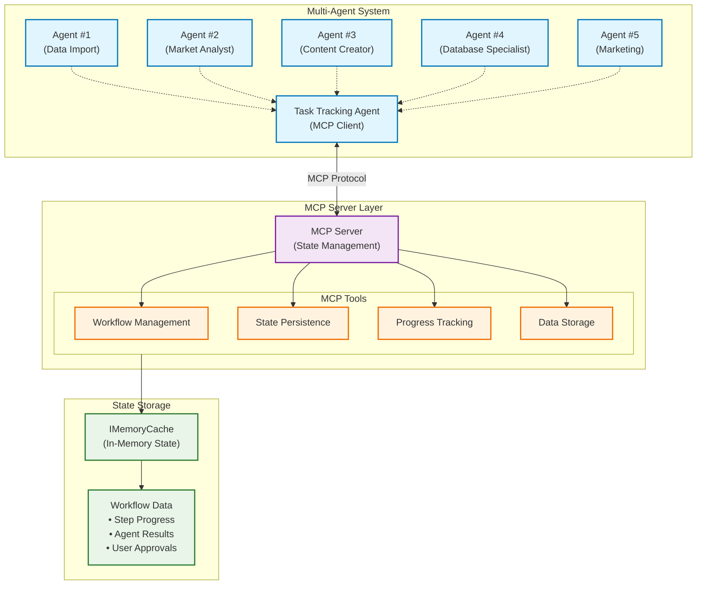

[< Previous Challenge](./Challenge-13.md) - [**Home**](../README.md) - [Next Challenge >](./Challenge-15.md)

# Challenge 14 - Create the Task Tracking Agent

**Estimated Time:** 30-45 minutes
**Difficulty:** Intermediate
**Prerequisites:** Complete Challenge 13 - Build Your Own MCP Server

## Introduction

In this challenge, you will create the **Task Tracking Agent**, a specialized agent responsible for monitoring and managing the state of your multi-agent workflow. This agent will act as the central coordinator, ensuring that tasks are executed in the correct order and that the workflow progresses smoothly from start to finish.

You will define the agent's instructions, provide it with the necessary tools for state management, and integrate it into your existing multi-agent system.

## Learning Objectives

By completing this challenge, you will understand:
- How to create a specialized agent with a specific role and set of instructions
- How to connect an agent to an MCP server to extend its capabilities
- How to register MCP tools as plugins for a Semantic Kernel agent
- The role of a task tracking agent in a multi-agent system

## Architecture Context

The Task Tracking Agent is a critical component of your multi-agent system. It communicates with the MCP server you built in Challenge 13 to persist and retrieve workflow state, allowing it to coordinate the other agents in the system.

## Challenges

### 1. Implement the Task Tracking Agent

In the `AgentRegistry.cs` file, you will implement the `CreateTaskTrackingAgentAsync` method. This method should perform the following steps:

1.  **Clone the Kernel**: Create a new kernel instance for the agent by cloning the one passed into the method. This ensures that each agent has its own isolated set of plugins.
2.  **Connect to the MCP Server**: Use the `McpClientFactory` to create a client that connects to the MCP server. The server endpoint is available in the `IConfiguration` service.
3.  **List and Register MCP Tools**: Once connected, list the available tools from the MCP server and register them as plugins with the agent's kernel. This will allow the agent to use the state management tools provided by the server.
4.  **Define the Agent**: Create a new `ChatCompletionAgent` with the following properties:
    *   **Name**: Use the `TaskTrackingAgentName` constant.
    *   **Description**: Provide a clear description of the agent's role. Refer to the [Agent Specifications](./Resources/Agent-Specifications.md#task-tracking-agent) for the exact text.
    *   **Instructions**: Provide detailed instructions for the agent. Refer to the [Agent Specifications](./Resources/Agent-Specifications.md#task-tracking-agent) for the exact text.
    *   **Kernel**: Assign the kernel you created in the first step.
5.  **Add the Agent to the Registry**: Add the newly created agent to the `_agents` dictionary.

Refer to the `Coach/Dotnet/eShop/src/Agents/MultiAgent/AgentRegistry.cs` file for a complete example of how to implement this method.

## Success Criteria

✅ **Task Tracking Agent Created**: The `CreateTaskTrackingAgentAsync` method is fully implemented.
✅ **MCP Connection Established**: The agent successfully connects to the MCP server.
✅ **MCP Tools Registered**: The state management tools from the MCP server are registered as plugins for the agent.
✅ **Agent Added to Registry**: The Task Tracking Agent is added to the `_agents` dictionary and is available for use in the multi-agent system.

## Resources

- [Agent Specifications](./Resources/Agent-Specifications.md#task-tracking-agent)
- [Model Context Protocol Documentation](https://modelcontextprotocol.io/)
- [Semantic Kernel MCP Integration Guide](https://learn.microsoft.com/en-us/semantic-kernel/concepts/plugins/adding-mcp-plugins?pivots=programming-language-csharp)

## Next Steps

In Challenge 15, you will enhance your multi-agent system by implementing a custom InteractiveGroupChatManager that replaces the basic RoundRobin orchestrator.

---

[< Previous Challenge](./Challenge-13.md) - [**Home**](../README.md) - [Next Challenge >](./Challenge-15.md)
