[< Previous Challenge](./Challenge-14.md) - [**Home**](../README.md) - [Next Challenge >](./Challenge-16.md)

# Challenge 15 - Custom Multi-Agent Orchestration

**Estimated Time:** 60-90 minutes  
**Difficulty:** Advanced  
**Prerequisites:** Complete Challenge 14 - Create the Task Tracking Agent

## Introduction

In this challenge, you'll enhance your multi-agent system by implementing a sophisticated **InteractiveGroupChatManager** that replaces the basic `RoundRobinGroupChatManager`. This advanced orchestrator introduces intelligent agent selection, dynamic workflow management, and AI-driven coordination decisions.

While the RoundRobin manager simply cycles through agents sequentially, your custom manager will use AI to make intelligent decisions about which agent should act next based on the current workflow state and requirements.

## The Challenge: From Simple to Intelligent Orchestration

**Current State (RoundRobin):**
- Agents are called in a predetermined sequence
- No intelligence about which agent is needed next
- Basic termination logic
- Limited workflow awareness

**Target State (Interactive):**
- AI-driven agent selection based on workflow context
- Dynamic termination based on task completion assessment
- Rich response filtering and summarization
- Intelligent workflow coordination

## Learning Objectives

By completing this challenge, you will understand:
- Advanced orchestration patterns in multi-agent systems
- AI-driven decision making for agent coordination
- Custom GroupChatManager implementation patterns
- Dynamic workflow management techniques

## Architecture Overview

Your InteractiveGroupChatManager will serve as an intelligent conductor for your multi-agent orchestra:

```mermaid
flowchart TD
    subgraph OrchestrationLayer["Intelligent Orchestration Layer"]
        ICM["InteractiveGroupChatManager"]
        
        subgraph DecisionEngine["AI Decision Engine"]
            AgentSelector["Agent Selection AI"]
            TerminationAI["Termination Assessment AI"]
            FilterAI["Response Filter AI"]
        end
        
        subgraph WorkflowControl["Workflow Control"]
            StateAnalysis["State Analysis"]
            PromptEngine["Dynamic Prompt Engine"]
            ResponseParser["JSON Response Parser"]
        end
    end
    
    subgraph AgentLayer["Multi-Agent System"]
        TaskAgent["Task Tracking Agent"]
        DataAgent["Data Import Agent"]
        MarketAgent["Market Analyst Agent"]
        ContentAgent["Content Creator Agent"]
        DBAgent["Database Specialist Agent"]
        MarketingAgent["Marketing Agent"]
    end
    
    subgraph StateLayer["State Management"]
        MCPServer["MCP Server"]
        WorkflowState["Workflow State"]
        ChatHistory["Chat History"]
    end

    %% Orchestration control
    ICM --> AgentSelector
    ICM --> TerminationAI
    ICM --> FilterAI
    ICM --> StateAnalysis
    ICM --> PromptEngine
    ICM --> ResponseParser
    
    %% Agent coordination
    ICM <--> TaskAgent
    ICM <--> DataAgent
    ICM <--> MarketAgent
    ICM <--> ContentAgent
    ICM <--> DBAgent
    ICM <--> MarketingAgent
    
    %% State management
    AgentLayer <--> MCPServer
    ICM <--> ChatHistory
    MCPServer <--> WorkflowState

    %% Styling
    classDef orchestration fill:#f3e5f5,stroke:#7b1fa2,stroke-width:3px
    classDef decision fill:#fff3e0,stroke:#f57c00,stroke-width:2px
    classDef agent fill:#e8f5e8,stroke:#388e3c,stroke-width:2px
    classDef state fill:#fce4ec,stroke:#c2185b,stroke-width:2px

    class ICM orchestration
    class AgentSelector,TerminationAI,FilterAI,StateAnalysis,PromptEngine,ResponseParser decision
    class TaskAgent,DataAgent,MarketAgent,ContentAgent,DBAgent,MarketingAgent agent
    class MCPServer,WorkflowState,ChatHistory state
```

## Challenges

### 1. Research Advanced Orchestration Patterns

Before implementing your solution, research the following concepts:

- **GroupChatManager Architecture**: Study the Semantic Kernel GroupChatManager base class and its virtual methods
- **AI-Driven Decision Making**: Learn how to use LLMs for orchestration decisions
- **JSON Structured Outputs**: Research how to get reliable structured responses from AI models
- **Agent Selection Strategies**: Understand context-aware agent coordination

Review the [Semantic Kernel Group Chat documentation](https://learn.microsoft.com/en-us/semantic-kernel/frameworks/agent/agent-orchestration/group-chat) to understand the extensibility points.

### 2. Design Your Orchestration Strategy

Analyze the workflow requirements and design an orchestration system that handles:

**Intelligent Agent Selection:**
- Context-aware decision making about which agent should act next
- Consideration of agent specializations and current workflow state
- Prevention of agents working outside their areas of expertise

**Dynamic Termination Logic:**
- AI assessment of task completion status
- Recognition of workflow completion signals
- Graceful handling of incomplete or failed workflows

**Response Processing:**
- Filtering and summarization of agent responses
- Generation of human-friendly workflow summaries
- Proper formatting for UI display

### 3. Implement the InteractiveGroupChatManager

Create your custom orchestration manager by implementing the following key methods:

**Core Orchestration Methods:**
- `SelectNextAgent()` - Use AI to choose the most appropriate agent for the next step
- `ShouldTerminate()` - Intelligent assessment of workflow completion
- `FilterResults()` - Process and summarize workflow results

**Key Implementation Considerations:**
- Use structured JSON responses for reliable AI decision making
- Implement proper error handling and fallback logic
- Design clear prompts that guide AI decision making
- Handle edge cases and unexpected agent responses

Research how to override the base `GroupChatManager` methods and implement custom orchestration logic.

### 4. Implement AI Decision Engine

Design and implement the AI-powered decision making components:

**Agent Selection AI:**
- Analyze chat history and workflow context
- Determine which agent is best suited for the next action
- Consider agent capabilities and current workflow requirements

**Termination Assessment:**
- Evaluate whether the workflow has achieved its objectives
- Recognize completion signals from agents
- Handle partial completion scenarios appropriately

**Response Filtering:**
- Process and summarize agent outputs
- Generate user-friendly workflow summaries
- Extract key information for decision making

### 5. Replace RoundRobin with Interactive Manager

Update your multi-agent system configuration:

- Replace `RoundRobinGroupChatManager` with your `InteractiveGroupChatManager`
- Ensure proper dependency injection and service registration
- Test the enhanced orchestration capabilities
- Validate intelligent agent selection and termination logic

## Technical Requirements

### Orchestration Implementation
- Inherit from `GroupChatManager` and override key virtual methods
- Use `IChatCompletionService` for AI-driven decision making
- Implement structured JSON response parsing for reliable results
- Include comprehensive logging and error handling

### AI Decision Engine
- Design effective prompts for agent selection decisions
- Implement termination assessment logic using AI
- Create response filtering and summarization capabilities
- Use structured outputs for reliable parsing

### Integration Points
- Seamless replacement of existing RoundRobin manager
- Compatibility with existing agent implementations
- Integration with MCP-based state management
- Proper error handling and fallback mechanisms

## Success Criteria

✅ **Custom Manager Implemented**: InteractiveGroupChatManager successfully replaces RoundRobin orchestrator  
✅ **Intelligent Agent Selection**: AI chooses appropriate agents based on workflow context  
✅ **Dynamic Termination**: AI accurately assesses workflow completion status  
✅ **Response Processing**: Agent responses are properly filtered and summarized  
✅ **Error Handling**: Robust handling of edge cases and unexpected scenarios  
✅ **End-to-End Workflow**: Complete product import workflow with enhanced orchestration  

## Design Patterns to Consider

### Orchestration Patterns
- **Strategy Pattern**: Different orchestration strategies for different workflow types
- **State Machine**: Clear workflow state transitions and management
- **Chain of Responsibility**: Agent selection based on capability chains

### AI Integration Patterns
- **Prompt Engineering**: Effective prompts for consistent AI decision making
- **Structured Outputs**: JSON schemas for reliable response parsing
- **Fallback Logic**: Graceful degradation when AI decisions are unclear

## Resources

- [Semantic Kernel Group Chat Manager Documentation](https://learn.microsoft.com/en-us/semantic-kernel/frameworks/agent/agent-orchestration/group-chat)
- [Structured Outputs with AI Models](https://learn.microsoft.com/en-us/semantic-kernel/concepts/ai-services/chat-completion/chat-completion-structured-outputs)
- [Agent Specifications Reference](./Resources/Agent-Specifications.md)

## Next Steps

In Challenge 16, you'll enhance your InteractiveGroupChatManager with human-in-the-loop capabilities, adding sophisticated approval workflows and user interaction patterns to create a complete enterprise-grade multi-agent system.

---

[< Previous Challenge](./Challenge-14.md) - [**Home**](../README.md) - [Next Challenge >](./Challenge-16.md)