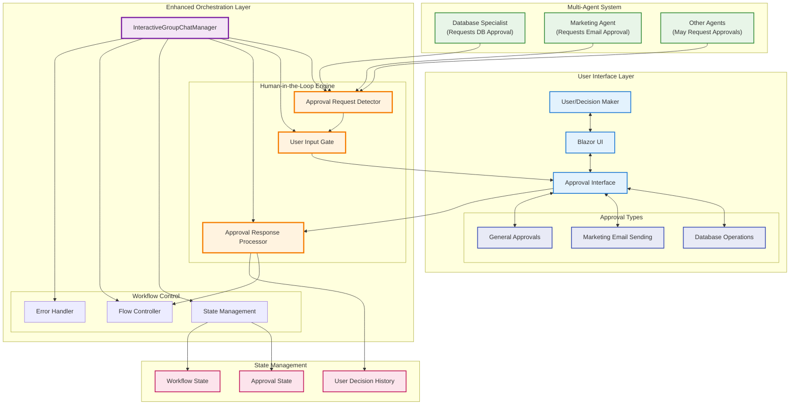

[< Previous Challenge](./Challenge-15.md) - [**Home**](../README.md)

# Challenge 16 - Human-in-the-Loop AI Workflows

**Estimated Time:** 60-90 minutes  
**Difficulty:** Expert  
**Prerequisites:** Complete Challenge 15 - Custom Multi-Agent Orchestration

## Introduction

In this final challenge, you'll complete your enterprise-grade multi-agent system by implementing sophisticated **Human-in-the-Loop (HITL)** capabilities. This transforms your system from a fully automated AI workflow into an intelligent collaborative system where humans and AI agents work together on complex decisions.

You'll enhance your InteractiveGroupChatManager with approval workflows, user interaction detection, and seamless UI integration that allows users to review and approve critical agent actions before they're executed.

## The Power of Human-in-the-Loop AI

**Why Human-in-the-Loop Matters:**
- **Critical Decision Points**: Some decisions require human judgment and oversight
- **Risk Mitigation**: Human approval for high-impact actions (database changes, sending emails)
- **Quality Control**: Human review ensures AI decisions align with business objectives
- **Compliance**: Many enterprise scenarios require human approval for audit trails
- **Learning**: Human feedback improves AI decision making over time

## Learning Objectives

By completing this challenge, you will understand:
- Human-in-the-Loop design patterns in AI systems
- Approval workflow implementation and coordination
- UI integration for seamless human-AI collaboration
- Enterprise governance patterns for AI systems
- State management for interactive workflows

## Architecture Overview

Your enhanced system will seamlessly blend AI automation with human oversight:

## Challenges

### 1. Research Human-in-the-Loop Patterns

Before implementing your solution, research the following concepts:

- **Approval Workflow Patterns**: Study common patterns for human approval in automated systems
- **UI Integration Strategies**: Understand how to coordinate between background AI processes and UI
- **State Management**: Learn how to handle approval states and workflow pausing/resuming
- **Error Handling**: Research graceful handling of approval timeouts, rejections, and edge cases

Review [Human-in-the-Loop AI patterns](https://learn.microsoft.com/en-us/azure/architecture/guide/ai/human-in-the-loop) and approval workflow design principles.

### 2. Design Your Approval System

Analyze the requirements for human oversight and design a system that handles:

**Approval Detection:**
- Recognition of `<approval_required>` tags in agent responses
- Identification of different approval types (database, email, general)
- Extraction of approval context and details for user review

**User Interaction Management:**
- Coordination with UI for approval presentation
- Handling of approve/deny user decisions
- Timeout management for pending approvals

**Workflow Coordination:**
- Pausing workflow execution during approval processes
- Resuming workflow based on user decisions
- Handling rejection scenarios and workflow termination

### 3. Implement Approval Detection Logic

Enhance your InteractiveGroupChatManager with approval detection capabilities:

**ShouldRequestUserInput() Method:**
- Parse agent responses for approval request tags
- Identify the type of approval needed (database operations, email sending, etc.)
- Extract approval context and format for user presentation
- Return appropriate signals to trigger UI approval workflows

**Key Implementation Considerations:**
- Handle different agent types and their specific approval patterns
- Extract meaningful context from approval requests
- Provide clear reasoning for why approval is needed
- Support multiple concurrent approval requests if needed

### 4. Implement Approval Workflow Integration

Design and implement the coordination between your orchestration manager and the UI:

**Approval State Management:**
- Track pending approvals and their status
- Coordinate workflow pausing during approval processes
- Handle approval responses and workflow resumption

**UI Coordination:**
- Format approval requests for user presentation
- Provide clear context and decision options
- Handle user responses and communicate back to orchestrator

**Error Handling:**
- Manage approval timeouts and user abandonment
- Handle rejection scenarios gracefully
- Provide fallback options when approvals are denied

### 5. Test End-to-End Human-in-the-Loop Workflows

Validate your implementation with comprehensive testing:

**Database Approval Workflow:**
- Trigger database specialist agent to request approval for product insertion
- Verify approval UI displays product information clearly
- Test both approval and rejection scenarios

**Email Approval Workflow:**
- Trigger marketing agent to request approval for email sending
- Verify email preview is displayed properly in approval UI
- Test workflow continuation and termination based on user decisions

**General Approval Scenarios:**
- Test various approval request formats and contexts
- Verify robust error handling and edge case management
- Validate state persistence and workflow recovery

## Technical Requirements

### Approval Detection Implementation
- Enhanced `ShouldRequestUserInput()` method with intelligent detection
- Robust parsing of approval tags and context extraction
- Support for different approval types and agent patterns

### UI Integration
- Seamless coordination with existing Blazor approval interface
- Clear presentation of approval context and options
- Proper handling of user decisions and response communication

### State Management
- Approval state tracking and persistence
- Workflow pausing and resumption logic
- User decision history and audit trail

### Error Handling
- Graceful handling of approval timeouts and rejections
- Robust error recovery and workflow continuation
- Clear error messaging and user feedback

## Success Criteria

✅ **Approval Detection Functional**: System correctly identifies and processes approval requests from agents  
✅ **UI Integration Seamless**: Approval requests are properly displayed and user decisions are processed  
✅ **Database Approval Workflow**: End-to-end testing of database operation approvals works correctly  
✅ **Email Approval Workflow**: Marketing email approval workflow functions properly  
✅ **Error Handling Robust**: System handles rejections, timeouts, and edge cases gracefully  
✅ **State Management Complete**: Approval states are properly tracked and workflows resume correctly  
✅ **Audit Trail**: User decisions are logged and trackable for compliance purposes  

## Implementation Patterns

### Approval Detection Patterns
- **Tag-Based Detection**: Recognition of XML-style approval tags in agent responses
- **Context Extraction**: Parsing approval content for meaningful user presentation
- **Type Classification**: Identifying different categories of approvals

### UI Coordination Patterns
- **Event-Driven Integration**: Coordination between background processes and UI
- **State Synchronization**: Keeping approval state consistent between components
- **Response Handling**: Processing user decisions and communicating back to workflows

### Workflow Management Patterns
- **Pause/Resume Logic**: Intelligent workflow suspension and continuation
- **Decision Trees**: Branching workflow logic based on approval outcomes
- **Timeout Handling**: Managing long-running approval processes

## Resources

- [Human-in-the-Loop AI Architecture Patterns](https://learn.microsoft.com/en-us/azure/architecture/guide/ai/human-in-the-loop)
- [Approval Workflow Design Principles](https://learn.microsoft.com/en-us/azure/architecture/patterns/approval-workflow)
- [Semantic Kernel Group Chat Manager Documentation](https://learn.microsoft.com/en-us/semantic-kernel/frameworks/agent/agent-orchestration/group-chat)
- [Agent Specifications Reference](./Resources/Agent-Specifications.md)

## Conclusion

🎉 **Congratulations!** You've successfully built a comprehensive, enterprise-grade multi-agent AI system that demonstrates:

### **Technical Achievements:**
- **Advanced Multi-Agent Coordination**: Intelligent orchestration with AI-driven decision making
- **State Management**: Robust workflow state tracking via MCP server implementation
- **Human-in-the-Loop Integration**: Sophisticated approval workflows with seamless UI coordination
- **Real-time Collaboration**: Live updates and feedback during agent execution
- **Enterprise Patterns**: Production-ready architecture with proper error handling and governance

### **Learning Journey Completed:**
From Challenge 1's basic chat interface to Challenge 16's sophisticated human-AI collaboration system, you've mastered:

1. **Foundation**: Semantic Kernel basics and AI integration (Challenges 1-10)
2. **Multi-Agent Systems**: Agent design, orchestration, and coordination (Challenges 11-12)
3. **State Management**: MCP server implementation and workflow tracking (Challenge 13)
4. **Advanced Orchestration**: Custom orchestration managers and AI decision making (Challenge 14)
5. **Human-in-the-Loop**: Enterprise approval workflows and governance (Challenge 15)

### **Real-World Impact:**
Your system now demonstrates patterns and capabilities found in production enterprise AI systems, including:
- Intelligent task delegation and coordination
- Human oversight and governance
- Robust state management and error handling
- Scalable architecture and extensible design

You've built more than just a learning project—you've created a foundation for understanding how to design, implement, and deploy sophisticated AI systems that augment human capabilities while maintaining appropriate oversight and control.

**Well done!** 🚀

---

[< Previous Challenge](./Challenge-15.md) - [**Home**](../README.md)