# Azure AI Foundry and Semantic Kernel Fundamentals

## Exercise 1: Azure AI Foundry Fundamentals

### Estimated Duration: 20 minutes

This hands-on lab provides experience with Azure AI Foundry and its core capabilities, including AI model deployment and integration with Azure AI Search. Designed for those new to the platform, the lab guides you step-by-step to set up an AI project, deploy a GPT-4o model, and configure essential AI services.

You will explore Azure AI Foundry to create and manage AI projects, use Models + Endpoints to deploy base models, and leverage Azure AI Search for scalable, efficient data retrieval. Ensure all prerequisites are met before starting, as the cloud-based Azure AI Foundry platform allows you to complete the lab remotely.

### Objectives

In this exercise, you will be performing the following tasks:
- Task 1: Set up Azure AI Foundry
- Task 2: Create Azure AI Search

### Task 1: Set up Azure AI Foundry

In this task, you will explore different flow types in Azure AI Foundry by creating a AI hub through Azure portal, then deploying the GPT-4o model, and testing its capabilities in the playground from the Azure AI Foundry.

1. On the **Azure portal** search bar, search for **AI Foundry (1)** and then select **Azure AI Foundry (2)** from the services.

    

1. Expnad **Use with AI Foundry (1)**, select **AI Hubs (2)**, click on the **Create (3)** drop down and then select **Hub (4)**.

    

1. On the **Azure AI hub** page, provide the following details and then click on **Review+create (5)**:

    - **Subscription**: Leave the default one **(1)**
    - Resource group: Select **ai-foundry-<inject key="Deployment ID" enableCopy="false"></inject> (2)**
    - Region: **<inject key="Region" enableCopy="false"></inject> (3)**
    - Name: Enter **ai-foundry-hub-<inject key="Deployment ID" enableCopy="false"></inject> (4)**

      

1. Once the Validation passed, click on **Create**.

    

1. Once the deployment is completed, click on **Go to resource**.

    

1. Click on **Launch Azure AI Foundry**.

    

1. Select **Model + endpoints (1)**, then then click on **+ Deploy model (2)**, followed by **Deploy Base model (3)**.  

    

1. Search for **gpt-4o (1)**, select the **gpt-4o** model **(2)**, and click on **Confirm (3)**.

    

1. On the **Deploy model gpt-4o** blade, specify the following configuration options and click on **Deploy (4)**:

    - **Deployment type**: **Standard** (1)
    - **Model version**: 2024-05-13 (Default) (2)
    - **Tokens per Minute Rate Limit**: **50K** (3)

       

1. Click on **Azure AI Foundry**.

    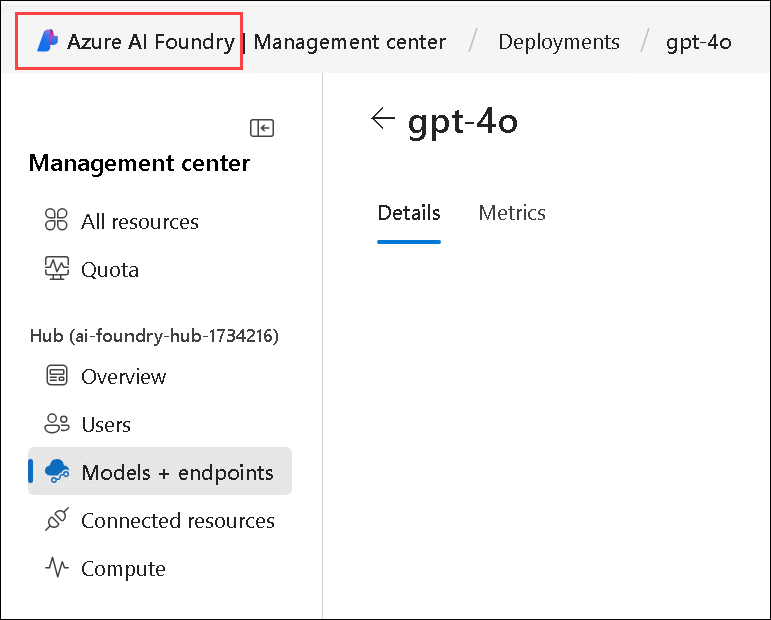

1. Select the **aifoundryhubxxxxxx** resource.

    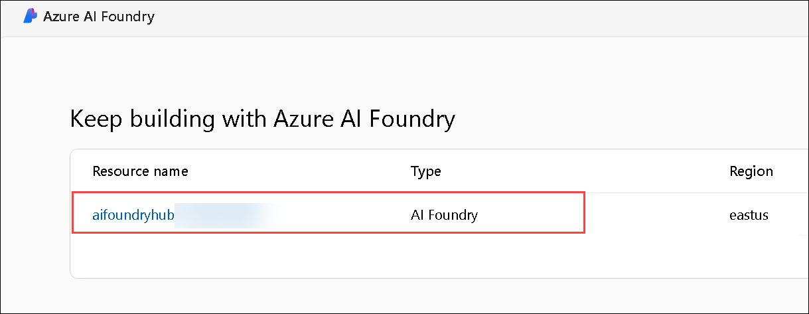

     >**Note**: **xxxxx** refers to randomly generated suffix.

1. Navigate to **Model + endpoints (1)**, then select **gpt-4o (2)** model and the click on **Open in Playground (3)**.

    

1. Replace the existing text with `Extract the United States Postal Service (USPS) formatted address from the following email` **(1)** then click on **Apply changes (2)**. Using this you can explore the capabilities of Azure OpenAI.

    

1. Click on **Continue**.

    

1. Provide the below mail in the chat **(1)** then click on **Send (2)** to identify and extract the postal address from the following email:
    ```
    Subject: Elevate Your Brand with Our Comprehensive Marketing Solutions!
    From: BrightEdge Marketing
    To: John Doe

    Dear John,
    At BrightEdge Marketing, we believe in the power of innovative marketing strategies to elevate brands and drive business success. Our team of experts is dedicated to helping you achieve your marketing goals through a comprehensive suite of services tailored to your unique needs.

    Please send letters to 123 Marketing Lane, Suite 400, in area 90210, Innovation City, California.

    Thank you for considering BrightEdge Marketing.
    Best regards,
    Sarah Thompson
    Marketing Director BrightEdge Marketing
    ```

    
    
1. You will receive a response similar to the one shown below:

    

> **Congratulations** on completing the task! Now, it's time to validate it. Here are the steps:

- Hit the Validate button for the corresponding task. If you receive a success message, you can proceed to the next task. 
- If not, carefully read the error message and retry the step, following the instructions in the lab guide.
- If you need any assistance, please contact us at cloudlabs-support@spektrasystems.com. We are available 24/7 to help you out.

<validation step="2b3e38c5-a34d-4134-9f1e-1625b32328c0" />  

### Task 2: Create Azure AI Search

In this task you will create a Azure AI Search resource.

1. Navigate back to the **Azure portal**.

1. On the search bar, search for **AI Search (1)** then select **AI Search (2)** from the services.
    
      

1. Select **AI Search (1)** then click on **+ Create (2)**.
    
      

1. On the **Create a search service** page, provide the following details and then click on **Review+create (5)**:

    - Subscription: Leave the default one **(1)**
    - Resource group: Select **ai-foundry-<inject key="Deployment ID" enableCopy="false"></inject> (2)**
    - Service name: Enter **ai-search-<inject key="Deployment ID" enableCopy="false"></inject> (3)**
    - Region: **<inject key="Region" enableCopy="false"></inject> (4)** 

        

1. Click on **Create**.
    
    

## Exercise 2: Semantic Kernel Fundamentals

### Estimated Duration: 25 Minutes

This hands-on lab provides practical experience with Semantic Kernel and the Azure AI Foundry GPT-4o model. Designed for those new to AI development, the lab guides you step-by-step on how to build an intelligent chat feature within a starter application. You will use the Semantic Kernel framework to connect with the GPT-4o model, implement a chat API that sends user prompts, and return dynamic AI-generated responses.

### Objectives
In this exercise, you will be performing the following tasks:
- Task 1: Set up environment variables
- Task 2: Update the code files and run the app

### Task 1: Set up environment variables

In this task, you will explore different flow types in Azure AI Foundry by setting up Visual Studio Code, retrieving Azure OpenAI credentials, and configuring them in Python and C# environments.

1. Open **Visual Studio Code** using the desktop shortcut in the labvm.

1. Click on **File (1)** and select **Open Folder (2)**.

     
    
1. Navigate to `C:\LabFiles` (1), select the **ai-developer (2)** folder, and click **Select Folder (3)**.

     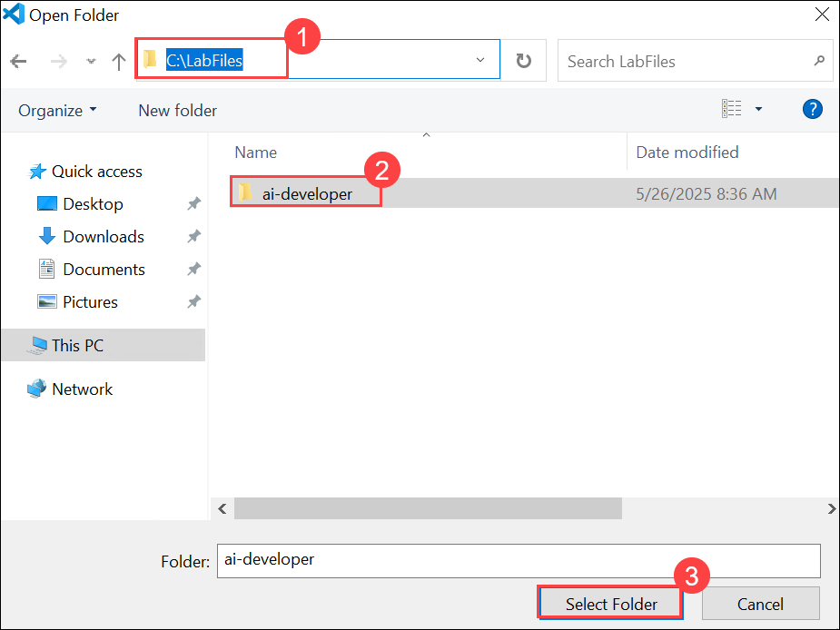

1. If you receive a `Do you trust the authors of the files in folder` warning, select the **checkbox (1)** and click **Yes, I trust the authors (2)**.

     

1. Navigate to the **AI Foundry** Portal, go to the **Home (1)** page, select **Azure OpenAI (2)**. Then **Copy (3)** the endpoint and paste it into **Notepad** to be used in the upcoming exercises.

     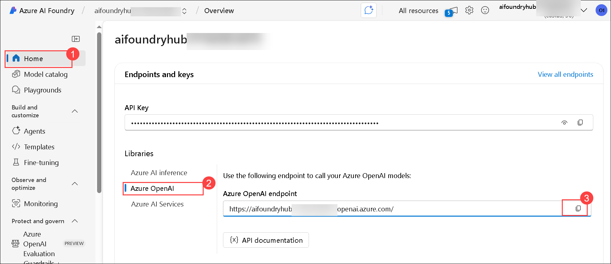

1. Copy the **API key** from the AI Foundry Portal and paste it into **Notepad** for use in the upcoming exercises.

     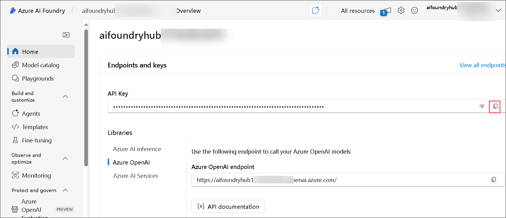

### Python:

1. Navigate to `Python>src` directory and open **.env** (1) file.

     

1. Paste **Azure OpenAI Service endpoint** copied earlier in the exercise besides `AZURE_OPENAI_ENDPOINT`.
    >Note:- Ensure that every value in the **.env** file is enclosed in **double quotes (")**.
1. Paste **API key** copied earlier in the exercise besides `AZURE_OPENAI_API_KEY`.

     

1. Use **Ctrl+S** to save the file.

### C Sharp(C#):

1. Navigate to `Dotnet>src>BlazorAI` directory and open **appsettings.json** file.

     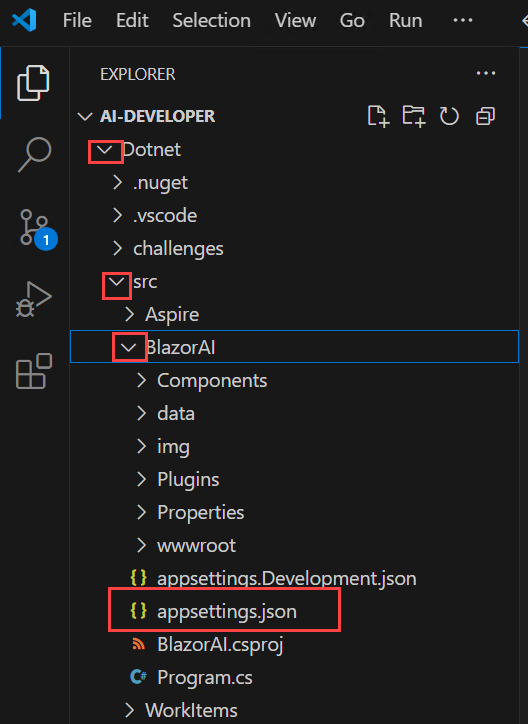

1. Paste **Azure OpenAI Service endpoint** copied earlier in the exercise besides `AOI_ENDPOINT`.
    >**Note**:- Ensure that every value in the **appsettings.json** file is enclosed in **double quotes (")**.

    >**Note**:- Make sure to remove the "/" from the endpoint.
1. Paste **API key** copied earlier in the exercise besides `AOI_API_KEY`.

     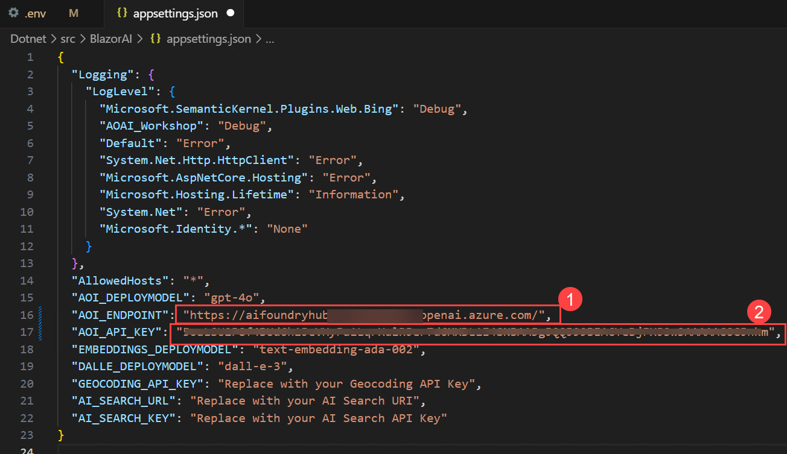

1. Use **Ctrl+S** to save the file.


### Task 2: Update the code files and run the app

In this task, you will explore different flow types in Azure AI Foundry by updating code files, running the AI-powered app in Python and C#, and testing responses to user prompts.

### Python:

1. Navigate to `Python>src` directory and open **chat.py (1)** file.

     

1. Add the following code in the `#Import Modules` (1) section of the file.
    ```
    from semantic_kernel.connectors.ai.chat_completion_client_base import ChatCompletionClientBase
    from semantic_kernel.connectors.ai.open_ai import OpenAIChatPromptExecutionSettings
    import os
    ```

     

1. Add the following code in the `# Challenge 02 - Chat Completion Service` (1) section of the file.
    
    ```
    chat_completion_service = AzureChatCompletion(
        deployment_name=os.getenv("AZURE_OPENAI_CHAT_DEPLOYMENT_NAME"),
        api_key=os.getenv("AZURE_OPENAI_API_KEY"),
        endpoint=os.getenv("AZURE_OPENAI_ENDPOINT"),
        service_id="chat-service",
    )
    kernel.add_service(chat_completion_service)
    execution_settings = kernel.get_prompt_execution_settings_from_service_id("chat-service")
    ```

     

1. Add the following code in the `# Start Challenge 02 - Sending a message to the chat completion service by invoking kernel` section of the file.
    ```
    global chat_history
    chat_history.add_user_message(user_input)
    chat_completion = kernel.get_service(type=ChatCompletionClientBase)
    execution_settings = kernel.get_prompt_execution_settings_from_service_id("chat-service")
    response = await chat_completion.get_chat_message_content(
        chat_history=chat_history,
        settings=execution_settings,
        kernel=kernel
    )
    chat_history.add_assistant_message(str(response))
    ```

     

1. Add the following code in the `#return result` section of the file.
    ```
    logger.info(f"Response: {response}")
    return response
    ```

     

1. In case you encounter any indentation error, use the code from the following URL:
    ```
    https://raw.githubusercontent.com/CloudLabsAI-Azure/ai-developer/refs/heads/prod/CodeBase/python/lab-02.py
    ```
1. Save the file.
1. Right click on `Python>src` in the left pane and select **Open in Integrated Terminal**.

     

1. Use the following command to run the app:
    ```
    streamlit run app.py
    ```
1. If you are asked for any email to register, feel free to use the below provided email, and hit **Enter**:

     ```
     test@gmail.com
     ```

      

1. If the app does not open automatically in the browser, you can access it using the following **URL**:

     ```
     http://localhost:8501
     ```
1. Submit the following prompt and see how the AI responds:

     ```
     Why is the sky blue?
     ```
     ```
     Why is it red?
     ```
1. You will receive a response similar to the one shown below:

     

### C Sharp(C#):

1. Navigate to `Dotnet>src>BlazorAI>Components>Pages` directory and open **Chat.razor.cs (1)** file.

     

1. Add the following code in the `// Your code goes here(Line no. 92)` (1) section of the file.

     ```
     chatHistory.AddUserMessage(userMessage);
     var chatCompletionService = kernel.GetRequiredService<IChatCompletionService>();
     var assistantResponse = await chatCompletionService.GetChatMessageContentAsync(
        chatHistory: chatHistory,
        kernel: kernel);
    
     chatHistory.AddAssistantMessage(assistantResponse.Content);
     ```

      

1. In case you encounter any indentation error, use the code from the following URL: 

     ```
     https://raw.githubusercontent.com/CloudLabsAI-Azure/ai-developer/refs/heads/prod/CodeBase/c%23/lab-02.cs
     ```

1. Use **Ctrl+S** to save the file.

1. Right click on `Dotnet>src>Aspire>Aspire.AppHost` **(1)** in the left pane and select **Open in Integrated Terminal (2)**.

     

1. Run the following line of code to trust the dev certificates necessary to run the app locally, and then select **Yes**:

     ```
     dotnet dev-certs https --trust
     ```

      

1. Use the following command to run the app:

     ```
     dotnet run
     ```
1. Open a new tab in the browser and navigate to the link for **blazor-aichat**, i.e. **https://localhost:7118/**.

    >**Note**: If you receive security warnings in the browser, close the browser and follow the link again.

1. Submit the following prompt and see how the AI responds:

     ```
     Why is the sky blue?
     ```
     ```
     Why is it red?
     ```
1. You will receive a response similar to the one shown below:

     

1. Once you receive the response, navigate back to the Visual studio code terminal and then press **Ctrl+C** to stop the build process.

## Exercise 3: Semantic Kernel Plugins

### Estimated Duration: 50 Minutes

This hands-on lab explores the power of plugins in enhancing LLM development with Semantic Kernel. Designed for those new to AI extensibility, the lab guides you through building and integrating plugins to expand the capabilities of your chatbot. You will implement a time and weather retrieval plugin, enabling your AI to access real-time and contextual data beyond its training scope. Additionally, you will learn to develop Semantic Kernel plugins in Python and leverage Auto Function Calling to chain them together seamlessly.

### Objectives
In this exercise, you will be performing the following tasks:
- Task 1: Try the app without the Time Plugin
- Task 2: Create and import the Time Plugin
- Task 3: Create and import the Geocoding Plugin
- Task 4: Create and import the Weather Plugin

### Task 1: Try the app without the Time Plugin

In this task, you will explore different flow types in Azure AI Foundry by running the app without the Time Plugin to observe its default behavior.

1. Launch your AI Chat app in any of the languages, and submit the following prompt:
    ```
    What time is it?
    ```
2. Since the AI cannot provide real-time information, you will get a response similar to the following:
    ```
    I can't provide real-time information, including the current time. You can check the time on your device or through various online sources.
    ```

    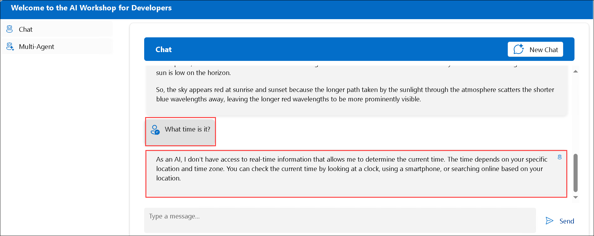

### Task 2: Create and import the Time Plugin

In this task, you will explore different flow types in Azure AI Foundry by creating and importing the Time Plugin to enhance the app's functionality.

### Python:

1. Navigate to `Python>src>plugins` directory, right click on **Plugins** then click on **New file** and then create a new file named **time_plugin.py (1)**.

    

1. Add the following code to the file:
    ```
    from datetime import datetime
    from typing import Annotated
    from semantic_kernel.functions import kernel_function


    class TimePlugin:
        @kernel_function()
        def current_time(self) -> str:
            return datetime.now().strftime("%Y-%m-%d %H:%M:%S")

        @kernel_function()
        def get_year(self, date_str: Annotated[str, "The date string in format YYYY-MM-DD"] = None) -> str:
            if date_str is None:
                return str(datetime.now().year)
            
            try:
                date_obj = datetime.strptime(date_str, "%Y-%m-%d")
                return str(date_obj.year)
            except ValueError:
                return "Invalid date format. Please use YYYY-MM-DD."

        @kernel_function()
        def get_month(self, date_str: Annotated[str, "The date string in format YYYY-MM-DD"] = None) -> str:
            if date_str is None:
                return datetime.now().strftime("%B")
            
            try:
                date_obj = datetime.strptime(date_str, "%Y-%m-%d")
                return date_obj.strftime("%B")  # Full month name
            except ValueError:
                return "Invalid date format. Please use YYYY-MM-DD."

        @kernel_function()
        def get_day_of_week(self, date_str: Annotated[str, "The date string in format YYYY-MM-DD"] = None) -> str:
            if date_str is None:
                return datetime.now().strftime("%A")
            
            try:
                date_obj = datetime.strptime(date_str, "%Y-%m-%d")
                return date_obj.strftime("%A")  # Full weekday name
            except ValueError:
                return "Invalid date format. Please use YYYY-MM-DD."
    ```
1. Save the file.

1. Navigate to `Python>src` directory and open **chat.py (1)** file.

    

1. Add the following code in the `#Import Modules` section of the file.
    ```
    from semantic_kernel.connectors.ai.open_ai.prompt_execution_settings.azure_chat_prompt_execution_settings import (
        AzureChatPromptExecutionSettings,
    )
    from plugins.time_plugin import TimePlugin
    ```
    
    

1. Add the following code in the `#Challenge 03 - Create Prompt Execution Settings` **(1)** section of the file.
    ```
    execution_settings = AzureChatPromptExecutionSettings()
    execution_settings.function_choice_behavior = FunctionChoiceBehavior.Auto()
    logger.info("Automatic function calling enabled")
    ```

    

1. Add the following code in the `# Placeholder for Time plugin` section of the file.
    ```
    time_plugin = TimePlugin()
    kernel.add_plugin(time_plugin, plugin_name="TimePlugin")
    logger.info("Time plugin loaded")
    ```

    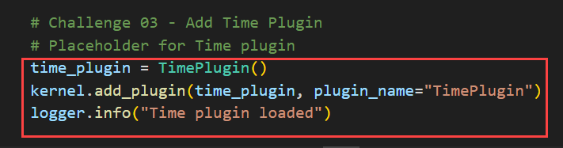

1. Search (using Ctrl+F) and remove the following piece of code from the file as we will enable automatic function calling and this is no longer required:
    ```
    execution_settings = kernel.get_prompt_execution_settings_from_service_id("chat-service")
    ```
    >**Note**: You need to remove it from two code blocks; one will be inside the **def initialize_kernel():** function, and another will be in the **global chat_history** code block.
1. In case you encounter any indentation error, use the code from the following URL:
    ```
    https://raw.githubusercontent.com/CloudLabsAI-Azure/ai-developer/refs/heads/prod/CodeBase/python/lab-03_time_plugin.py
    ```
1. Save the file.
1. Right-click on `Python>src` **(1)** in the left pane and select **Open in Integrated Terminal (2)**.

    
1. Use the following command to run the app:
    ```
    streamlit run app.py
    ```
1. If the app does not open automatically in the browser, you can access it using the following **URL**:
    ```
    http://localhost:8501
    ```
1. Submit the following prompt:
    ```
    What time is it?
    ```
1. Since the AI has the **Time Plugin**, it will be able to provide real-time information, you will get a response similar to the following:
    ```
    The current time is 3:43 PM on January 23, 2025.
    ```

    


### C Sharp(C#):

1. Navigate to `Dotnet>src>BlazorAI>Plugins` directory, right click on **Plugins** then click on **New file** and then  and create a new file named **TimePlugin.cs (1)**.

    
1. Add the following code to the file:
    ```
    using System;
    using System.ComponentModel;
    using System.Globalization;
    using Microsoft.SemanticKernel;

    namespace BlazorAI.Plugins
    {
        public class TimePlugin
        {        
            [KernelFunction("current_time")]
            [Description("Gets the current date and time from the server. Use this directly when the user asks what time it is or wants to know the current date.")]
            public string CurrentTime()
            {
                return DateTime.Now.ToString("yyyy-MM-dd HH:mm:ss");
            }

            [KernelFunction("get_current_time")]
            [Description("Gets the current date and time from the server's system clock. Use this directly without asking the user for their location.")]
            public string GetCurrentTime()
            {
                return DateTime.Now.ToString("yyyy-MM-dd HH:mm:ss");
            }
            
            [KernelFunction("get_year")]
            [Description("Extract the year from a date string or get the current year from the system clock. Examples: 'What year is it now?' or 'What year is 2023-05-15?'")]
            public string GetYear(
                [Description("The date string. Accepts formats like YYYY-MM-DD, MM/DD/YYYY, etc. If not provided, uses the server's current date.")] 
                string? dateStr = null)
            {
                if (string.IsNullOrEmpty(dateStr))
                {
                    return DateTime.Now.Year.ToString();
                }

                DateTime date;
                if (TryParseDate(dateStr, out date))
                {
                    return date.Year.ToString();
                }
                
                return $"Could not parse '{dateStr}' as a valid date. Please provide a date in a standard format like YYYY-MM-DD or MM/DD/YYYY.";
            }
            
            [KernelFunction("get_month")]
            [Description("Extract the month name from a date string or get the current month from the system clock. Examples: 'What month is it now?' or 'What month is 2023-05-15?'")]
            public string GetMonth(
                [Description("The date string. Accepts formats like YYYY-MM-DD, MM/DD/YYYY, etc. If not provided, uses the server's current date.")] 
                string? dateStr = null)
            {
                if (string.IsNullOrEmpty(dateStr))
                {
                    return DateTime.Now.ToString("MMMM");
                }
                
                DateTime date;
                if (TryParseDate(dateStr, out date))
                {
                    return date.ToString("MMMM"); // Full month name
                }
                
                return $"Could not parse '{dateStr}' as a valid date. Please provide a date in a standard format like YYYY-MM-DD or MM/DD/YYYY.";
            }
            
            [KernelFunction("get_day_of_week")]
            [Description("Get the day of week from the server's system clock or for a specific date. Examples: 'What day is it today?' or 'What day of the week is 2023-05-15?'")]
            public string GetDayOfWeek(
                [Description("The date string. Accepts formats like YYYY-MM-DD, MM/DD/YYYY, etc. If not provided, uses the server's current date.")] 
                string? dateStr = null)
            {
                if (string.IsNullOrEmpty(dateStr))
                {
                    return DateTime.Now.ToString("dddd");
                }
                
                DateTime date;
                if (TryParseDate(dateStr, out date))
                {
                    return date.ToString("dddd"); // Full day name
                }
                
                return $"Could not parse '{dateStr}' as a valid date. Please provide a date in a standard format like YYYY-MM-DD or MM/DD/YYYY.";
            }

            private bool TryParseDate(string dateStr, out DateTime result)
            {
                string[] formats = { 
                    "yyyy-MM-dd", "MM/dd/yyyy", "dd/MM/yyyy", 
                    "M/d/yyyy", "d/M/yyyy", "MMM d, yyyy", 
                    "MMMM d, yyyy", "yyyy/MM/dd", "dd-MMM-yyyy"
                };
                
                return DateTime.TryParseExact(
                    dateStr, 
                    formats, 
                    CultureInfo.InvariantCulture,
                    DateTimeStyles.None, 
                    out result) || DateTime.TryParse(dateStr, out result);
            }
        }
    }
    ```
1. Save the file.
1. Navigate to `Dotnet>src>BlazorAI>Components>Pages` directory and open **Chat.razor.cs (1)** file.

    
1. Add the following code in the `// Import Models` **(1)** section of the file.
    ```
    using Microsoft.SemanticKernel.Connectors.OpenAI;
    using BlazorAI.Plugins;
    using System;
    ```

    
1. Search **private Kernel? kernel;** (using Ctrl+F)  and add the following piece of code below it:
    ```
    private OpenAIPromptExecutionSettings? promptSettings;
    ```

    
1. Search **chatHistory = [];** (using Ctrl+F)  and add the following piece of code below it:
    ```
    chatHistory = new ChatHistory();
    ```

    
1. Add the following code in the `// Challenge 03 - Create OpenAIPromptExecutionSettings` (1) section of the file.
    ```
    promptSettings = new OpenAIPromptExecutionSettings
    {
        ToolCallBehavior = ToolCallBehavior.AutoInvokeKernelFunctions,
        Temperature = 0.7,
        TopP = 0.95,
        MaxTokens = 800
    };
    ```

    

     >**Note**: Please refer the screenshots to locate the code in proper position that helps you to avoid indentation error.

1. Add the following code in the `// Challenge 03 - Add Time Plugin` section of the file.
    ```
    var timePlugin = new Plugins.TimePlugin();
    kernel.ImportPluginFromObject(timePlugin, "TimePlugin");
    ```

    
1. Search **var assistantResponse = await chatCompletionService.GetChatMessageContentAsync** (using Ctrl+F)  and add the following line of code between chatHistory and kernel:
    ```
    executionSettings: promptSettings,
    ```
    >**Note**: The final piece of code will be similar to the code below:
    ```
    var assistantResponse = await chatCompletionService.GetChatMessageContentAsync(
        chatHistory: chatHistory,
        executionSettings: promptSettings,
        kernel: kernel);
    ```
    
    
1. In case you encounter any indentation error, use the code from the following URL:
    ```
    https://raw.githubusercontent.com/CloudLabsAI-Azure/ai-developer/refs/heads/prod/CodeBase/c%23/lab-03_time_plugin.cs
    ```
1. Save the file.

1. Right click on `Dotnet>src>Aspire>Aspire.AppHost` **(1)** in the left pane and select **Open in Integrated Terminal (2)**.

    
1. Use the following command to run the app:
    ```
    dotnet run
    ```
1. Open a new tab in the browser and navigate to the link for **blazor-aichat**, i.e. **https://localhost:7118/**.
1. Submit the following prompt:
    ```
    What time is it?
    ```
1. Since the AI has the **Time Plugin**, it will be able to provide real-time information, and you will get a response similar to the following:
    ```
    The current time is 3:43 PM on January 23, 2025.
    ```

    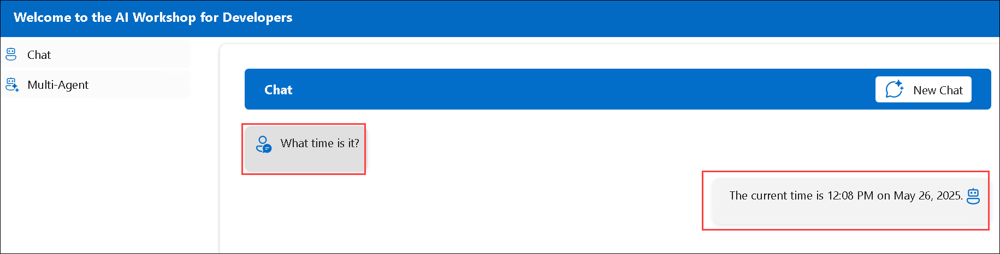

1. Once you receive the response, navigate back to the Visual studio code terminal and then press **Ctrl+C** to stop the build process.

### Task 3: Create and import the Geocoding Plugin

In this task, you will explore different flow types in Azure AI Foundry by creating and importing the Geocoding Plugin to enable location-based functionality.

1. Open a new tab in the browser, navigate to the [Geocoding API](https://geocode.maps.co/) portal, and click on the **Free API Key** button on the top.

    

1. Enter your details and click on **Create Account (1)**.

    
    >**Note**: Use your personal or work e-mail ID to register.
1. You will receive an e-mail. Click on the link in the e-mail to verify your e-mail.

    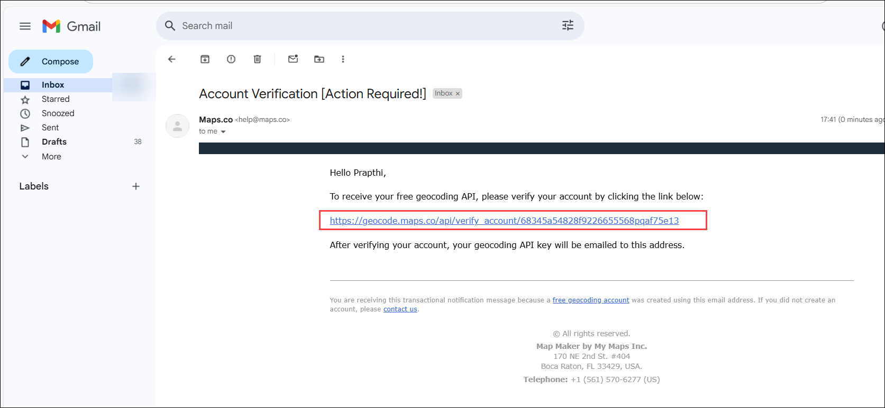

1. You will receive your free **geocoding API key,** save it in Notepad for further use.

    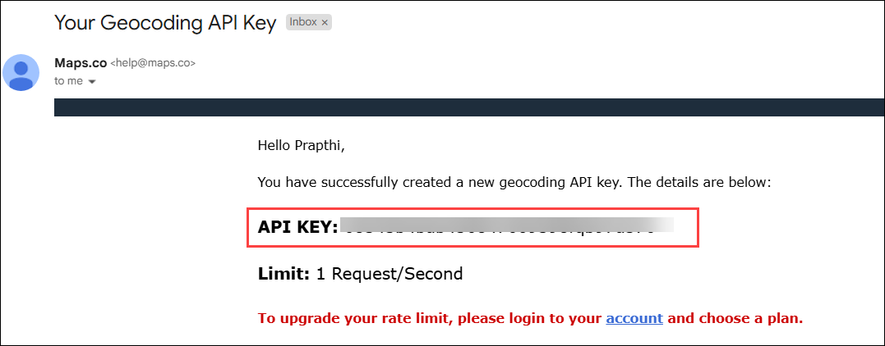

### Python:

1. Navigate to `Python>src` directory and open **.env (1)** file.

    
1. Paste the geocoding API key you received just now via e-mail besides `GEOCODING_API_KEY`.

    
    >Note:- Ensure that every value in the **.env** file is enclosed in **double quotes (")**.
1. Save the file.
1. Navigate to `Python>src` directory and open **chat.py** file.

    
1. Add the following code in the `#Import Modules` section of the file.
    ```
    from plugins.geo_coding_plugin import GeoPlugin
    ```

     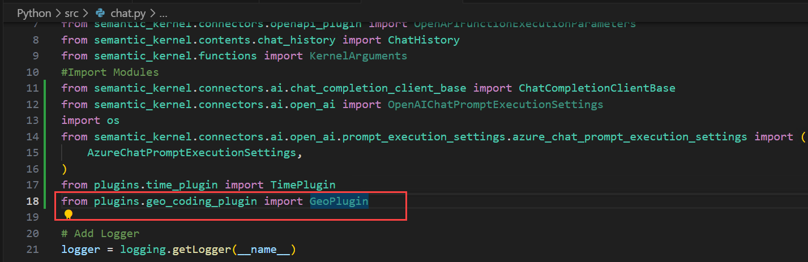

1. Add the following code in the `# Placeholder for Time plugin` section, after the **time plugin** in the file.
    ```
    kernel.add_plugin(
        GeoPlugin(),
        plugin_name="GeoLocation",
    )
    logger.info("GeoLocation plugin loaded")
    ```

    

     >**Note**: Please refer the screenshots to locate the code in proper position that helps you to avoid indentation error.

1. In case you encounter any indentation error, use the code from the following URL:
    ```
    https://raw.githubusercontent.com/CloudLabsAI-Azure/ai-developer/refs/heads/prod/CodeBase/python/lab-03_geo_coding.py
    ```
1. Save the file.
1. Right click on `Python>src` **(1)** in the left pane and select **Open in Integrated Terminal (2)**.

    
1. Use the following command to run the app:
    ```
    streamlit run app.py
    ```
1. If the app does not open automatically in the browser, you can access it using the following **URL**:
    ```
    http://localhost:8501
    ```
1. Submit the following prompt:
    ```
    What are the geo-coordinates for Tampa, FL
    ```
1. Since the AI has the **Geocoding Plugin**, it will be able to provide real-time information, you will get a response similar to the following:
    ```
    The geo-coordinates for Tampa, FL are:

    Latitude: 27.9477595
    Longitude: -82.458444 
    ```

    

### C Sharp(C#):

1. Navigate to `Dotnet>src>BlazorAI` directory and open **appsettings.json** file.

    
1. Paste the geocoding API key you received just now via e-mail besides `GEOCODING_API_KEY`.

    
    >Note:- Ensure that every value in the **appsettings.json** file is enclosed in **double quotes (")**.
1. Save the file.
1. Navigate to `Dotnet>src>BlazorAI>Components>Pages` directory and open **Chat.razor.cs** file.

    
1. Add the following code in the `// Challenge 03 - Add Time Plugin` section, after the **time plugin** in the file.
    ```
    var geocodingPlugin = new GeocodingPlugin(
        kernel.Services.GetRequiredService<IHttpClientFactory>(), 
        Configuration);
    kernel.ImportPluginFromObject(geocodingPlugin, "GeocodingPlugin");
    ```

    

     >**Note**: Please refer the screenshots to locate the code in proper position that helps you to avoid indentation error.

1. In case you encounter any indentation error, use the code from the following URL:
    ```
    https://raw.githubusercontent.com/CloudLabsAI-Azure/ai-developer/refs/heads/prod/CodeBase/c%23/lab-03_geo_coding.cs
    ```
1. Save the file.
1. Right click on `Dotnet>src>Aspire>Aspire.AppHost` **(1)** in the left pane and select **Open in Integrated Terminal (2)**.

    
1. Use the following command to run the app:
    ```
    dotnet run
    ```
1. Open a new tab in the browser and navigate to the link for **blazor-aichat** i.e **https://localhost:7118/**
1. Submit the following prompt:
    ```
    What are the geo-coordinates for Tampa, FL
    ```
1. Since the AI has the **Geocoding Plugin**, it will be able to provide real-time information, you will get a response similar to the following:
    ```
    The geo-coordinates for Tampa, FL are:

    Latitude: 27.9477595
    Longitude: -82.458444 
    ```

    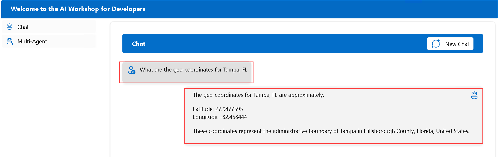

### Task 4: Create and import the Weather Plugin

In this task, you will explore different flow types in Azure AI Foundry by creating and importing the Weather Plugin to integrate weather-related functionality.

### Python:

1. Navigate to `Python>src>plugins` directory and create a new file named **weather_plugin.py (1)**.

    
1. Add the following code in the file:
    ```
    from typing import Annotated
    import requests
    from semantic_kernel.functions import kernel_function
    import json
    from datetime import datetime, timedelta

    class WeatherPlugin:
        @kernel_function(description="Get weather forecast for a location up to 16 days in the future")
        def get_forecast_weather(self, 
                                latitude: Annotated[float, "Latitude of the location"],
                                longitude: Annotated[float, "Longitude of the location"],
                                days: Annotated[int, "Number of days to forecast (up to 16)"] = 16):
            
            # Ensure days is within valid range (API supports up to 16 days)
            if days > 16:
                days = 16
            
            url = (f"https://api.open-meteo.com/v1/forecast"
                f"?latitude={latitude}&longitude={longitude}"
                f"&daily=temperature_2m_max,temperature_2m_min,precipitation_sum,precipitation_probability_max,weather_code"
                f"&amp;current=temperature_2m,relative_humidity_2m,apparent_temperature,precipitation,weather_code,wind_speed_10m"
                f"&temperature_unit=fahrenheit&wind_speed_unit=mph&precipitation_unit=inch"
                f"&forecast_days={days}&timezone=auto")
            
            try:
                response = requests.get(url)
                response.raise_for_status()
                data = response.json()
                
                daily = data.get('daily', {})
                times = daily.get('time', [])
                max_temps = daily.get('temperature_2m_max', [])
                min_temps = daily.get('temperature_2m_min', [])
                precip_sums = daily.get('precipitation_sum', [])
                precip_probs = daily.get('precipitation_probability_max', [])
                weather_codes = daily.get('weather_code', [])
                
                forecasts = []
                for i in range(len(times)):
                    # Convert date string to datetime object for day name
                    date_obj = datetime.strptime(times[i], "%Y-%m-%d")
                    day_name = date_obj.strftime("%A, %B %d")
                    
                    weather_desc = self._get_weather_description(weather_codes[i])
                    
                    forecast = {
                        "date": times[i],
                        "day": day_name,
                        "high_temp": f"{max_temps[i]}°F",
                        "low_temp": f"{min_temps[i]}°F",
                        "precipitation": f"{precip_sums[i]} inches",
                        "precipitation_probability": f"{precip_probs[i]}%",
                        "conditions": weather_desc
                    }
                    forecasts.append(forecast)
                
                result = {
                    "location_coords": f"{latitude}, {longitude}",
                    "forecast_days": len(forecasts),
                    "forecasts": forecasts
                }
                
                # For more concise output in chat
                return json.dumps(result, indent=2)
            except Exception as e:
                return f"Error fetching forecast weather: {str(e)}"
        
        def _get_weather_description(self, code):
            weather_codes = {
                0: "Clear sky",
                1: "Mainly clear", 2: "Partly cloudy", 3: "Overcast",
                45: "Fog", 48: "Depositing rime fog",
                51: "Light drizzle", 53: "Moderate drizzle", 55: "Dense drizzle",
                56: "Light freezing drizzle", 57: "Dense freezing drizzle",
                61: "Slight rain", 63: "Moderate rain", 65: "Heavy rain",
                66: "Light freezing rain", 67: "Heavy freezing rain",
                71: "Slight snow fall", 73: "Moderate snow fall", 75: "Heavy snow fall",
                77: "Snow grains",
                80: "Slight rain showers", 81: "Moderate rain showers", 82: "Violent rain showers",
                85: "Slight snow showers", 86: "Heavy snow showers",
                95: "Thunderstorm", 96: "Thunderstorm with slight hail", 99: "Thunderstorm with heavy hail"
            }
            return weather_codes.get(code, "Unknown")
    ```
1. Save the file.
1. Navigate to `Python>src` directory and open **chat.py (1)** file.

    
1. Add the following code in the `#Import Modules` section of the file.
    ```
    from plugins.weather_plugin import WeatherPlugin
    ```

    
1. Add the following code in the `# Placeholder for Time plugin` section, after the **Geocoding plugin** in the file.
    ```
    kernel.add_plugin(
        WeatherPlugin(),
        plugin_name="Weather",
    )
    logger.info("Weather plugin loaded")
    ```

    

     >**Note**: Please refer the screenshots to locate the code in proper position that helps you to avoid indentation error.    
1. In case you encounter any indentation error, use the code from the following URL:
    ```
    https://raw.githubusercontent.com/CloudLabsAI-Azure/ai-developer/refs/heads/prod/CodeBase/python/lab-03_weather.py
    ```
1. Save the file.
1. Right click on `Python>src` **(1)** in the left pane and select **Open in Integrated Terminal (2)**.

    

1. Use the following command to run the app:
    ```
    streamlit run app.py
    ```
1. If the app does not open automatically in the browser, you can access it using the following **URL**:
    ```
    http://localhost:8501
    ```
1. Submit the following prompt:
    ```
    What is today's weather in San Francisco?
    ```
1. You will receive a response similar to the one shown below:

    

    The AI will perform the following plan to answer the question but may do so in a different order or different set of functions:

    1️⃣ The AI should ask Semantic Kernel to call the GetDate function on the Time Plugin to get today's date in order to calculate the number of days until next Thursday

    2️⃣ Because the Weather Forecast requires a Latitude and Longitude, the AI should instruct Semantic Kernel to call the GetLocation function on the Geocoding Plugin to get the coordinates for San Francisco

    3️⃣ Finally, the AI should ask Semantic Kernel to call the GetWeatherForecast function on the Weather Plugin passing in the current date/time and Lat/Long to get the weather forecast for Next Thursday (expressed as the number of days in the future) at the coordinates for San Francisco

    A simplified sequence diagram between Semantic Kernel and AI is shown below:

    

### C Sharp(C#):

1. Navigate to `Dotnet>src>BlazorAI>Plugins` directory and create a new file named **WeatherPlugin.cs (1)**.

    
1. Add the following code in the file:
    ```
    using System;
    using System.Collections.Generic;
    using System.ComponentModel;
    using System.Globalization;
    using System.Net.Http;
    using System.Text.Json;
    using System.Threading.Tasks;
    using Microsoft.SemanticKernel;

    namespace BlazorAI.Plugins
    {
        public class WeatherPlugin
        {
            private readonly IHttpClientFactory _httpClientFactory;

            public WeatherPlugin(IHttpClientFactory httpClientFactory)
            {
                _httpClientFactory = httpClientFactory;
            }

            [KernelFunction("GetWeatherForecast")]
            [Description("Get weather forecast for a location up to 16 days in the future")]
            public async Task<string> GetWeatherForecastAsync(
                [Description("Latitude of the location")] double latitude,
                [Description("Longitude of the location")] double longitude,
                [Description("Number of days to forecast (up to 16)")] int days = 16)
            {
                // Ensure days is within valid range (API supports up to 16 days)
                if (days > 16)
                    days = 16;

                var url = $"https://api.open-meteo.com/v1/forecast" +
                        $"?latitude={latitude}&longitude={longitude}" +
                        $"&daily=temperature_2m_max,temperature_2m_min,precipitation_sum,precipitation_probability_max,weather_code" +
                        $"&current=temperature_2m,relative_humidity_2m,apparent_temperature,precipitation,weather_code,wind_speed_10m" +
                        $"&temperature_unit=fahrenheit&wind_speed_unit=mph&precipitation_unit=inch" +
                        $"&forecast_days={days}&timezone=auto";

                try
                {
                    var httpClient = _httpClientFactory.CreateClient();
                    var response = await httpClient.GetAsync(url);
                    response.EnsureSuccessStatusCode();
                    
                    var content = await response.Content.ReadAsStringAsync();
                    var data = JsonDocument.Parse(content);
                    
                    // Extract daily forecast data
                    var dailyElement = data.RootElement.GetProperty("daily");
                    var times = dailyElement.GetProperty("time").EnumerateArray().ToArray();
                    var maxTemps = dailyElement.GetProperty("temperature_2m_max").EnumerateArray().ToArray();
                    var minTemps = dailyElement.GetProperty("temperature_2m_min").EnumerateArray().ToArray();
                    var precipSums = dailyElement.GetProperty("precipitation_sum").EnumerateArray().ToArray();
                    var precipProbs = dailyElement.GetProperty("precipitation_probability_max").EnumerateArray().ToArray();
                    var weatherCodes = dailyElement.GetProperty("weather_code").EnumerateArray().ToArray();
                    
                    // Build a readable forecast for each day
                    var forecasts = new List<object>();
                    for (int i = 0; i < times.Length; i++)
                    {
                        // Convert date string to DateTime object for day name
                        var dateStr = times[i].GetString();
                        var dateObj = DateTime.Parse(dateStr!);
                        var dayName = dateObj.ToString("dddd, MMMM dd", CultureInfo.InvariantCulture);
                        
                        var weatherDesc = GetWeatherDescription(weatherCodes[i].GetInt32());
                        
                        var forecast = new
                        {
                            date = dateStr,
                            day = dayName,
                            high_temp = $"{maxTemps[i]}°F",
                            low_temp = $"{minTemps[i]}°F", 
                            precipitation = $"{precipSums[i]} inches",
                            precipitation_probability = $"{precipProbs[i]}%",
                            conditions = weatherDesc
                        };
                        
                        forecasts.Add(forecast);
                    }
                    
                    var result = new
                    {
                        location_coords = $"{latitude}, {longitude}",
                        forecast_days = forecasts.Count,
                        forecasts
                    };
                    
                    // For more concise output in chat
                    return JsonSerializer.Serialize(result, new JsonSerializerOptions { WriteIndented = true });
                }
                catch (Exception ex)
                {
                    return $"Error fetching forecast weather: {ex.Message}";
                }
            }
            
            [KernelFunction("GetForecastWithPlugins")]
            [Description("Gets weather forecast for any location by coordinating with Time and Geocoding plugins.")]
            public async Task<string> GetForecastWithPluginsAsync(
                [Description("The kernel instance to use for calling other plugins")] Kernel kernel,
                [Description("The location name (city, address, etc.)")] string location,
                [Description("The day of the week to get forecast for, or number of days in future")] string daySpec = "0")
            {
                try
                {
                    // Step 1: Get current date from Time Plugin
                    var dateResult = await kernel.InvokeAsync("Time", "GetDate");
                    string? todayStr = dateResult.GetValue<string>();
                    if (todayStr == null)
                    {
                        return "Could not determine the current date.";
                    }
                    DateTime today = DateTime.Parse(todayStr);
                    
                    // Step 2: Calculate target day based on specification
                    int daysInFuture;
                    if (int.TryParse(daySpec, out daysInFuture))
                    {
                        // If daySpec is a number, use it directly
                    }
                    else if (Enum.TryParse<DayOfWeek>(daySpec, true, out var targetDay))
                    {
                        // Calculate days until the next occurrence of the target day
                        daysInFuture = ((int)targetDay - (int)today.DayOfWeek + 7) % 7;
                        if (daysInFuture == 0) daysInFuture = 7; // If today is the target day, get next week
                    }
                    else
                    {
                        return $"Invalid day specification: {daySpec}. Please provide a day name or number of days.";
                    }
                    
                    // Step 3: Get location coordinates from Geocoding Plugin
                    var locationResult = await kernel.InvokeAsync("Geocoding", "GetLocation", new() { ["location"] = location });
                    string? locationJson = locationResult.GetValue<string>();
                    
                    if (locationJson == null)
                    {
                        return $"Could not get location data for: {location}";
                    }
                    
                    var locationData = JsonDocument.Parse(locationJson);
                    double latitude, longitude;
                    
                    try {
                        latitude = locationData.RootElement.GetProperty("latitude").GetDouble();
                        longitude = locationData.RootElement.GetProperty("longitude").GetDouble();
                    }
                    catch (Exception)
                    {
                        return $"Could not extract coordinates for location: {location}";
                    }
                    
                    // Step 4: Get weather forecast
                    return await GetWeatherForecastAsync(latitude, longitude, daysInFuture + 1);
                }
                catch (Exception ex)
                {
                    return $"Error coordinating weather forecast: {ex.Message}";
                }
            }

            private string GetWeatherDescription(int code)
            {
                var weatherCodes = new Dictionary<int, string>
                {
                    { 0, "Clear sky" },
                    { 1, "Mainly clear" }, { 2, "Partly cloudy" }, { 3, "Overcast" },
                    { 45, "Fog" }, { 48, "Depositing rime fog" },
                    { 51, "Light drizzle" }, { 53, "Moderate drizzle" }, { 55, "Dense drizzle" },
                    { 56, "Light freezing drizzle" }, { 57, "Dense freezing drizzle" },
                    { 61, "Slight rain" }, { 63, "Moderate rain" }, { 65, "Heavy rain" },
                    { 66, "Light freezing rain" }, { 67, "Heavy freezing rain" },
                    { 71, "Slight snow fall" }, { 73, "Moderate snow fall" }, { 75, "Heavy snow fall" },
                    { 77, "Snow grains" },
                    { 80, "Slight rain showers" }, { 81, "Moderate rain showers" }, { 82, "Violent rain showers" },
                    { 85, "Slight snow showers" }, { 86, "Heavy snow showers" },
                    { 95, "Thunderstorm" }, { 96, "Thunderstorm with slight hail" }, { 99, "Thunderstorm with heavy hail" }
                };
                
                return weatherCodes.TryGetValue(code, out var description) ? description : "Unknown";
            }
        }
    }
    ```
1. Save the file.
1. Navigate to `Dotnet>src>BlazorAI>Components>Pages` directory and open **Chat.razor.cs (1)** file.

    
1. Add the following code in the `// Challenge 03 - Add Time Plugin` section, after the **geocoding plugin** in the file.yeah
    ```
    var weatherPlugin = new WeatherPlugin(
        kernel.Services.GetRequiredService<IHttpClientFactory>());
        kernel.ImportPluginFromObject(weatherPlugin, "WeatherPlugin");
    ```

    
1. In case you encounter any indentation error, use the code from the following URL:
    ```
    https://raw.githubusercontent.com/CloudLabsAI-Azure/ai-developer/refs/heads/prod/CodeBase/c%23/lab-03_weather.cs
    ```
1. Save the file.
1. Right click on `Dotnet>src>Aspire>Aspire.AppHost` in the left pane and select **Open in Integrated Terminal**.

    
1. Use the following command to run the app:
    ```
    dotnet run
    ```
1. Open a new tab in the browser and navigate to the link for **blazor-aichat**, i.e. **https://localhost:7118/**.
1. Submit the following prompt:
    ```
    What is today's weather in San Francisco?
    ```
1. You will receive a response similar to the one shown below:

    

    The AI will perform the following plan to answer the question but may do so in a different order or with a different set of functions:

    1️⃣ The AI should ask Semantic Kernel to call the GetDate function on the Time Plugin to get today's date to calculate the number of days until next Thursday

    2️⃣ Because the Weather Forecast requires a Latitude and Longitude, the AI should instruct Semantic Kernel to call the GetLocation function on the Geocoding Plugin to get the coordinates for San Francisco

    3️⃣ Finally, the AI should ask Semantic Kernel to call the GetWeatherForecast function on the Weather Plugin passing in the current date/time and Lat/Long to get the weather forecast for Next Thursday (expressed as the number of days in the future) at the coordinates for San Francisco

    A simplified sequence diagram between Semantic Kernel and AI is shown below:

    

## Exercise 4: Import Plugin using OpenAPI

### Estimated Duration: 25 Minutes

This hands-on lab explores the integration of OpenAPI with Semantic Kernel to enhance AI-driven applications. Designed for developers new to API orchestration, the lab guides you through leveraging OpenAPI specifications to load external services as plugins dynamically. You will learn to import the provided WorkItems API as an OpenAPI plugin, enabling seamless interaction through AI-driven prompts. By the end of this lab, you will understand how OpenAPI simplifies API integration, reduces manual coding, and enhances the automation of external service calls.

### Objectives
In this exercise, you will be performing the following tasks:
- Task 1: Try the app without the OpenAPI Plugin
- Task 2: Create and import the OpenAPI Plugin

### Task 1: Try the app without the OpenAPI Plugin

In this task, you will explore different flow types in Azure AI Foundry by running the app without the OpenAPI Plugin to observe its default behavior.

1. Launch your AI Chat app in any of the languages, submit the following prompt, and see how it responds:
    ```
    What are my work items?
    ```
1. You will receive a response similar to the one shown below:

    

### Task 2: Create and import the OpenAPI Plugin

In this task, you will explore different flow types in Azure AI Foundry by creating and importing the OpenAPI Plugin to extend the app's capabilities.

### Python:

1. Right click on `Python>src>workitems` in the left pane and select **Open in Integrated Terminal (1)**.

    
1. Use the following command to run the app:
    ```
    python api.py
    ```
    >**Note**:- Please don't close the `terminal`.
1. You can find the OpenAPI spec in the following path `http://127.0.0.1:8000/openapi.json`.

    
1. The Swagger page can be found at `http://127.0.0.1:8000/docs`.

    
1. Navigate to `Python>src` directory and open **chat.py (1)** file.

    
1. Add the following code in the `# Placeholder for OpenAPI plugin` section of the file.
    ```
    kernel.add_plugin_from_openapi(
        plugin_name="get_tasks",
        openapi_document_path="http://127.0.0.1:8000/openapi.json",
        execution_settings=OpenAPIFunctionExecutionParameters(
            enable_payload_namespacing=True,
        )
    )
    ```

    

     >**Note**: Please refer the screenshots to locate the code in proper position that helps you to avoid indentation error.

1. In case you encounter any indentation error, use the code from the following URL:
    ```
    https://raw.githubusercontent.com/CloudLabsAI-Azure/ai-developer/refs/heads/prod/CodeBase/python/lab-04.py
    ```
1. Save the file.
1. Right-click on `Python>src` **(1)** in the left pane and select **Open in Integrated Terminal (2)**.

    
1. Use the following command to run the app:
    ```
    streamlit run app.py
    ```
1. If the app does not open automatically in the browser, you can access it using the following **URL**:
    ```
    http://localhost:8501
    ```
1. Submit the following prompt and see how the AI responds:
    ```
    What are my work items?
    ```
1. You will receive a response similar to the one shown below:

    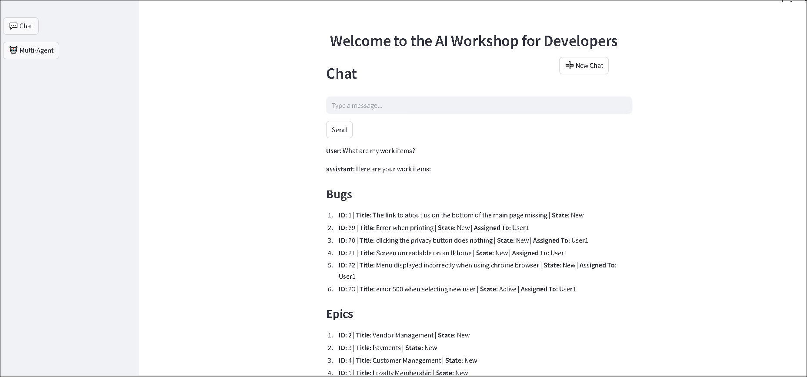


### C Sharp(C#):

1. Right-click on `Dotnet>src>Aspire>Aspire.AppHost` **(1)** in the left pane and select **Open in Integrated Terminal (2)**.

    
1. Use the following command to run the app:
    ```
    dotnet run
    ```
    >**Note**:- Please don't close the `terminal`.
1. You can find the OpenAPI spec in the following path `http://localhost:5115/swagger/v1/swagger.json`.

    
1. The swagger page can be found at `http://localhost:5115/swagger/index.html`.

    
1. Navigate to `Dotnet>src>BlazorAI>Components>Pages` directory and open **Chat.razor.cs (1)** file.

    
1. Add the following code in the `// Import Models` section of the file.
    ```
    using Microsoft.SemanticKernel.Plugins.OpenApi;
    ```

    
1. Add the following code in the `// Challenge 04 - Import OpenAPI Spec` (1) section of the file.
    ```
    await kernel.ImportPluginFromOpenApiAsync(
        pluginName: "todo",
        uri: new Uri("http://localhost:5115/swagger/v1/swagger.json"),
        executionParameters: new OpenApiFunctionExecutionParameters()
        {
            EnablePayloadNamespacing = true
        }
    );
    ```

    

     >**Note**: Please refer the screenshots to locate the code in proper position that helps you to avoid indentation error.

1. In case you encounter any indentation error, use the code from the following URL:
    ```
    https://raw.githubusercontent.com/CloudLabsAI-Azure/ai-developer/refs/heads/prod/CodeBase/c%23/lab-04.cs
    ```
1. Save the file.
1. Right click on `Dotnet>src>Aspire>Aspire.AppHost` **(1)** in the left pane and select **Open in Integrated Terminal (2)**.

    
1. Use the following command to run the app:
    ```
    dotnet run
    ```
1. Open a new tab in the browser and navigate to the link for **blazor-aichat**, i.e. **https://localhost:7118/**.
    >**Note**: If you receive security warnings in the browser, close the browser and follow the link again.
1. Submit the following prompt and see how the AI responds:
    ```
    What are my work items?
    ```
1. You will receive a response similar to the one shown below:

    

1. Once you receive the response, navigate back to the Visual studio code terminal and then press **Ctrl+C** to stop the build process.

## Exercise 5: Retrieval-Augmented Generation (RAG)

### Estimated Duration: 40 Minutes

This hands-on lab introduces you to the Retrieval-Augmented Generation (RAG) pattern—an AI architecture that enhances response quality by integrating relevant external knowledge into the generative process. Designed for those new to RAG, the lab guides you through how retrieval mechanisms work alongside generative models to deliver more accurate, informed, and context-aware outputs. You will also gain a clear understanding of data privacy and security prompts, completions, embeddings, and training data remaining fully isolated—they are not shared with other customers, OpenAI, Microsoft, or third parties, nor are they used to improve models automatically.

### Objectives
In this exercise, you will be performing the following tasks:
- Task 1: Deploy a Text Embedding model
- Task 2: Create a Semantic Search Plugin to query the AI Search Index

### Task 1: Deploy a Text Embedding model

In this task, you will explore different flow types in Azure AI Foundry by deploying a Text Embedding model to enable text representation and similarity analysis.

1. Navigate to the [Azure AI Foundry](https://ai.azure.com/) portal.
1. Click on **Models + endpoints (1)** under **My assets** in the left pane, then click on **+ Deploy model**, followed by **Deploy Base model (2)**.

    
1. Search for **text-embedding-ada-002**, select the model **(1)**, and click on **Confirm (2)**.

    

1. Click on **Deploy**.

1. Navigate back to **Models+endpoints (1)**, select **GPT-4o (2)**, and click on **Open in playground (3)**.

    

1. Click on **Add your data (1)** and select **+ Add a new data source (2)**.

    

1. On the **Select or add data source**blade, provide the following details and then click on **Next (6)**:

    - Select **Upload files (1)** for `Data source`
    - Subscription: Leave the default one **(2)**
    - Select Azure blob Azure Storage blob resouce: Select the storage account that starts with **aifoundryhubxxxxxx (3)**
    - Select Azure AI Search resource: Select **ai-search-<inject key="Deployment ID" enableCopy="false"></inject> (4)** 
    - Enter the index name: Enter **employeehandbook (5)** 
 
      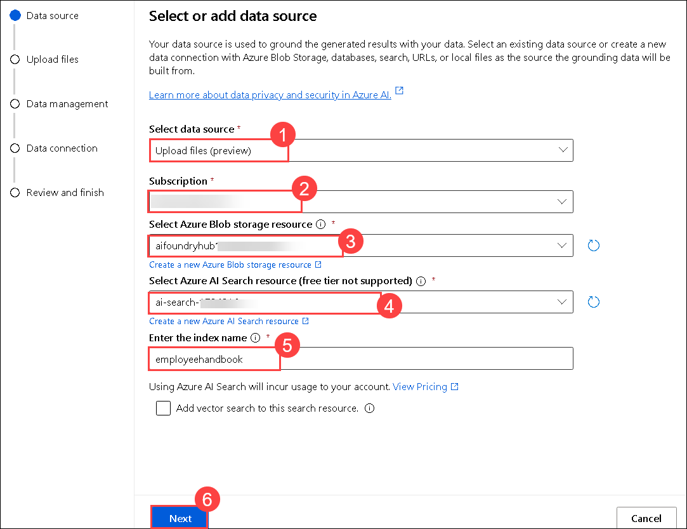

1. Click on **Browse for files**.

    
  
1. Navigate to `C:\LabFiles\ai-developer\Dotnet\src\BlazorAI\data\` and select **employee_handbook.pdf (1).** Click on **Open (2)**.

    

1. Click on **Upload files**.

    

1. Click on **Next**.

1. On the **Data Management** page, click on **Next**.

    

1. On the **Data Connection** blade, select **API Key (1)** for authenticatio and then click on **Next (2)**.    

    

1. Review the configuration and then click on **Save and close**.

    

1. The data injection might take around 5 minutes.

    

1. Navigate to the **Azure Portal** and search **AI Search (1).** Click on it and open the **AI Search (2)** resource located there.

    

1. Select **ai-search-<inject key="Deployment ID" enableCopy="false"></inject>**.    
    
    

1. On the **Overview (1)** page, copy the **URL (2)** and paste it into Notepad.

    
1. Navigate to **Keys (1)** under **Settings** in the left pane, copy the **Primary admin key (2)** from Azure Portal, and paste it into Notepad.

    

> **Congratulations** on completing the task! Now, it's time to validate it. Here are the steps:
 - Hit the Validate button for the corresponding task. If you receive a success message, you can proceed to the next task. 
 - If not, carefully read the error message and retry the step, following the instructions in the lab guide.
 - If you need any assistance, please contact us at cloudlabs-support@spektrasystems.com. We are available 24/7 to help you out.

<validation step="d14590b3-6fd6-4081-858c-f38572b7468c" />  

### Task 2: Create a Semantic Search Plugin to query the AI Search Index

In this task, you will explore different flow types in Azure AI Foundry by creating a Semantic Search Plugin to query the AI Search Index for enhanced retrieval capabilities.

### Python:

1. Navigate to `Python>src` directory and open **.env (1)** file.

    
1. Paste the **AI search URL** that you copied earlier in the exercise besides `AI_SEARCH_URL` in **.env** file.

    >Note:- Ensure that every value in the **.env** file is enclosed in **double quotes (")**.

1. Paste the **Primary admin key** that you copied earlier in the exercise besides `AI_SEARCH_KEY`.

    

1. Save the file.
1. Navigate to `Python>src>plugins` directory and create a new file named **ContosoSearchPlugin.py (1)**.

    
1. Add the following code to the file:
    ```
    import json
    import os
    from typing import Dict, List, Any, Optional

    import requests
    from azure.core.credentials import AzureKeyCredential
    from azure.search.documents import SearchClient
    from azure.search.documents.models import VectorizedQuery
    from dotenv import load_dotenv

    class ContosoSearchPlugin:
        def __init__(self):
            load_dotenv()
            
            self.openai_endpoint = os.getenv("AZURE_OPENAI_ENDPOINT")
            self.openai_api_key = os.getenv("AZURE_OPENAI_API_KEY")
            self.embedding_deployment = os.getenv("AZURE_OPENAI_EMBED_DEPLOYMENT_NAME")
            self.embedding_api_version = os.getenv("AZURE_OPENAI_API_VERSION", "2023-05-15")
            
            self.search_endpoint = os.getenv("AI_SEARCH_URL")
            self.search_key = os.getenv("AI_SEARCH_KEY")
            self.search_index_name = os.getenv("AZURE_SEARCH_INDEX", "employeehandbook")
            
            self.search_client = SearchClient(
                endpoint=self.search_endpoint,
                index_name=self.search_index_name,
                credential=AzureKeyCredential(self.search_key)
            )
            
        def generate_embedding(self, text: str) -> List[float]:
            if not text:
                raise ValueError("Input text cannot be empty")
                
            url = f"{self.openai_endpoint}/openai/deployments/{self.embedding_deployment}/embeddings?api-version={self.embedding_api_version}"
            headers = {
                "Content-Type": "application/json",
                "api-key": self.openai_api_key
            }
            payload = {
                "input": text,
                "dimensions": 1536  # Standard for text-embedding-ada-002
            }
            
            try:
                response = requests.post(url, headers=headers, json=payload)
                response.raise_for_status()
                embedding_data = response.json()
                return embedding_data["data"][0]["embedding"]
            except Exception as e:
                raise Exception(f"Failed to generate embedding: {str(e)}")
        
        def search_documents(self, query: str, top: int = 3) -> List[Dict[str, Any]]:
            try:
                # Generate embedding for the query
                query_embedding = self.generate_embedding(query)
                
                # Create a vectorized query
                vector_query = VectorizedQuery(
                    vector=query_embedding,
                    k_nearest_neighbors=top,
                    fields="contentVector"
                )
                
                # Execute the search
                results = self.search_client.search(
                    search_text=query,  # Also include text search for hybrid retrieval
                    vector_queries=[vector_query],
                    select=["id", "content", "page_num", "chunk_id"],
                    top=top
                )
                
                # Format the results
                search_results = []
                for result in results:
                    search_results.append({
                        "id": result["id"],
                        "content": result["content"],
                        "page_num": result.get("page_num", "Unknown"),
                        "chunk_id": result.get("chunk_id", "Unknown"),
                        "score": result["@search.score"]
                    })
                
                return search_results
                
            except Exception as e:
                raise Exception(f"Search failed: {str(e)}")
        
        def query_handbook(self, query: str, top: int = 3) -> str:
            try:
                results = self.search_documents(query, top)
                
                # Format the results into a nice response
                if not results:
                    return "No relevant information found in the Contoso Handbook."
                
                response = f"Here's what I found in the Contoso Handbook about '{query}':\n\n"
                for i, result in enumerate(results, 1):
                    response += f"Result {i} (Page {result['page_num']}):\n{result['content']}\n\n"
                
                return response
                
            except Exception as e:
                return f"Error querying the Contoso Handbook: {str(e)}"
    if __name__ == "__main__":
        search_plugin = ContosoSearchPlugin()
        query = "What is Contoso's vacation policy?"
        result = search_plugin.query_handbook(query)
        print(result)
    ```
1. Save the file.
1. Navigate to `Python>src` directory and open **chat.py (1)** file.

    
1. Add the following code in the `#Import Modules` section of the file.
    ```
    from semantic_kernel.connectors.ai.open_ai import AzureTextEmbedding
    from plugins.ContosoSearchPlugin import ContosoSearchPlugin
    ```

    
1. Add the following code in the `#Challenge 05 - Add Text Embedding service for semantic search` section of the file.
    ```
    text_embedding_service = AzureTextEmbedding(
        deployment_name=os.getenv("AZURE_OPENAI_EMBED_DEPLOYMENT_NAME"),
        api_key=os.getenv("AZURE_OPENAI_API_KEY"),
        endpoint=os.getenv("AZURE_OPENAI_ENDPOINT"),
        service_id="embedding-service"
    )
    kernel.add_service(text_embedding_service)
    logger.info("Text Embedding service added")
    ```

    

     >**Note**: Please refer the screenshots to locate the code in proper position that helps you to avoid indentation error.

1. Add the following code in the `# Challenge 05 - Add Search Plugin` section of the file.
    ```
    kernel.add_plugin(
        ContosoSearchPlugin(),
        plugin_name="ContosoSearch",
    )
    logger.info("Contoso Handbook Search plugin loaded")
    ```

    

     >**Note**: Please refer the screenshots to locate the code in proper position that helps you to avoid indentation error.    
1. In case you encounter any indentation error, use the code from the following URL:
    ```
    https://raw.githubusercontent.com/CloudLabsAI-Azure/ai-developer/refs/heads/prod/CodeBase/python/lab-05.py
    ```
1. Save the file.
1. Right click on `Python>src` **(1)** in the left pane and select **Open in Integrated Terminal (2)**.

    
1. Use the following command to run the app:
    ```
    streamlit run app.py
    ```
1. If the app does not open automatically in the browser, you can access it using the following **URL**:
    ```
    http://localhost:8501
    ```
1. Submit the following prompt and see how the AI responds:
    ```
    What are the steps for the Contoso Performance Reviews?
    ```
    ```
    What is Contoso's policy on Data Security?
    ```
    ```
    Who do I contact at Contoso for questions regarding workplace safety?
    ```
1. You will receive a response similar to the one shown below:

    

    

    

### C Sharp(C#):

1. Navigate to `Dotnet>src>BlazorAI` directory and open **appsettings.json (1)** file.

    
1. Paste the **AI search URL** that you copied earlier in the exercise besides `AI_SEARCH_URL` in **appsettings.json** file..
    >Note:- Ensure that every value in the **appsettings.json** file is enclosed in **double quotes (")**.
1. Paste the **Primary admin key (1)** that you copied earlier in the exercise besides `AI_SEARCH_KEY` **(2)**.

    
1. Save the file.
1. Navigate to `Dotnet>src>BlazorAI>Plugins` directory and create a new file named **ContosoSearchPlugin.cs (1)**.

    
1. Add the following code to the file:
    ```
    using System.ComponentModel;
    using System.Text.Json.Serialization;
    using Azure;
    using Azure.Search.Documents;
    using Azure.Search.Documents.Indexes;
    using Azure.Search.Documents.Models;
    using Microsoft.SemanticKernel;
    using Microsoft.SemanticKernel.Embeddings;
    using System.Text;

    namespace BlazorAI.Plugins
    {
        public class ContosoSearchPlugin
        {
            private readonly ITextEmbeddingGenerationService _textEmbeddingGenerationService;
            private readonly SearchIndexClient _indexClient;

            public ContosoSearchPlugin(IConfiguration configuration)
            {
                // Create the search index client
                _indexClient = new SearchIndexClient(
                    new Uri(configuration["AI_SEARCH_URL"]),
                    new AzureKeyCredential(configuration["AI_SEARCH_KEY"]));

                // Get the embedding service from the kernel
                var kernelBuilder = Kernel.CreateBuilder();
                kernelBuilder.AddAzureOpenAITextEmbeddingGeneration(
                    configuration["EMBEDDINGS_DEPLOYMODEL"],
                    configuration["AOI_ENDPOINT"],
                    configuration["AOI_API_KEY"]);
                var kernel = kernelBuilder.Build();
                _textEmbeddingGenerationService = kernel.GetRequiredService<ITextEmbeddingGenerationService>();
            }

            [KernelFunction("SearchHandbook")]
            [Description("Searches the Contoso employee handbook for information about company policies, benefits, procedures, or other employee-related questions. Use this when the user asks about company policies, employee benefits, work procedures, or any information that might be in an employee handbook.")]
            public async Task<string> Search(
                [Description("The user's question about company policies, benefits, procedures or other handbook-related information")] string query)
            {
                try
                {
                    // Convert string query to vector embedding
                    ReadOnlyMemory<float> embedding = await _textEmbeddingGenerationService.GenerateEmbeddingAsync(query);

                    // Get client for search operations
                    SearchClient searchClient = _indexClient.GetSearchClient("employeehandbook");

                    // Configure request parameters
                    VectorizedQuery vectorQuery = new(embedding);
                    vectorQuery.Fields.Add("contentVector");  // The vector field in your index
                    vectorQuery.KNearestNeighborsCount = 3;   // Get top 3 matches

                    SearchOptions searchOptions = new()
                    {
                        VectorSearch = new() { Queries = { vectorQuery } },
                        Size = 3  // Return top 3 results
                    };

                    // Perform search request
                    Response<SearchResults<IndexSchema>> response = await searchClient.SearchAsync<IndexSchema>(searchOptions);

                    // Collect search results
                    StringBuilder results = new StringBuilder();
                    await foreach (SearchResult<IndexSchema> result in response.Value.GetResultsAsync())
                    {
                        if (!string.IsNullOrEmpty(result.Document.Content))
                        {
                            results.AppendLine($"Title: {result.Document.Title}");
                            results.AppendLine($"Content: {result.Document.Content}");
                            results.AppendLine();
                        }
                    }

                    return results.Length > 0 
                        ? results.ToString()
                        : "No relevant information found in the employee handbook.";
                }
                catch (Exception ex)
                {
                    return $"Search error: {ex.Message}";
                }
            }

            private sealed class IndexSchema
            {
                [JsonPropertyName("content")]
                public string Content { get; set; }

                [JsonPropertyName("title")]
                public string Title { get; set; }

                [JsonPropertyName("url")]
                public string Url { get; set; }
            }
        }
    }
    ```
1. Save the file.
1. Navigate to `Dotnet>src>BlazorAI>Components>Pages` directory and open **Chat.razor.cs (1)** file.

    
1. Add the following code in the `// Import Models` section of the file.
    ```
    using Microsoft.SemanticKernel.Connectors.AzureAISearch;
    using Azure;
    using Azure.Search.Documents.Indexes;
    using Microsoft.Extensions.DependencyInjection;
    ```

    
1. Add the following code in the `// Challenge 05 - Register Azure AI Foundry Text Embeddings Generation` section of the file.
    ```
    kernelBuilder.AddAzureOpenAITextEmbeddingGeneration(
        Configuration["EMBEDDINGS_DEPLOYMODEL"]!,
        Configuration["AOI_ENDPOINT"]!,
        Configuration["AOI_API_KEY"]!);
    ```

    

     >**Note**: Please refer the screenshots to locate the code in proper position that helps you to avoid indentation error.

1. Add the following code in the `// Challenge 05 - Register Search Index` section of the file.
    ```
    kernelBuilder.Services.AddSingleton<SearchIndexClient>(sp => 
        new SearchIndexClient(
            new Uri(Configuration["AI_SEARCH_URL"]!), 
            new AzureKeyCredential(Configuration["AI_SEARCH_KEY"]!)
        )
    );

    kernelBuilder.Services.AddSingleton<AzureAISearchVectorStoreRecordCollection<Dictionary<string, object>>>(sp =>
    {
        var searchIndexClient = sp.GetRequiredService<SearchIndexClient>();
        return new AzureAISearchVectorStoreRecordCollection<Dictionary<string, object>>(
            searchIndexClient,
            "employeehandbook"
        );
    });

    kernelBuilder.AddAzureAISearchVectorStore();
    ```

    

     >**Note**: Please refer the screenshots to locate the code in proper position that helps you to avoid indentation error.

1. Add the following code in the `// Challenge 05 - Add Search Plugin` section of the file.
    ```
    var searchPlugin = new ContosoSearchPlugin(Configuration);
    kernel.ImportPluginFromObject(searchPlugin, "HandbookPlugin");
    ```

    
1. In case you encounter any indentation error, use the code from the following URL:
    ```
    https://raw.githubusercontent.com/CloudLabsAI-Azure/ai-developer/refs/heads/prod/CodeBase/c%23/lab-05.cs
    ```
1. Save the file.
1. Right-click on `Dotnet>src>Aspire>Aspire.AppHost` **(1)** in the left pane and select **Open in Integrated Terminal (2)**.

    
1. Use the following command to run the app:
    ```
    dotnet run
    ```
1. Open a new tab in the browser and navigate to the link for **blazor-aichat**, i.e. **https://localhost:7118/**.
1. Submit the following prompt and see how the AI responds:
    ```
    What are the steps for the Contoso Performance Reviews?
    ```
    ```
    What is Contoso's policy on Data Security?
    ```
    ```
    Who do I contact at Contoso for questions regarding workplace safety?
    ```
1. You will receive a response similar to the one shown below:

    

    

    

1. Once you receive the response, navigate back to the Visual studio code terminal and then press **Ctrl+C** to stop the build process.

## Exercise 6: Responsible AI: Exploring Content Filters in Azure AI Foundry
### Estimated Duration: 25 Minutes

This hands-on lab introduces content filtering in Azure AI Foundry to help you build safer, more responsible AI applications.
You will learn to apply built-in filters, adjust settings, and create custom rules to block unwanted content—all within Azure AI Foundry Studio.

### Objectives
In this exercise, you will be performing the following tasks:
- Task 1: Adjust Filter Settings
- Task 2: Filter specific words or patterns


### Task 1: Adjust Filter Settings

In this task, you will explore different flow types in Azure AI Foundry by adjusting filter settings to refine search results and improve query accuracy.

1. Navigate to the [Azure AI Foundry](https://ai.azure.com/) portal.

1. Click on **Guardrails + Controls (1)** under **Protect and govern** in the left pane. Navigate to **Content filters (2)** tab and then **+ Create content filter (3)**.

    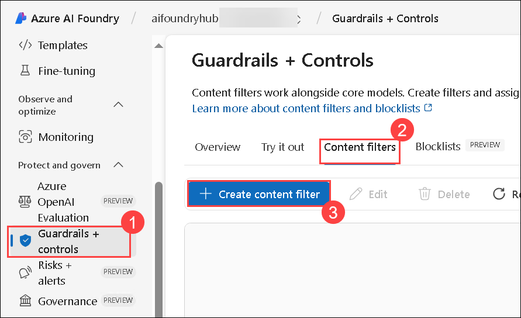

1. On the **Create filters to allow or block specific types of content** blade, specify the following configuration options and click on **Next (2)**:
   - **Name**:  **AggressiveContentFilter (1)**

     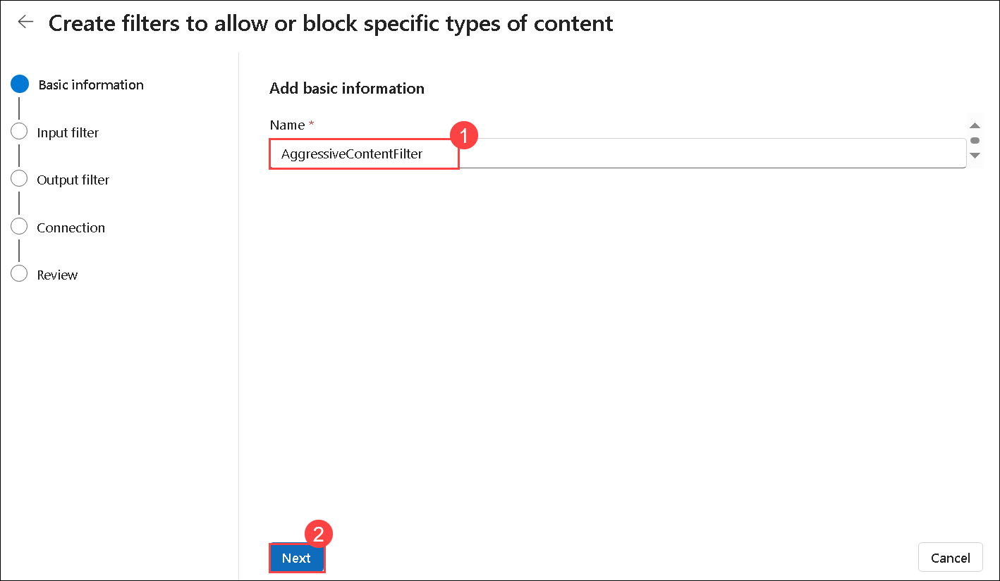

1. Leave the visible options to default and click on **Next** twice.

1. On the **Create filters to allow or block specific types of content**, **Deployment (Optional)** blade, select **all 2** of the deployments, and click **Next (2)**.

    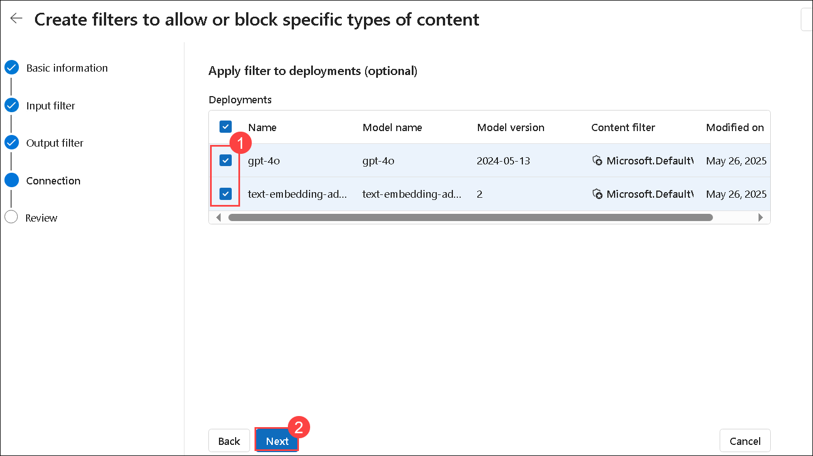

1. If you get a **Replacing existing content filter** warning, click on **Replace (1)**.

    

1. Create one **Create filter**.

    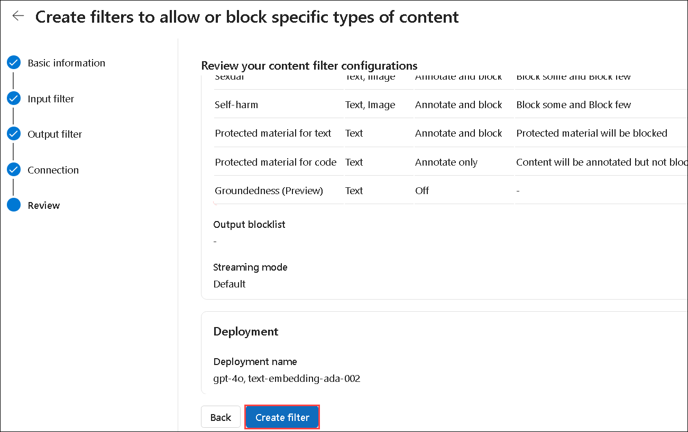


### Task 2: Filter specific words or patterns

In this task, you will explore different flow types in Azure AI Foundry by filtering specific words or patterns to refine search results and enhance data relevance.

1. Navigate to **Blocklists (Preview) (1)** tab and then **+ Create blocklist (2)**.

    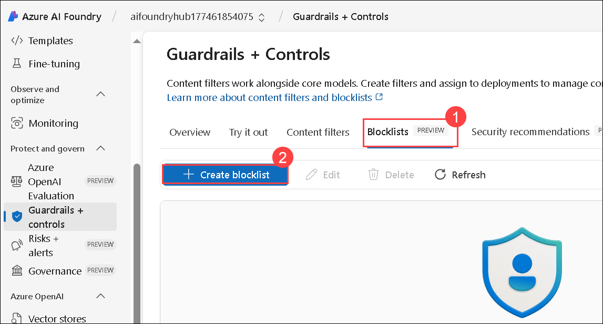
    
1. On the **Create a blocklist** blade, specify the following configuration options and click on **Create blocklist (3)**:

    - **Name**:  **CustomBlocklist<inject key="Deployment ID" enableCopy="false"></inject> (1)**
    - **Description**: This is a custom blocklist. **(2)**

      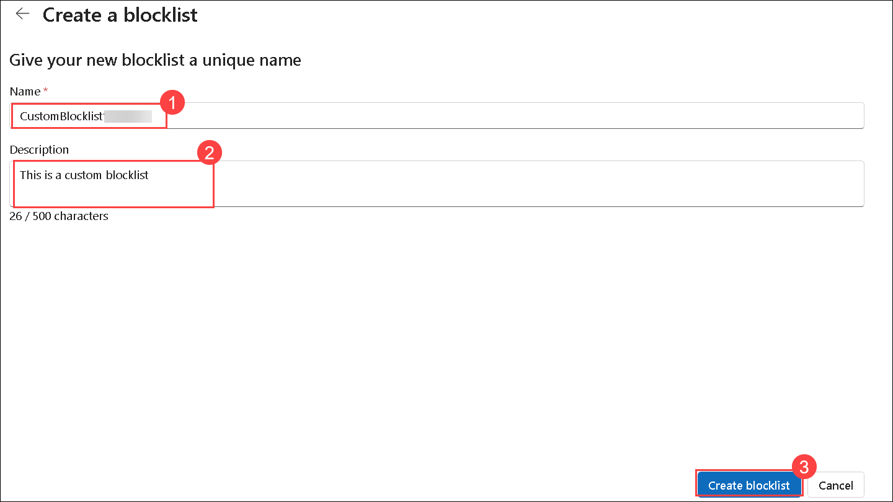

1. Click on **CustomBlocklist<inject key="Deployment ID" enableCopy="false"></inject>** created earlier.

1. Click on **+ Add new term**.

    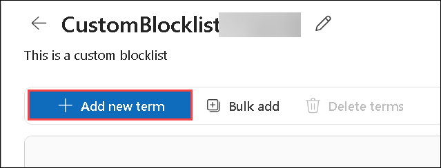

1. Enter words **password (1)** and select the type as required (**Exact Match** or **Regex**) then click on **Add term**.

    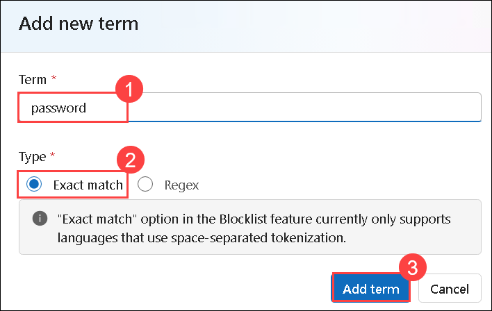

1. Click on **+ Add new term** again.   

1. Repeat the step for the following and select the type as required (**Exact Match** or **Regex**):-

    - credentials
    - exploit
    - hack
    - keylogger
    - phishing
    - SSN
    - credit card
    - bank account
    - CVV
    - casino
    - poker
    - betting

      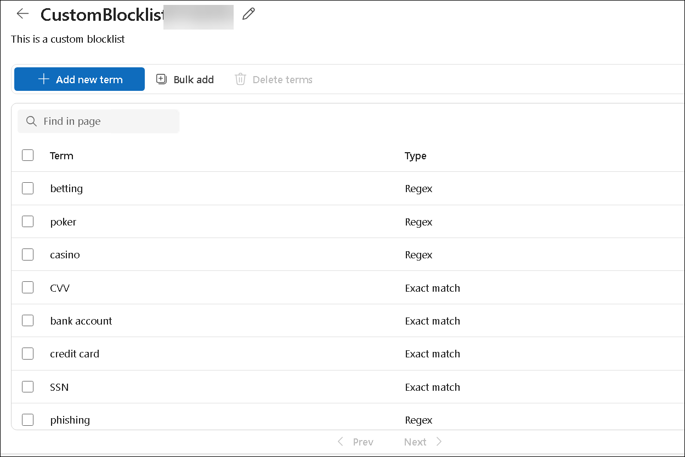

## Exercise 7: Image Generation using DALL-E

### Estimated Duration: 25 Minutes

This hands-on lab introduces image generation capabilities to your reference application using DALL·E, an advanced AI model that transforms text into visuals. Designed for those new to AI-powered creativity, the lab guides you step-by-step in integrating DALL·E to generate images from descriptive text prompts. You will explore how DALL·E can create visuals ranging from realistic objects and scenes to imaginative, abstract concepts—unlocking new possibilities for creative expression and user interaction.

### Objectives
In this exercise, you will be performing the following tasks:
- Task 1: Deploy a DALL-E model
- Task 2: Create and import the Image Generation Plugin

### Task 1: Deploy a DALL-E model

In this task, you will explore different flow types in Azure AI Foundry by deploying a DALL-E model to generate images from text prompts.

1. Navigate to the [Azure AI Foundry](https://ai.azure.com/) portal.
1. Click on **Models + endpoints (1)** under **My assets** in the left pane, then click on **+ Deploy model**, followed by **Deploy base model (2)**.

    

1. Search for **dall-e-3 (1)**, select the model **(2)**, and click on **Confirm (3)**.

    

1. Click on **Deploy**.

    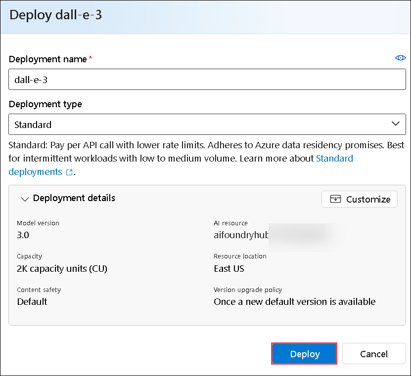

1. On the **dall-e-3** page, copy the **Target URI (1)** and **Key (2)** and paste them into Notepad.

    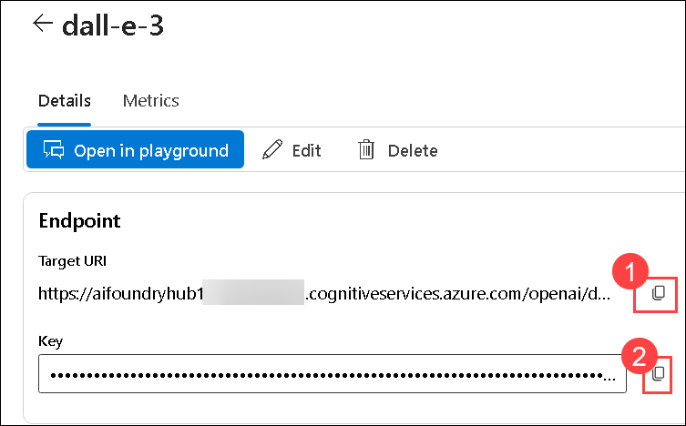

### Python:

1. Navigate to `Python>src` directory and open **.env (1)** file.

    
1. Paste the **Target URI** that you copied earlier in the exercise besides `AZURE_TEXT_TO_IMAGE_ENDPOINT` (1).
    >Note:- Ensure that every value in the **.env** file is enclosed in **double quotes (")**.
1. Paste the **API key (1)** that you copied earlier in the exercise besides `AZURE_TEXT_TO_IMAGE_API_KEY` (2).

    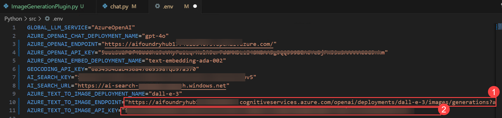

1. Save the file.

### Task 2: Create and import the Image Generation Plugin

In this task, you will explore different flow types in Azure AI Foundry by creating and importing the Image Generation Plugin to enable AI-powered image creation.

### Python:

1. Navigate to `Python>src>plugins` directory and create a new file named **ImageGenerationPlugin.py (1)**.

    
1. Add the following code to the file:

    ```
    import os
    import json
    from typing import Annotated
    from semantic_kernel.functions import kernel_function, KernelFunction
    from semantic_kernel.kernel import Kernel
    import httpx
    from PIL import Image

    class ImageGenerationPlugin:
        """Plugin for generating images using DALL-E."""

        def __init__(self):
            """Initialize the ImageGenerationPlugin."""
            self._kernel = None

        # This method will be called by Semantic Kernel when the plugin is registered
        def set_kernel(self, kernel):
            self._kernel = kernel

        @kernel_function(
            description="Generates an image based on the text prompt",
            name="generate_image"
        )
        async def generate_image(
            self, 
            prompt: Annotated[str, "Text description of the image to generate"],
            size: Annotated[str, "Size of the image (default: 1024x1024)"] = "1024x1024",
            kernel=None  # Allow kernel to be passed as a parameter
        ) -> str:
            """
            Generate an image using DALL-E based on the provided text prompt.
            Returns the URL of the generated image.
            """
            try:
                # Use the provided kernel or the stored one
                kernel_to_use = kernel or self._kernel
                if not kernel_to_use:
                    return "Error: No kernel available to the plugin"
                    
                # Get the image service - use correct method name
                try:
                    image_service = kernel_to_use.get_service(service_id="image-service")
                except Exception as e:
                    return f"Error accessing image service: {str(e)}"

                print(f"Generating image with prompt: {prompt}")
                
                # Parse size (format like "1024x1024")
                if "x" in size:
                    width, height = map(int, size.split('x'))
                else:
                    # Default to square if size format is incorrect
                    width = height = 1024
                
                # Generate the image with correct parameter names
                result = await image_service.generate_image(
                    description=prompt,  # Using prompt as the description
                    width=width,
                    height=height
                )

                image_dir = os.path.join(os.curdir, 'images')

                # If the directory doesn't exist, create it
                if not os.path.isdir(image_dir):
                    os.mkdir(image_dir)

                # Properly handle the result based on its type
                try:
                    # For newer SDK versions that return a string
                    if isinstance(result, str):
                        print(f"Result is a string: {result}")
                        json_response = json.loads(result)
                    # For older SDK versions that return an object with model_dump_json
                    else:
                        print(f"Result is an object with type: {type(result)}")
                        json_response = json.loads(result.model_dump_json())
                    
                    print(f"API Response: {json_response}")
                    
                    image_url = json_response["data"][0]["url"]  # extract image URL from response
                    return image_url
                    
                except Exception as e:
                    # If we can't parse the response properly, log it and return it as-is
                    print(f"Error processing image response: {str(e)}")
                    print(f"Raw response: {result}")
                    
                    # If the result is already the URL, return it directly
                    if isinstance(result, str) and result.startswith("http"):
                        return result
                            
                    return f"Image response received but couldn't process it: {result}"

            except Exception as e:
                import traceback
                error_details = traceback.format_exc()
                print(f"Error generating image: {str(e)}\n{error_details}")
                return f"Error generating image: {str(e)}"
    ```
1. Save the file.
1. Navigate to `Python>src` directory and open **chat.py (1)** file.

    

1. Add the following code in the `#Import Modules` section of the file.

    ```
    from plugins.ImageGenerationPlugin import ImageGenerationPlugin
    from semantic_kernel.connectors.ai.open_ai import AzureTextToImage
    ```

    

1. Add the following code in the `#Challenge 07 - Add DALL-E image generation service` section of the file.
    ```
    image_generation_service = AzureTextToImage(
        deployment_name=os.getenv("AZURE_TEXT_TO_IMAGE_DEPLOYMENT_NAME"),
        api_key=os.getenv("AZURE_TEXT_TO_IMAGE_API_KEY"),
        endpoint=os.getenv("AZURE_TEXT_TO_IMAGE_ENDPOINT"),
        service_id="image-service"
    )
    kernel.add_service(image_generation_service)
    ```

    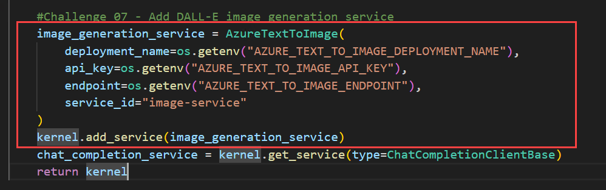

     >**Note**: Please refer the screenshots to locate the code in proper position that helps you to avoid indentation error.

1. Add the following code in the `# Placeholder for Text To Image plugin` section of the file.

    ```
    image_plugin = ImageGenerationPlugin()
    image_plugin.set_kernel(kernel)
    kernel.add_plugin(
        image_plugin,
        plugin_name="ImageGeneration",
    )
    logger.info("Image Generation plugin loaded")
    ```

    

     >**Note**: Please refer the screenshots to locate the code in proper position that helps you to avoid indentation error.

1. In case you encounter any indentation error, use the code from the following URL:

    ```
    https://raw.githubusercontent.com/CloudLabsAI-Azure/ai-developer/refs/heads/prod/CodeBase/python/lab-07.py
    ```
1. Save the file.
1. Right click on `Python>src` **(1)** in the left pane and select **Open in Integrated Terminal (2)**.

    

1. Use the following command to run the app:
    ```
    streamlit run app.py
    ```
1. If the app does not open automatically in the browser, you can access it using the following **URL**:

    ```
    http://localhost:8501
    ```
1. Submit the following prompt and see how the AI responds:

    ```
    Create a picture of a cute kitten wearing a hat.
    ```
1. You will receive a response similar to the one shown below:

    

### C Sharp(C#):

1. Navigate to `Dotnet>src>BlazorAI>Plugins` directory and create a new file named **ImageGenerationPlugin.cs**.

    
1. Add the following code to the file:
    ```
    using System;
    using System.ComponentModel;
    using System.IO;
    using System.Threading.Tasks;
    using Microsoft.Extensions.Configuration;
    using Microsoft.SemanticKernel;
    using Microsoft.SemanticKernel.TextToImage;
    using Microsoft.Extensions.Logging;
    using System.Text.Json;
    using System.Net.Http;
    using System.Text.RegularExpressions;

    namespace BlazorAI.Plugins
    {
        public class ImageGenerationPlugin
        {
            private readonly IConfiguration _configuration;
            private ILogger<ImageGenerationPlugin> _logger;
            private readonly HttpClient _httpClient;

            public ImageGenerationPlugin(IConfiguration configuration)
            {
                _configuration = configuration;
                _httpClient = new HttpClient();
            }

            [KernelFunction("GenerateImage")]
            [Description("Generates an image based on a text description. Use this when the user wants to create, draw, or visualize an image.")]
            public async Task<string> GenerateImage(
                [Description("Detailed description of the image to generate")] string prompt,
                [Description("Size of the image (e.g., '1024x1024', '512x512')")] string size = "1024x1024",
                Kernel kernel = null)
            {
                try
                {
                    _logger = kernel?.GetRequiredService<ILoggerFactory>()?.CreateLogger<ImageGenerationPlugin>();
                    _logger?.LogInformation($"Generating image with prompt: {prompt}, size: {size}");

                    var imageService = kernel.GetRequiredService<ITextToImageService>();
                    
                    int width = 1024;
                    int height = 1024;
                    
                    if (size != null && size.Contains("x"))
                    {
                        var dimensions = size.Split('x');
                        if (dimensions.Length == 2 && 
                            int.TryParse(dimensions[0], out int parsedWidth) && 
                            int.TryParse(dimensions[1], out int parsedHeight))
                        {
                            width = parsedWidth;
                            height = parsedHeight;
                        }
                        else
                        {
                            _logger?.LogWarning($"Invalid size format: {size}. Using default 1024x1024.");
                        }
                    }

                    string resultString = await imageService.GenerateImageAsync(prompt, width, height, kernel);
                    
                    string fileName = $"generated_{Guid.NewGuid()}.png";
                    string directoryPath = Path.Combine(Directory.GetCurrentDirectory(), "wwwroot", "images");
                    
                    if (!Directory.Exists(directoryPath))
                    {
                        Directory.CreateDirectory(directoryPath);
                    }
                    
                    string filePath = Path.Combine(directoryPath, fileName);
                    
                    byte[] imageBytes;
                    
                    if (Uri.IsWellFormedUriString(resultString, UriKind.Absolute))
                    {
                        return $"";
                    }
                    else if (resultString.StartsWith("data:image"))
                    {
                        var base64Data = resultString.Substring(resultString.IndexOf(',') + 1);
                        imageBytes = Convert.FromBase64String(base64Data);
                    }
                    else if (Regex.IsMatch(resultString, @"^[A-Za-z0-9+/]*={0,2}$"))
                    {
                        imageBytes = Convert.FromBase64String(resultString);
                    }
                    else
                    {
                        throw new InvalidOperationException($"Unexpected string format returned from image generation: {resultString.Substring(0, Math.Min(100, resultString.Length))}...");
                    }
                    
                    await File.WriteAllBytesAsync(filePath, imageBytes);
                    
                    return $"";
                }
                catch (Exception ex)
                {
                    _logger?.LogError(ex, $"Error generating image: {ex.Message}");
                    return $"Error generating image: {ex.Message}";
                }
            }
        }
    }
    ```
1. Save the file.
1. Navigate to `Dotnet>src>BlazorAI>Components>Pages` directory and open **Chat.razor.cs (1)** file.

    
    
1. Add the following code in the `// Challenge 07 - Add Azure AI Foundry Text To Image` section of the file.
    ```
    kernelBuilder.AddAzureOpenAITextToImage(
        Configuration["DALLE_DEPLOYMODEL"]!,
        Configuration["AOI_ENDPOINT"]!,
        Configuration["AOI_API_KEY"]!);
    ```

    

1. Add the following code in the `// Challenge 07 - Text To Image Plugin` section of the file.
    ```
    var imageGenerationPlugin = new ImageGenerationPlugin(Configuration);
    kernel.ImportPluginFromObject(imageGenerationPlugin, "ImagePlugin");
    ```

    
1. In case you encounter any indentation error, use the code from the following URL:
    ```
    https://raw.githubusercontent.com/CloudLabsAI-Azure/ai-developer/refs/heads/prod/CodeBase/c%23/lab-07.cs
    ```
1. Save the file.
1. Right click on `Dotnet>src>Aspire>Aspire.AppHost` in the left pane and select **Open in Integrated Terminal**.
1. Use the following command to run the app:
    ```
    dotnet run
    ```
1. Open a new tab in the browser and navigate to the link for **blazor-aichat**, i.e. **https://localhost:7118/**.

    >**Note**: If you receive security warnings in the browser, close the browser and follow the link again.
1. Submit the following prompt and see how the AI responds:
    ```
    Create a picture of a cute kitten wearing a hat.
    ```
1. You will receive a response similar to the one shown below:

    

1. Once you receive the response, navigate back to the Visual studio code terminal and then press **Ctrl+C** to stop the build process.

## Exercise 8: Multi-Agent Systems

### Estimated Duration: 30 Minutes

This hands-on lab introduces **multi-agent system development**, where a user request is processed by multiple agents, each with a distinct **persona and responsibility**. Designed for those new to **AI-driven automation**, the lab guides you through integrating agents that collaborate to generate a well-rounded response. Whether handling specialized tasks or combining expertise, this system ensures comprehensive context-aware outputs. By the end of this lab, you will understand how to **orchestrate multi-agent interactions** to enhance AI-driven decision-making and user experiences.

### Objectives
In this exercise, you will be performing the following tasks:
- Task 1: Create a Multi-agent chat system

### Task 1: Create a Multi-agent chat system

In this task, you will explore different flow types in Azure AI Foundry by creating a Multi-Agent Chat System to enable collaborative AI interactions.

### Python:

1. Navigate to `Python>src` directory and open **multi_agent.py** file.

    

1. Remove the existing code and add the code from the following URL in the file.
    ```
    https://raw.githubusercontent.com/CloudLabsAI-Azure/ai-developer/refs/heads/prod/CodeBase/python/lab-08.py
    ```
1. Save the file.
1. Right click on `Python>src` **(1)** in the left pane and select **Open in Integrated Terminal (2)**.

    
1. Use the following command to run the app:
    ```
    streamlit run app.py
    ```
1. If the app does not open automatically in the browser, you can access it using the following **URL**:
    ```
    http://localhost:8501
    ```
1. Select **Multi-Agent (1)** on the left-hand side pane.

    
1. Submit the following prompt and see how the AI responds:
    ```
    Build a Calculator app.
    ```
1. You will receive a response similar to the one shown below:

    


### C Sharp(C#):

1. Navigate to `Dotnet>src>BlazorAI>Components>Pages` directory and open **MultiAgent.razor.cs (1)** file.

    
1. Remove the existing code and add the code from the following URL in the file.
    ```
    https://raw.githubusercontent.com/CloudLabsAI-Azure/ai-developer/refs/heads/prod/CodeBase/c%23/lab-08.cs
    ```
1. Save the file.
1. Right click on `Dotnet>src>Aspire>Aspire.AppHost` **(1)** in the left pane and select **Open in Integrated Terminal (2)**.

    
1. Use the following command to run the app:
    ```
    dotnet run
    ```
1. Open a new tab in the browser and navigate to the link for **blazor-aichat**, i.e. **https://localhost:7118/**.

    >**Note**: If you receive security warnings in the browser, close the browser and follow the link again.
1. Select **Multi-Agent (1)** on the left-hand side pane.

    
1. Submit the following prompt and see how the AI responds:
    ```
    Build a Calculator app.
    ```
1. You will receive a response similar to the one shown below:

    

## Review :

In this series of exercises, we explored advanced AI development techniques using **Azure AI Foundry**, **Semantic Kernel**, and related tools to build, deploy, and enhance intelligent applications. Through hands-on implementation, we gained in-depth proficiency in deploying models, integrating external data sources, extending chatbot functionality, orchestrating APIs, and applying ethical AI practices.

### Key Accomplishments:

* **Model Deployment & Integration**

  * Created AI projects and deployed the **GPT-4o** base model using **Azure AI Foundry Models + Endpoints**.
  * Integrated **Semantic Kernel** with **GPT-4o** to enable intelligent, dynamic AI interactions.
  * Developed a chat API to process user prompts and generate AI-driven responses.

* **Plugin & API Orchestration**

  * Built and integrated **Python-based Semantic Kernel plugins**, including **time** and **weather retrieval plugins**, for real-time contextual responses.
  * Enabled **Auto Function Calling** to seamlessly chain multiple plugins.
  * Integrated **OpenAPI plugins** (e.g., **WorkItems API**) with Semantic Kernel for dynamic, automated API interactions.

* **Enhanced Data Retrieval with RAG**

  * Implemented the **Retrieval-Augmented Generation (RAG)** pattern using **Azure AI Search** for context-aware outputs.
  * Orchestrated retrieval and generation workflows via **Semantic Kernel** to enrich responses with external knowledge.

* **Content Safety & Responsible AI**

  * Applied **Azure AI Content Safety** tools to enforce responsible AI behavior.
  * Configured **built-in and custom content moderation rules** to filter inappropriate or harmful content.
  * Adjusted moderation settings to align with ethical AI development standards.

* **Generative AI for Visual Content**

  * Integrated **DALL·E** into reference applications for **text-to-image generation**.
  * Explored creative applications of generative AI for visual content production.
  * Configured **Azure AI Foundry** to support DALL·E-based workflows.

* **Multi-Agent System Design**

  * Designed and implemented a **multi-agent system** to process complex user requests through collaboration among specialized agents.
  * Assigned distinct **personas and responsibilities** to agents to simulate expertise-driven collaboration.
  * Coordinated agent responses into unified, intelligent outputs.

---

### Summary

Through this immersive experience, we gained valuable expertise in building secure, scalable, and intelligent AI solutions by leveraging Azure AI Foundry, Semantic Kernel, and associated tools. From model deployment and plugin integration to API orchestration and multi-agent collaboration, each module enhanced our ability to deliver cutting-edge AI-driven applications with ethical considerations, rich contextual capabilities, and powerful generative features.

