# Azure AI Foundry and Semantic Kernel Fundamentals

### Overall Estimated Duration: 4 Hours

## Overview

In this hands-on lab series, participants will explore the core capabilities of **Azure AI Foundry** and the **Semantic Kernel** framework to build intelligent, extensible AI applications. Designed for beginners in AI development, the labs guide participants through setting up AI projects in Azure AI Foundry, deploying the **GPT-4o** model, and connecting it seamlessly with Semantic Kernel to enable dynamic, prompt-based interactions. Participants will learn how to integrate **plugins**—such as time and weather utilities—to extend chatbot functionality, implement **Retrieval-Augmented Generation (RAG)** for more informed responses, and leverage **OpenAPI** to connect external services with minimal code. The labs also highlight responsible AI practices with **content filtering tools** in Foundry Studio and creative AI integration through **DALL·E** for image generation, delivered in a secure, cloud-based environment. This series provides foundational, hands-on experience with Semantic Kernel and Azure AI Foundry to help participants build scalable, AI-powered applications.

## Objective

**Explore how Azure AI Foundry and Semantic Kernel empower you to build intelligent, extensible, and responsible AI applications.** Gain hands-on experience deploying GPT-4o models, integrating external services and APIs, developing custom plugins, and implementing advanced AI design patterns such as Retrieval-Augmented Generation (RAG) and multi-agent collaboration. By the end of this lab series, you'll be able to:

- **Azure AI Foundry Fundamentals**: Learn how to create, manage, and deploy AI projects using Azure AI Foundry and GPT-4o.
- **Semantic Kernel Fundamentals**: Build an intelligent chat experience by connecting Semantic Kernel with GPT-4o through a simple starter app.
- **Semantic Kernel Plugins**: Extend your chatbot’s capabilities by building and integrating custom Semantic Kernel plugins.
- **Import Plugin using OpenAPI**: Seamlessly integrate external APIs into Semantic Kernel using OpenAPI specifications.
- **Retrieval-Augmented Generation (RAG)**: Enhance AI responses by combining external knowledge retrieval with generative models using the RAG pattern.
- **Responsible AI: Exploring Content Filters in Azure AI Foundry**: Apply content filtering tools to build safer, more accountable AI applications within Azure AI Foundry.
- **Image Generation using DALL·E**: Generate creative visuals from text prompts by integrating DALL·E into your reference application.
- **Multi-Agent Systems**: Coordinate multiple AI agents within Semantic Kernel to solve complex tasks through collaboration.

## Prerequisites

- Basic knowledge of Azure
- Familiarity with AI concepts, such as language models and embeddings
- Basic understanding of REST APIs and JSON data formats
- Familiarity with Semantic Kernel concepts such as plugins, planners, and AI skills
- Basic experience using resource management
- (Optional) Familiarity with OpenAPI specifications for plugin integration
- (Optional) Understanding of Retrieval-Augmented Generation (RAG) patterns for AI applications

## Architecture
In this hands-on lab, participants will explore **Azure AI Foundry** and **Semantic Kernel** to build, deploy, and extend AI-powered applications. The journey begins with the **Azure Portal**, where they will access and manage AI services. They will deploy **GPT-4o** models using **Models + Endpoints**, enabling real-time AI interactions. To enhance response accuracy, participants will implement **Retrieval-Augmented Generation (RAG)** using **Azure AI Search**, ensuring contextually informed outputs.  

The lab also covers **plugins**, such as **Time & Weather utilities** for real-time data retrieval and **OpenAPI integration** to connect external services seamlessly. Participants will explore **content filtering** within Azure AI Foundry, applying built-in safety measures to ensure responsible AI usage. Additionally, they will integrate **DALL·E** for AI-driven image generation, enabling creative AI applications. By the end of the lab, participants will have the foundational skills to develop scalable, secure, and extensible AI solutions using Azure’s powerful AI ecosystem.

## Architecture Diagram

## Explanation of Components 

- **Azure AI Foundry**: Provides an integrated environment for AI model development, deployment, and management.  
- **Azure AI Studio**: A web-based interface for managing AI models, endpoints, and inference capabilities.  
- **Models + Endpoints**: Used for deploying and managing **GPT-4o** models for real-time AI interactions.  
- **Semantic Kernel**: An AI orchestration framework that connects **LLMs, plugins, and APIs** for enhanced AI capabilities.
- **OpenAPI**: Facilitates seamless integration with external APIs for AI-driven workflows.  
- **Azure AI Search**: Enhances **Retrieval-Augmented Generation (RAG)** by fetching relevant contextual data.  
- **Azure Blob Storage**: Stores indexed documents, datasets, and knowledge bases for AI-powered insights.  
- **Azure AI Content Safety**: Provides content filtering and moderation tools to ensure responsible AI usage.   
- **Azure AI Vision Services**: Supports **DALL·E** integration for AI-powered image generation.  
- **Visual Studio Code (VS Code)**: Development environment for AI application coding, debugging, and testing.    
- **Python SDKs & REST APIs**: Used to interact with **Azure AI Foundry, Semantic Kernel, and OpenAI services**.

## Getting Started with the Lab
 
## Accessing Your Lab Environment
 
Once you're ready to dive in, your virtual machine and lab guide will be right at your fingertips within your web browser.

   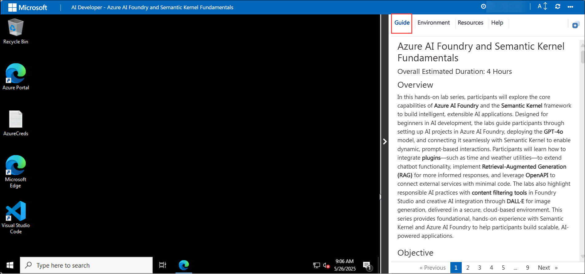

## Virtual Machine & Lab Guide
 
Your virtual machine is your workhorse throughout the workshop. The lab guide is your roadmap to success.
 
## Exploring Your Lab Resources
 
To get a better understanding of your lab resources and credentials, navigate to the **Environment** tab.
 
   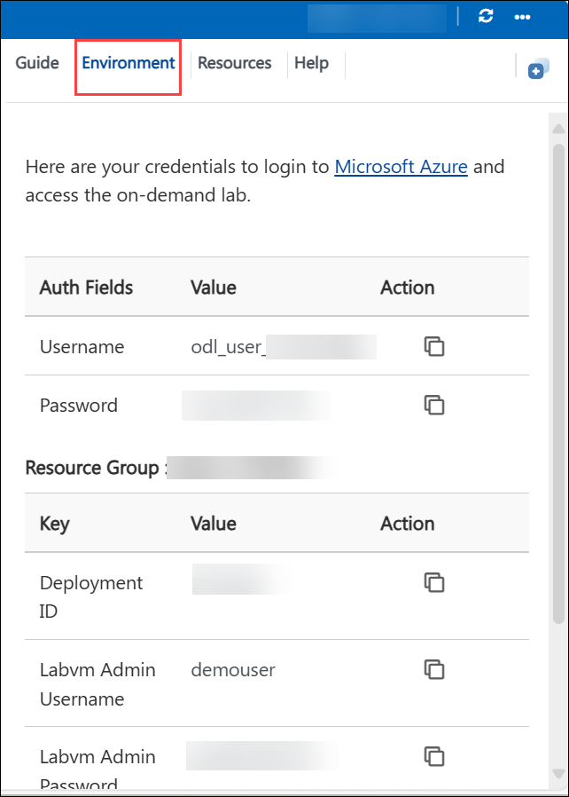
 
## Utilizing the Split Window Feature
 
For convenience, you can open the lab guide in a separate window by selecting the **Split Window (1)** button from the top right corner.
 
 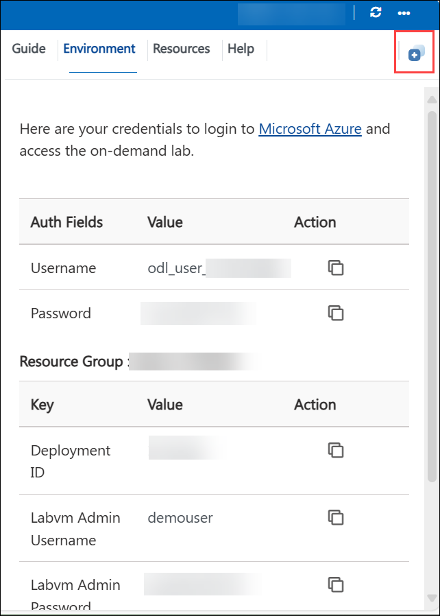
 
## Managing Your Virtual Machine
 
**Start, stop, or restart (2)** your virtual machine from the **Resources (1)** tab. Your experience is in your hands!
 
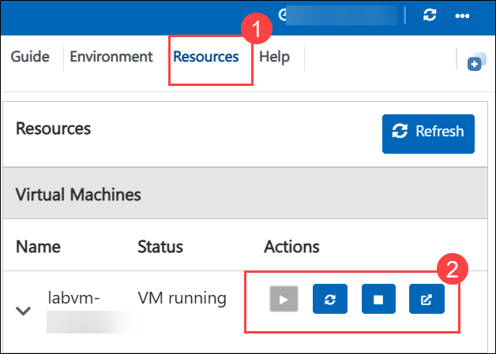

## Lab Validation

1. After completing the task, hit the **Validate** button under the Validation tab integrated into your lab guide. You can proceed to the next task if you receive a success message. If not, carefully read the error message and retry the step, following the instructions in the lab guide.

   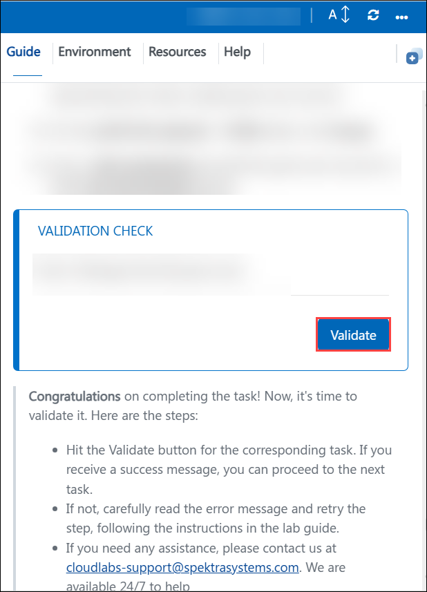

## Lab Guide Zoom In/Zoom Out
 
To adjust the zoom level for the environment page, click the **A↕: 100%** icon located next to the timer in the lab environment.

   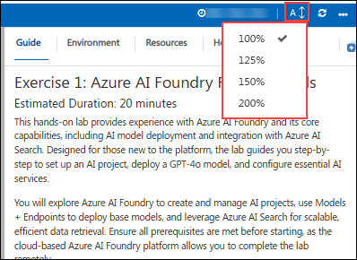

## Let's Get Started with Azure Portal

1. On your virtual machine, click on the Azure Portal icon as shown below:

   .png)
   
1. You'll see the **Sign in to Microsoft Azure** tab. Here, enter your credentials:
 
   - **Email/Username:** <inject key="AzureAdUserEmail"></inject>
 
       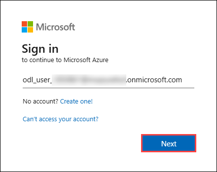
 
1. Next, provide your password:
 
   - **Password:** <inject key="AzureAdUserPassword"></inject>
 
       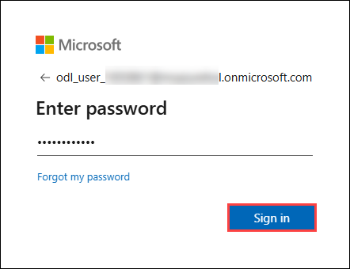

1. If an **Action required** pop-up window appears, click on **Next**.

   

1. On **Start by getting the app** page, click on **Next**.

   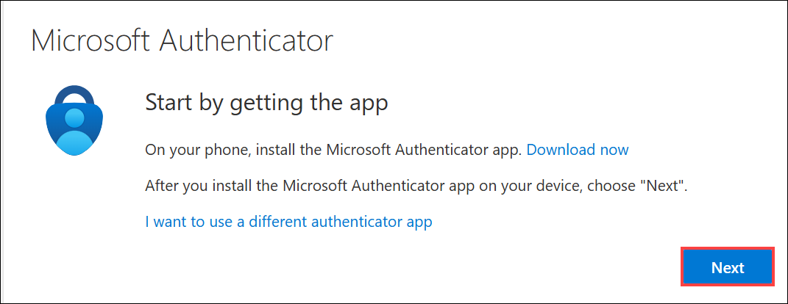

1. On the Set up your account page, select  **Next**.

   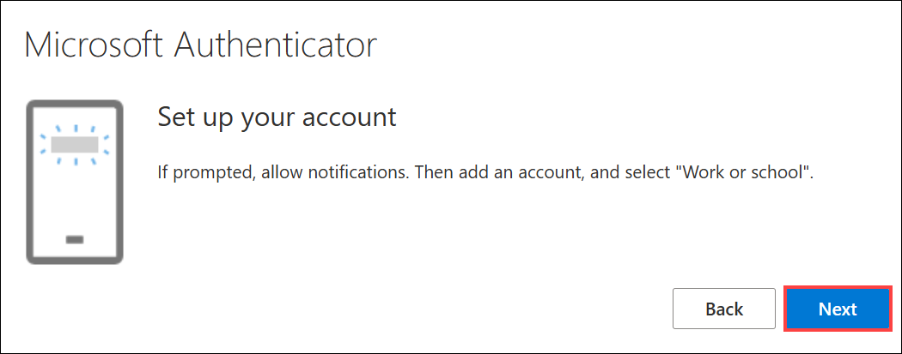

1. In **Android**, go to the Play Store, search for **Microsoft Authenticator,** and tap on **Install**.

   

   >Note: For **iOS**, open the App Store and repeat the steps.

   >Note: Skip If already installed.
   
1. Open the app and click on **Scan a QR code**.
1. Scan the **QR code (1)** visible on the screen and click on **Next (2)**.

   

1. On the Keep your account secure page. Enter the code, which is shown on the Authenticator app.

   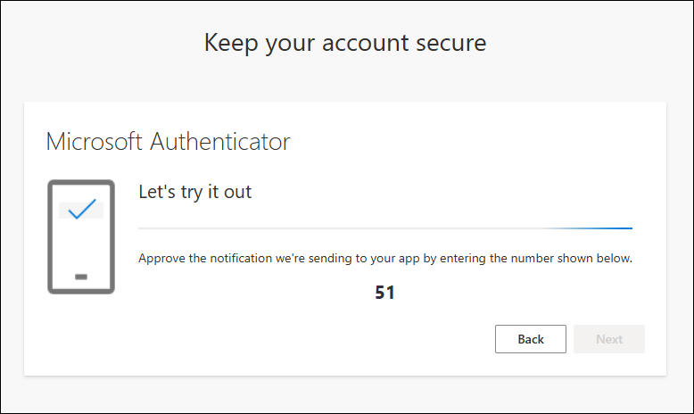

1. Once the notification is approved, click on **Next (1)**.

   

1. Select **Done** on the success page.

   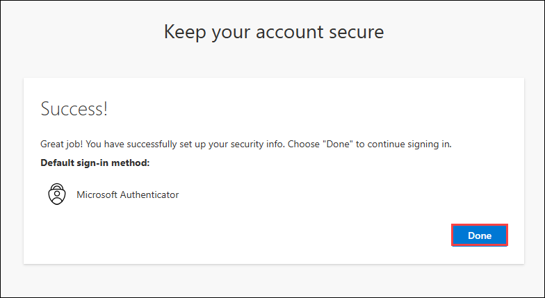

1. If prompted to stay signed in, you can click **No.**

   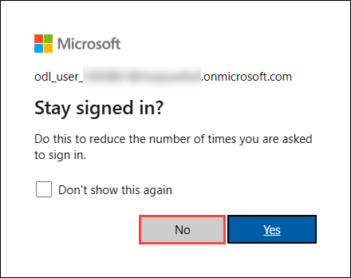

1. Tap on **Finish** in the mobile device.

   >NOTE: While logging in again, enter the digits displayed on the screen in the **Authenticator app** and click on Yes.

1. If a **Welcome to Microsoft Azure** pop-up window appears, simply click **"Cancel"** to skip the tour.

   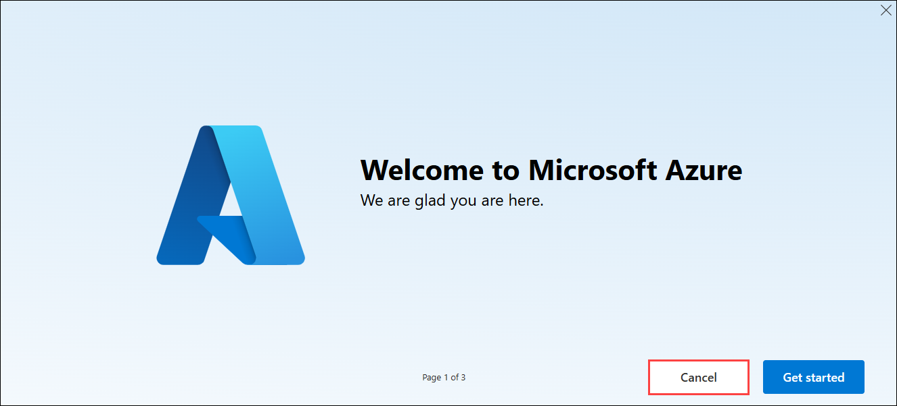

1. You can use the **Previous (1)** and **Next (2)** buttons to navigate through the lab guide.

   .png)

## Support Contact

The CloudLabs support team is available 24/7, 365 days a year, via email and live chat to ensure seamless assistance anytime. We offer dedicated support channels tailored specifically for learners and instructors, ensuring that all your needs are promptly and efficiently addressed.

Learner Support Contacts:

- Email Support: cloudlabs-support@spektrasystems.com
- Live Chat Support: https://cloudlabs.ai/labs-support

Now, click **Next** from the lower right corner to move on to the next page.

## Happy Learning!!
