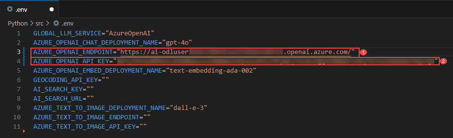

# **Exercise 2**: Semantic Kernel Fundamentals

### Estimated Duration: 25 minutes

This hands-on lab provides practical experience with Semantic Kernel and the Azure AI Foundry GPT-4o model. Designed for those new to AI development, the lab guides you step-by-step to build an intelligent chat feature within a starter application. You will use the Semantic Kernel framework to connect with the GPT-4o model, implement a chat API that sends user prompts, and return dynamic AI-generated responses. Complete all prerequisites before starting, as the cloud-based environment enables you to complete the lab remotely.

## Objectives
In this exercise, you will be performing the following tasks:

## Task 1: Setup Azure AI Foundry

1. Open **Visual Studio code** from the desktop shortcut in the labvm.
1. Click on **File (1)** and select **Open Folder (2)**.

    
1. Navigate to `C:\LabFiles` (1) and select **ai-developer (2)** folder and click on **Select Folder**.

    
1. If you receive `Do you trust the authors of the files in folder` warning, select the checkbox (1) and click on **Yes, I trust the authors (2)**.

    
1. Navigate to AI Foundry Portal and on **Overview (1)** page select **Azure OpenAI Service (2)** and **Copy (3)** the endpoint and paste it in **Notepad**, as it will be used in the upcoming exercises.

    
1. Copy the API key from AI Foundry Portal and paste it in **Notepad**, as it will be used in the upcoming exercises.

    

## Task 2: Setup environment variables
<details>
<summary><strong>Python</strong></summary>

1. Navigate to `Python>src` directory and open **.env** (1) file.

    
1. Paste **Azure OpenAI Service endpoint** copied earlier in the exercise besides `AZURE_OPENAI_ENDPOINT`.
    >Note:- Ensure that every value in the **.env** file is enclosed in **double quotes (")**.
1. Paste **API key** copied earlier in the exercise besides `AZURE_OPENAI_API_KEY`.

    
1. Save the file.

</details>

<details>
<summary><strong>C Sharp(C#)</strong></summary>

1. Navigate to `Dotnet>src>BlazorAI` directory and open **appsettings.json (1)** file.

    
1. Paste **Azure OpenAI Service endpoint** copied earlier in the exercise besides `AOI_ENDPOINT`.
    >**Note**:- Ensure that every value in the **appsettings.json** file is enclosed in **double quotes (")**.

    >**Note**:- Make sure to remove the "/" from the endpoint.
1. Paste **API key** copied earlier in the exercise besides `AOI_API_KEY`.

    
1. Save the file.

</details>

## Task 3: Update the code files and run the app

<details>
<summary><strong>Python</strong></summary>

1. Navigate to `Python>src` directory and open **chat.py** file.

    
1. Add the following code in the `#Import Modules` (1) section of the file.
    ```
    from semantic_kernel.connectors.ai.chat_completion_client_base import ChatCompletionClientBase
    from semantic_kernel.connectors.ai.open_ai import OpenAIChatPromptExecutionSettings
    import os
    ```

    
1. Add the following code in the `# Challenge 02 - Chat Completion Service` (1) section of the file.
    ```
    chat_completion_service = AzureChatCompletion(
        deployment_name=os.getenv("AZURE_OPENAI_CHAT_DEPLOYMENT_NAME"),
        api_key=os.getenv("AZURE_OPENAI_API_KEY"),
        endpoint=os.getenv("AZURE_OPENAI_ENDPOINT"),
        service_id="chat-service",
    )
    kernel.add_service(chat_completion_service)
    execution_settings = kernel.get_prompt_execution_settings_from_service_id("chat-service")
    ```

    
1. Add the following code in the `# Start Challenge 02 - Sending a message to the chat completion service by invoking kernel` section of the file.
    ```
    global chat_history
    chat_history.add_user_message(user_input)
    chat_completion = kernel.get_service(type=ChatCompletionClientBase)
    execution_settings = kernel.get_prompt_execution_settings_from_service_id("chat-service")
    response = await chat_completion.get_chat_message_content(
        chat_history=chat_history,
        settings=execution_settings,
        kernel=kernel
    )
    chat_history.add_assistant_message(str(response))
    ```

    
1. Add the following code in the `#return result` section of the file.
    ```
    logger.info(f"Response: {response}")
    return response
    ```

    
1. In case you encounter any indentation error, use the code from the following URL:
    ```
    https://raw.githubusercontent.com/CloudLabsAI-Azure/ai-developer/refs/heads/prod/CodeBase/python/lab-02.py
    ```
1. Save the file.
1. Right click on `Python>src` in the left pane and select **Open in Integrated Terminal**.

    
1. Use the following command to run the app:
    ```
    streamlit run app.py
    ```
1. If you are asked for any email to register, feel free to use the below provided email, and hit **Enter**:
    ```
    test@gmail.com
    ```

    
1. If the app does not open automatically in the browser, you can access it using the following **URL**:

    ```
    http://localhost:8501
    ```
1. Submit the following prompt and see how the AI responds:
    ```
    Why is the sky blue?
    ```
    ```
    Why is it red?
    ```
1. You will receive a response similar to the one shown below:

    
</details>

<details>
<summary><strong>C Sharp(C#)</strong></summary>

1. Navigate to `Dotnet>src>BlazorAI>Components>Pages` directory and open **Chat.razor.cs (1)** file.

    
1. Add the following code in the `// Your code goes here(Line no. 92)` (1) section of the file.
    ```
    chatHistory.AddUserMessage(userMessage);
    var chatCompletionService = kernel.GetRequiredService<IChatCompletionService>();
    var assistantResponse = await chatCompletionService.GetChatMessageContentAsync(
        chatHistory: chatHistory,
        kernel: kernel);
    chatHistory.AddAssistantMessage(assistantResponse.Content);
    ```

    
1. In case you encounter any indentation error, use the code from the following URL: 
    ```
    https://raw.githubusercontent.com/CloudLabsAI-Azure/ai-developer/refs/heads/prod/CodeBase/c%23/lab-02.cs
    ```
1. Save the file.
1. Right click on `Dotnet>src>Aspire>Aspire.AppHost` in the left pane and select **Open in Integrated Terminal**.

    
1. Run the following line of code to trust the dev-certificates neccessary to run the app locally, and then select on **Yes**:
    ```
    dotnet dev-certs https --trust
    ```

    
1. Use the following command to run the app:
    ```
    dotnet run
    ```
1. Open a new tab in browser and navigate to the link for **blazor-aichat** i.e **https://localhost:7118/**.

    >**Note**: If you receive security warnings in the browser, close the browser and follow the link again.
1. Submit the following prompt and see how the AI responds:
    ```
    Why is the sky blue?
    ```
    ```
    Why is it red?
    ```
1. You will receive a response similar to the one shown below:
    
</details>

## Summary

In this exercise, we utilized **Semantic Kernel** in combination with the **Azure AI Foundry GPT-4o model** to build an intelligent chat feature within a starter application. We integrated the Semantic Kernel framework with GPT-4o, implemented a chat API to handle user prompts, and returned dynamic AI-generated responses. This enhanced our proficiency in connecting applications to powerful language models using modern AI development frameworks.