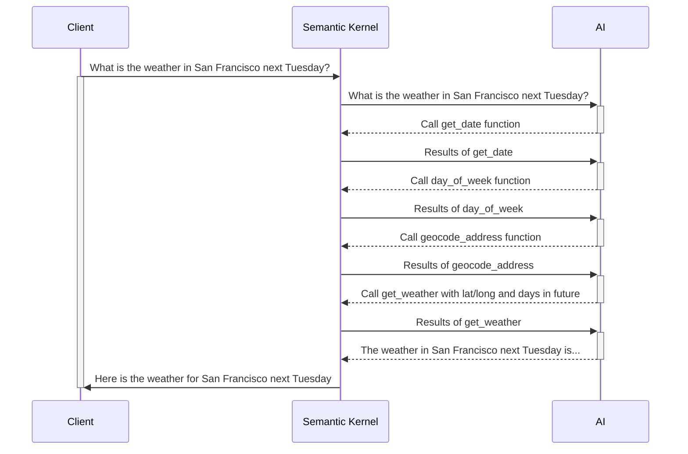

# **Exercise 3**: Semantic Kernel Plugins

### Estimated Duration: 50 minutes

This hands-on lab explores the power of plugins in enhancing LLM development with Semantic Kernel. Designed for those new to AI extensibility, the lab guides you through building and integrating plugins to expand the capabilities of your chatbot. You will implement a time plugin and a weather retrieval plugin, enabling your AI to access real-time and contextual data beyond its training scope. Additionally, you will learn to develop Semantic Kernel plugins in Python and leverage Auto Function Calling to seamlessly chain them together. Complete all prerequisites before starting, as the cloud-based environment allows you to complete the lab remotely.

## Objectives
In this exercise, you will be performing the following tasks:

## Task 1: Try the app without the Time Plugin
1. Launch your AI Chat app in any of the languange, and submit the following prompt:
    ```
    What time is it?
    ```
2. Since the AI does not have the capability to provide real-time information, you will get a response similar to the following:
    ```
    I can't provide real-time information, including the current time. You can check the time on your device or through various online sources.
    ```
## Task 2: Create and import the Time Plugin
<details>
<summary><strong>Python</strong></summary>

1. Navigate to `Python>src>plugins` directory and create a new file named **time_plugin.py**.
1. Add the following code in the file:
    ```
    from datetime import datetime
    from typing import Annotated
    from semantic_kernel.functions import kernel_function


    class TimePlugin:
        @kernel_function()
        def current_time(self) -> str:
            return datetime.now().strftime("%Y-%m-%d %H:%M:%S")

        @kernel_function()
        def get_year(self, date_str: Annotated[str, "The date string in format YYYY-MM-DD"] = None) -> str:
            if date_str is None:
                return str(datetime.now().year)
            
            try:
                date_obj = datetime.strptime(date_str, "%Y-%m-%d")
                return str(date_obj.year)
            except ValueError:
                return "Invalid date format. Please use YYYY-MM-DD."

        @kernel_function()
        def get_month(self, date_str: Annotated[str, "The date string in format YYYY-MM-DD"] = None) -> str:
            if date_str is None:
                return datetime.now().strftime("%B")
            
            try:
                date_obj = datetime.strptime(date_str, "%Y-%m-%d")
                return date_obj.strftime("%B")  # Full month name
            except ValueError:
                return "Invalid date format. Please use YYYY-MM-DD."

        @kernel_function()
        def get_day_of_week(self, date_str: Annotated[str, "The date string in format YYYY-MM-DD"] = None) -> str:
            if date_str is None:
                return datetime.now().strftime("%A")
            
            try:
                date_obj = datetime.strptime(date_str, "%Y-%m-%d")
                return date_obj.strftime("%A")  # Full weekday name
            except ValueError:
                return "Invalid date format. Please use YYYY-MM-DD."
    ```
1. Save the file.
1. Navigate to `Python>src` directory and open **chat.py** file.
1. Add the following code in the `#Import Modules` section of the file.
    ```
    from semantic_kernel.connectors.ai.open_ai.prompt_execution_settings.azure_chat_prompt_execution_settings import (
        AzureChatPromptExecutionSettings,
    )
    from plugins.time_plugin import TimePlugin
    ```
1. Add the following code in the `#Challenge 03 - Create Prompt Execution Settings` section of the file.
    ```
    execution_settings = AzureChatPromptExecutionSettings()
    execution_settings.function_choice_behavior = FunctionChoiceBehavior.Auto()
    logger.info("Automatic function calling enabled")
    ```
1. Add the following code in the `# Placeholder for Time plugin` section of the file.
    ```
    time_plugin = TimePlugin()
    kernel.add_plugin(time_plugin, plugin_name="TimePlugin")
    logger.info("Time plugin loaded")
    ```
1. Add the following code in the `# Placeholder for Time plugin` section of the file.
    ```
    time_plugin = TimePlugin()
    kernel.add_plugin(time_plugin, plugin_name="TimePlugin")
    logger.info("Time plugin loaded")
    ```
1. Search (using Ctrl+F) and remove the following piece of code from the file as we will enable automatic function calling and this is no longer required:
    ```
    execution_settings = kernel.get_prompt_execution_settings_from_service_id("chat-service")
    ```
    >**Note**: You need to remove it from two code blocks, one will be inside **def initialize_kernel():** function and another will be in **global chat_history** code block.
1. In case you encounter any indentation error, use the below code:
    ```
    import asyncio
    import logging
    from dotenv import load_dotenv
    from semantic_kernel import Kernel
    from semantic_kernel.connectors.ai.open_ai import AzureChatCompletion, OpenAITextToImage
    from semantic_kernel.connectors.ai.function_choice_behavior import FunctionChoiceBehavior
    from semantic_kernel.connectors.openapi_plugin import OpenAPIFunctionExecutionParameters
    from semantic_kernel.contents.chat_history import ChatHistory
    from semantic_kernel.functions import KernelArguments
    #Import Modules
    from semantic_kernel.connectors.ai.chat_completion_client_base import ChatCompletionClientBase
    from semantic_kernel.connectors.ai.open_ai import OpenAIChatPromptExecutionSettings
    import os
    from semantic_kernel.connectors.ai.open_ai.prompt_execution_settings.azure_chat_prompt_execution_settings import (
        AzureChatPromptExecutionSettings,
    )
    from plugins.time_plugin import TimePlugin

    #Add Logger
    logger = logging.getLogger(__name__)

    load_dotenv(override=True)

    chat_history = ChatHistory()

    def initialize_kernel():
    #Challene 02 - Add Kernel
        kernel = Kernel()
        #Challenge 02 - Chat Completion Service
        chat_completion_service = AzureChatCompletion(
            deployment_name=os.getenv("AZURE_OPENAI_CHAT_DEPLOYMENT_NAME"),
            api_key=os.getenv("AZURE_OPENAI_API_KEY"),
            endpoint=os.getenv("AZURE_OPENAI_ENDPOINT"),
            service_id="chat-service",
        )
        kernel.add_service(chat_completion_service)
        #Challenge 05 - Add Text Embedding service for semantic search
        #Challenge 07 - Add DALL-E image generation service
        chat_completion_service = kernel.get_service(type=ChatCompletionClientBase)
        return kernel


    async def process_message(user_input):
        kernel = initialize_kernel()

        #Challenge 03 and 04 - Services Required
        #Challenge 03 - Create Prompt Execution Settings
        execution_settings = AzureChatPromptExecutionSettings()
        execution_settings.function_choice_behavior = FunctionChoiceBehavior.Auto()
        logger.info("Automatic function calling enabled")


        # Challenge 03 - Add Time Plugin
        # Placeholder for Time plugin
        time_plugin = TimePlugin()
        kernel.add_plugin(time_plugin, plugin_name="TimePlugin")
        logger.info("Time plugin loaded")

        # Challenge 04 - Import OpenAPI Spec
        # Placeholder for OpenAPI plugin


        # Challenge 05 - Add Search Plugin


        # Challenge 06- Semantic kernel filters

        # Challenge 07 - Text To Image Plugin
        # Placeholder for Text To Image plugin

        # Start Challenge 02 - Sending a message to the chat completion service by invoking kernel
        global chat_history
        chat_history.add_user_message(user_input)
        chat_completion = kernel.get_service(type=ChatCompletionClientBase)
        response = await chat_completion.get_chat_message_content(
            chat_history=chat_history,
            settings=execution_settings,
            kernel=kernel
        )
        chat_history.add_assistant_message(str(response))

        #return result
        logger.info(f"Response: {response}")
        return response

    def reset_chat_history():
        global chat_history
        chat_history = ChatHistory()
    ```
1. Save the file.
1. Right click on `Python>src` in the left pane and select **Open in Integrated Terminal**.
1. Use the following command to run the app:
    ```
    streamlit run app.py
    ```
1. If the app does not open automatically in the browser, you can access it using the following **URL**:
    ```
    http://localhost:8501
    ```
1. Submit the following prompt:
    ```
    What time is it?
    ```
1. Since the AI have the **Time Plugin**, it will be able to provide real-time information, you will get a response similar to the following:
    ```
    The current time is 3:43 PM on January 23, 2025.
    ```
</details>

<details>
<summary><strong>C Sharp(C#)</strong></summary>

1. Navigate to `Dotnet>src>BlazorAI>Plugins` directory and create a new file named **TimePlugin.cs**.
1. Add the following code in the file:
    ```
    using System;
    using System.ComponentModel;
    using System.Globalization;
    using Microsoft.SemanticKernel;

    namespace BlazorAI.Plugins
    {
        public class TimePlugin
        {        
            [KernelFunction("current_time")]
            [Description("Gets the current date and time from the server. Use this directly when the user asks what time it is or wants to know the current date.")]
            public string CurrentTime()
            {
                return DateTime.Now.ToString("yyyy-MM-dd HH:mm:ss");
            }

            [KernelFunction("get_current_time")]
            [Description("Gets the current date and time from the server's system clock. Use this directly without asking the user for their location.")]
            public string GetCurrentTime()
            {
                return DateTime.Now.ToString("yyyy-MM-dd HH:mm:ss");
            }
            
            [KernelFunction("get_year")]
            [Description("Extract the year from a date string or get the current year from the system clock. Examples: 'What year is it now?' or 'What year is 2023-05-15?'")]
            public string GetYear(
                [Description("The date string. Accepts formats like YYYY-MM-DD, MM/DD/YYYY, etc. If not provided, uses the server's current date.")] 
                string? dateStr = null)
            {
                if (string.IsNullOrEmpty(dateStr))
                {
                    return DateTime.Now.Year.ToString();
                }

                DateTime date;
                if (TryParseDate(dateStr, out date))
                {
                    return date.Year.ToString();
                }
                
                return $"Could not parse '{dateStr}' as a valid date. Please provide a date in a standard format like YYYY-MM-DD or MM/DD/YYYY.";
            }
            
            [KernelFunction("get_month")]
            [Description("Extract the month name from a date string or get the current month from the system clock. Examples: 'What month is it now?' or 'What month is 2023-05-15?'")]
            public string GetMonth(
                [Description("The date string. Accepts formats like YYYY-MM-DD, MM/DD/YYYY, etc. If not provided, uses the server's current date.")] 
                string? dateStr = null)
            {
                if (string.IsNullOrEmpty(dateStr))
                {
                    return DateTime.Now.ToString("MMMM");
                }
                
                DateTime date;
                if (TryParseDate(dateStr, out date))
                {
                    return date.ToString("MMMM"); // Full month name
                }
                
                return $"Could not parse '{dateStr}' as a valid date. Please provide a date in a standard format like YYYY-MM-DD or MM/DD/YYYY.";
            }
            
            [KernelFunction("get_day_of_week")]
            [Description("Get the day of week from the server's system clock or for a specific date. Examples: 'What day is it today?' or 'What day of the week is 2023-05-15?'")]
            public string GetDayOfWeek(
                [Description("The date string. Accepts formats like YYYY-MM-DD, MM/DD/YYYY, etc. If not provided, uses the server's current date.")] 
                string? dateStr = null)
            {
                if (string.IsNullOrEmpty(dateStr))
                {
                    return DateTime.Now.ToString("dddd");
                }
                
                DateTime date;
                if (TryParseDate(dateStr, out date))
                {
                    return date.ToString("dddd"); // Full day name
                }
                
                return $"Could not parse '{dateStr}' as a valid date. Please provide a date in a standard format like YYYY-MM-DD or MM/DD/YYYY.";
            }

            private bool TryParseDate(string dateStr, out DateTime result)
            {
                string[] formats = { 
                    "yyyy-MM-dd", "MM/dd/yyyy", "dd/MM/yyyy", 
                    "M/d/yyyy", "d/M/yyyy", "MMM d, yyyy", 
                    "MMMM d, yyyy", "yyyy/MM/dd", "dd-MMM-yyyy"
                };
                
                return DateTime.TryParseExact(
                    dateStr, 
                    formats, 
                    CultureInfo.InvariantCulture,
                    DateTimeStyles.None, 
                    out result) || DateTime.TryParse(dateStr, out result);
            }
        }
    }
    ```
1. Save the file.
1. Navigate to `Dotnet>src>BlazorAI>Components>Pages` directory and open **Chat.razor.cs** file.
1. Add the following code in the `// Import Models` section of the file.
    ```
    using Microsoft.SemanticKernel.Connectors.OpenAI;
    using BlazorAI.Plugins;
    using System;
    ```
1. Search **private Kernel? kernel;** (using Ctrl+F)  and add the following piece of code below it:
    ```
    private OpenAIPromptExecutionSettings? promptSettings;
    ```
1. Search **chatHistory = [];** (using Ctrl+F)  and update the line with the following piece of code:
    ```
    chatHistory = new ChatHistory();
    ```
1. Add the following code in the `// Challenge 03 - Create OpenAIPromptExecutionSettings` section of the file.
    ```
    promptSettings = new OpenAIPromptExecutionSettings
    {
        ToolCallBehavior = ToolCallBehavior.AutoInvokeKernelFunctions,
        Temperature = 0.7,
        TopP = 0.95,
        MaxTokens = 800
    };
    ```
1. Add the following code in the `// Challenge 03 - Add Time Plugin` section of the file.
    ```
    var timePlugin = new Plugins.TimePlugin();
    kernel.ImportPluginFromObject(timePlugin, "TimePlugin");
    ```
1. Search **var assistantResponse = await chatCompletionService.GetChatMessageContentAsync** (using Ctrl+F)  and add the following line of code between chatHistory and kernel:
    ```
    executionSettings: promptSettings,
    ```
    >**Note**: The final piece of code will be similar to the code below:
    ```
    var assistantResponse = await chatCompletionService.GetChatMessageContentAsync(
        chatHistory: chatHistory,
        executionSettings: promptSettings,
        kernel: kernel);
    ```
1. In case you encounter any indentation error, use the below code:
    ```
    using Microsoft.AspNetCore.Components;
    using Microsoft.SemanticKernel;
    using Microsoft.SemanticKernel.ChatCompletion;
    // Import Models
    using Microsoft.SemanticKernel.Connectors.OpenAI;
    using BlazorAI.Plugins;
    using System;
    #pragma warning disable SKEXP0040 // Type is for evaluation purposes only and is subject to change or removal in future updates. Suppress this diagnostic to proceed.
    #pragma warning disable SKEXP0020 // Type is for evaluation purposes only and is subject to change or removal in future updates. Suppress this diagnostic to proceed.
    #pragma warning disable SKEXP0010 // Type is for evaluation purposes only and is subject to change or removal in future updates. Suppress this diagnostic to proceed.
    #pragma warning disable SKEXP0001 // Type is for evaluation purposes only and is subject to change or removal in future updates. Suppress this diagnostic to proceed.

    namespace BlazorAI.Components.Pages;

    public partial class Chat
    {
        private ChatHistory? chatHistory;
        private Kernel? kernel;
        private OpenAIPromptExecutionSettings? promptSettings;

        [Inject]
        public required IConfiguration Configuration { get; set; }
        [Inject]
        private ILoggerFactory LoggerFactory { get; set; } = null!;

        protected async Task InitializeSemanticKernel()
        {
            chatHistory = [];
            chatHistory = new ChatHistory();

            // Challenge 02 - Configure Semantic Kernel
            var kernelBuilder = Kernel.CreateBuilder();

            // Challenge 02 - Add OpenAI Chat Completion
            kernelBuilder.AddAzureOpenAIChatCompletion(
                Configuration["AOI_DEPLOYMODEL"]!,
                Configuration["AOI_ENDPOINT"]!,
                Configuration["AOI_API_KEY"]!);

            // Add Logger for Kernel
            kernelBuilder.Services.AddSingleton(LoggerFactory);

            // Challenge 03 and 04 - Services Required
            kernelBuilder.Services.AddHttpClient();

            // Challenge 05 - Register Azure AI Foundry Text Embeddings Generation


            // Challenge 05 - Register Search Index


            // Challenge 07 - Add Azure AI Foundry Text To Image


            // Challenge 02 - Finalize Kernel Builder
            kernel = kernelBuilder.Build();

            // Challenge 03, 04, 05, & 07 - Add Plugins
            await AddPlugins();

            // Challenge 02 - Chat Completion Service


            // Challenge 03 - Create OpenAIPromptExecutionSettings
            promptSettings = new OpenAIPromptExecutionSettings
            {
                ToolCallBehavior = ToolCallBehavior.AutoInvokeKernelFunctions,
                Temperature = 0.7,
                TopP = 0.95,
                MaxTokens = 800
            };


        }


        private async Task AddPlugins()
        {
            // Challenge 03 - Add Time Plugin
            var timePlugin = new Plugins.TimePlugin();
            kernel.ImportPluginFromObject(timePlugin, "TimePlugin");

            // Challenge 04 - Import OpenAPI Spec

            // Challenge 05 - Add Search Plugin

            // Challenge 07 - Text To Image Plugin

        }

        private async Task SendMessage()
        {
            if (!string.IsNullOrWhiteSpace(newMessage) && chatHistory != null)
            {
                // This tells Blazor the UI is going to be updated.
                StateHasChanged();
                loading = true;
                // Copy the user message to a local variable and clear the newMessage field in the UI
                var userMessage = newMessage;
                newMessage = string.Empty;
                StateHasChanged();

                // Start Challenge 02 - Sending a message to the chat completion service

                chatHistory.AddUserMessage(userMessage);
                var chatCompletionService = kernel.GetRequiredService<IChatCompletionService>();
                var assistantResponse = await chatCompletionService.GetChatMessageContentAsync(
                    chatHistory: chatHistory,
                    executionSettings: promptSettings,
                    kernel: kernel);
                chatHistory.AddAssistantMessage(assistantResponse.Content);

                // End Challenge 02 - Sending a message to the chat completion service

                loading = false;
            }
        }
    }

    ```
1. Save the file.
1. Right click on `Dotnet>src>Aspire>Aspire.AppHost` in the left pane and select **Open in Integrated Terminal**.
1. Use the following command to run the app:
    ```
    dotnet run
    ```
1. Navigate to the link that is in the output section of the terminal:
    >**Note**: The link can be found besides **Login to the dashboard at** in the terminal.

    >**Note**: If you recieve security warnings in the browser, close the browser and follow the link again.
1. Navigate to the link pointing towards **blazor-aichat** i.e **https://localhost:7118/**
1. Submit the following prompt:
    ```
    What time is it?
    ```
1. Since the AI have the **Time Plugin**, it will be able to provide real-time information, you will get a response similar to the following:
    ```
    The current time is 3:43 PM on January 23, 2025.
    ```
</details>

## Task 3: Create and import the Geocoding Plugin
1. Navigate to [Geocoding API](https://geocode.maps.co/) portal and click on **Free API key** button on the top.
1. Enter you details and click on **Create Account**.
    >**Note**: Use your personal or work e-mail ID to register.
1. You will recieve an e-mail, click on the link in the e-mail to verify your e-mail.
1. You will recieve your free **geocoding API key**, save it for further use.
<details>
<summary><strong>Python</strong></summary>

1. Navigate to `Python>src` directory and open **.env** file.
1. Paste the geocoding API key you recieved just now via e-mail besides `GEOCODING_API_KEY`.
    >Note:- Ensure that every value in the **.env** file is enclosed in **double quotes (")**.
1. Save the file.
1. Navigate to `Python>src` directory and open **chat.py** file.
1. Add the following code in the `#Import Modules` section of the file.
    ```
    from plugins.geo_coding_plugin import GeoPlugin
    ```
1. Add the following code in the `# Placeholder for Time plugin` section, after the **time plugin** in the file.
    ```
    kernel.add_plugin(
        GeoPlugin(),
        plugin_name="GeoLocation",
    )
    logger.info("GeoLocation plugin loaded")
    ```
1. In case you encounter any indentation error, use the below code:
    ```
    import asyncio
    import logging
    from dotenv import load_dotenv
    from semantic_kernel import Kernel
    from semantic_kernel.connectors.ai.open_ai import AzureChatCompletion, OpenAITextToImage
    from semantic_kernel.connectors.ai.function_choice_behavior import FunctionChoiceBehavior
    from semantic_kernel.connectors.openapi_plugin import OpenAPIFunctionExecutionParameters
    from semantic_kernel.contents.chat_history import ChatHistory
    from semantic_kernel.functions import KernelArguments
    #Import Modules
    from semantic_kernel.connectors.ai.chat_completion_client_base import ChatCompletionClientBase
    from semantic_kernel.connectors.ai.open_ai import OpenAIChatPromptExecutionSettings
    import os
    from semantic_kernel.connectors.ai.open_ai.prompt_execution_settings.azure_chat_prompt_execution_settings import (
        AzureChatPromptExecutionSettings,
    )
    from plugins.time_plugin import TimePlugin
    from plugins.geo_coding_plugin import GeoPlugin

    #Add Logger
    logger = logging.getLogger(__name__)

    load_dotenv(override=True)

    chat_history = ChatHistory()

    def initialize_kernel():
    #Challene 02 - Add Kernel
        kernel = Kernel()
        #Challenge 02 - Chat Completion Service
        chat_completion_service = AzureChatCompletion(
            deployment_name=os.getenv("AZURE_OPENAI_CHAT_DEPLOYMENT_NAME"),
            api_key=os.getenv("AZURE_OPENAI_API_KEY"),
            endpoint=os.getenv("AZURE_OPENAI_ENDPOINT"),
            service_id="chat-service",
        )
        kernel.add_service(chat_completion_service)
        #Challenge 05 - Add Text Embedding service for semantic search
        #Challenge 07 - Add DALL-E image generation service
        chat_completion_service = kernel.get_service(type=ChatCompletionClientBase)
        return kernel


    async def process_message(user_input):
        kernel = initialize_kernel()

        #Challenge 03 and 04 - Services Required
        #Challenge 03 - Create Prompt Execution Settings
        execution_settings = AzureChatPromptExecutionSettings()
        execution_settings.function_choice_behavior = FunctionChoiceBehavior.Auto()
        logger.info("Automatic function calling enabled")


        # Challenge 03 - Add Time Plugin
        # Placeholder for Time plugin
        time_plugin = TimePlugin()
        kernel.add_plugin(time_plugin, plugin_name="TimePlugin")
        logger.info("Time plugin loaded")

        kernel.add_plugin(
            GeoPlugin(),
            plugin_name="GeoLocation",
        )
        logger.info("GeoLocation plugin loaded")

        # Challenge 04 - Import OpenAPI Spec
        # Placeholder for OpenAPI plugin


        # Challenge 05 - Add Search Plugin


        # Challenge 06- Semantic kernel filters

        # Challenge 07 - Text To Image Plugin
        # Placeholder for Text To Image plugin

        # Start Challenge 02 - Sending a message to the chat completion service by invoking kernel
        global chat_history
        chat_history.add_user_message(user_input)
        chat_completion = kernel.get_service(type=ChatCompletionClientBase)
        response = await chat_completion.get_chat_message_content(
            chat_history=chat_history,
            settings=execution_settings,
            kernel=kernel
        )
        chat_history.add_assistant_message(str(response))

        #return result
        logger.info(f"Response: {response}")
        return response

    def reset_chat_history():
        global chat_history
        chat_history = ChatHistory()
    ```
1. Save the file.
1. Right click on `Python>src` in the left pane and select **Open in Integrated Terminal**.
1. Use the following command to run the app:
    ```
    streamlit run app.py
    ```
1. If the app does not open automatically in the browser, you can access it using the following **URL**:
    ```
    http://localhost:8501
    ```
1. Submit the following prompt:
    ```
    What are the geo-coordinates for Tampa, FL
    ```
1. Since the AI have the **Geocoding Plugin**, it will be able to provide real-time information, you will get a response similar to the following:
    ```
    The geo-coordinates for Tampa, FL are:

    Latitude: 27.9477595
    Longitude: -82.458444 
    ```
</details>

<details>
<summary><strong>C Sharp(C#)</strong></summary>

1. Navigate to `Dotnet>src>BlazorAI` directory and open **appsettings.json** file.
1. Paste the geocoding API key you recieved just now via e-mail besides `GEOCODING_API_KEY`.
    >Note:- Ensure that every value in the **appsettings.json** file is enclosed in **double quotes (")**.
1. Save the file.
1. Navigate to `Dotnet>src>BlazorAI>Components>Pages` directory and open **Chat.razor.cs** file.
1. Add the following code in the `// Challenge 03 - Add Time Plugin` section, after the **time plugin** in the file.
    ```
    var geocodingPlugin = new GeocodingPlugin(
        kernel.Services.GetRequiredService<IHttpClientFactory>(), 
        Configuration);
    kernel.ImportPluginFromObject(geocodingPlugin, "GeocodingPlugin");
    ```
1. In case you encounter any indentation error, use the below code:
    ```
    using Microsoft.AspNetCore.Components;
    using Microsoft.SemanticKernel;
    using Microsoft.SemanticKernel.ChatCompletion;
    // Import Models
    using Microsoft.SemanticKernel.Connectors.OpenAI;
    using BlazorAI.Plugins;
    using System;
    #pragma warning disable SKEXP0040 // Type is for evaluation purposes only and is subject to change or removal in future updates. Suppress this diagnostic to proceed.
    #pragma warning disable SKEXP0020 // Type is for evaluation purposes only and is subject to change or removal in future updates. Suppress this diagnostic to proceed.
    #pragma warning disable SKEXP0010 // Type is for evaluation purposes only and is subject to change or removal in future updates. Suppress this diagnostic to proceed.
    #pragma warning disable SKEXP0001 // Type is for evaluation purposes only and is subject to change or removal in future updates. Suppress this diagnostic to proceed.

    namespace BlazorAI.Components.Pages;

    public partial class Chat
    {
        private ChatHistory? chatHistory;
        private Kernel? kernel;
        private OpenAIPromptExecutionSettings? promptSettings;

        [Inject]
        public required IConfiguration Configuration { get; set; }
        [Inject]
        private ILoggerFactory LoggerFactory { get; set; } = null!;

        protected async Task InitializeSemanticKernel()
        {
            chatHistory = [];
            chatHistory = new ChatHistory();

            // Challenge 02 - Configure Semantic Kernel
            var kernelBuilder = Kernel.CreateBuilder();

            // Challenge 02 - Add OpenAI Chat Completion
            kernelBuilder.AddAzureOpenAIChatCompletion(
                Configuration["AOI_DEPLOYMODEL"]!,
                Configuration["AOI_ENDPOINT"]!,
                Configuration["AOI_API_KEY"]!);

            // Add Logger for Kernel
            kernelBuilder.Services.AddSingleton(LoggerFactory);

            // Challenge 03 and 04 - Services Required
            kernelBuilder.Services.AddHttpClient();

            // Challenge 05 - Register Azure AI Foundry Text Embeddings Generation


            // Challenge 05 - Register Search Index


            // Challenge 07 - Add Azure AI Foundry Text To Image


            // Challenge 02 - Finalize Kernel Builder
            kernel = kernelBuilder.Build();

            // Challenge 03, 04, 05, & 07 - Add Plugins
            await AddPlugins();

            // Challenge 02 - Chat Completion Service


            // Challenge 03 - Create OpenAIPromptExecutionSettings
            promptSettings = new OpenAIPromptExecutionSettings
            {
                ToolCallBehavior = ToolCallBehavior.AutoInvokeKernelFunctions,
                Temperature = 0.7,
                TopP = 0.95,
                MaxTokens = 800
            };


        }


        private async Task AddPlugins()
        {
            // Challenge 03 - Add Time Plugin
            var timePlugin = new Plugins.TimePlugin();
            kernel.ImportPluginFromObject(timePlugin, "TimePlugin");
            
            var geocodingPlugin = new GeocodingPlugin(
                kernel.Services.GetRequiredService<IHttpClientFactory>(), 
                Configuration);
            kernel.ImportPluginFromObject(geocodingPlugin, "GeocodingPlugin");

            // Challenge 04 - Import OpenAPI Spec

            // Challenge 05 - Add Search Plugin

            // Challenge 07 - Text To Image Plugin

        }

        private async Task SendMessage()
        {
            if (!string.IsNullOrWhiteSpace(newMessage) && chatHistory != null)
            {
                // This tells Blazor the UI is going to be updated.
                StateHasChanged();
                loading = true;
                // Copy the user message to a local variable and clear the newMessage field in the UI
                var userMessage = newMessage;
                newMessage = string.Empty;
                StateHasChanged();

                // Start Challenge 02 - Sending a message to the chat completion service

                chatHistory.AddUserMessage(userMessage);
                var chatCompletionService = kernel.GetRequiredService<IChatCompletionService>();
                var assistantResponse = await chatCompletionService.GetChatMessageContentAsync(
                    chatHistory: chatHistory,
                    executionSettings: promptSettings,
                    kernel: kernel);
                chatHistory.AddAssistantMessage(assistantResponse.Content);

                // End Challenge 02 - Sending a message to the chat completion service

                loading = false;
            }
        }
    }
    ```
1. Save the file.
1. Right click on `Dotnet>src>Aspire>Aspire.AppHost` in the left pane and select **Open in Integrated Terminal**.
1. Use the following command to run the app:
    ```
    dotnet run
    ```
1. Navigate to the link that is in the output section of the terminal:
    >**Note**: The link can be found besides **Login to the dashboard at** in the terminal.

    >**Note**: If you recieve security warnings in the browser, close the browser and follow the link again.
1. Navigate to the link pointing towards **blazor-aichat** i.e **https://localhost:7118/**
1. Submit the following prompt:
    ```
    What are the geo-coordinates for Tampa, FL
    ```
1. Since the AI have the **Geocoding Plugin**, it will be able to provide real-time information, you will get a response similar to the following:
    ```
    The geo-coordinates for Tampa, FL are:

    Latitude: 27.9477595
    Longitude: -82.458444 
    ```

</details>

## Task 4: Create and import the Weather Plugin
<details>
<summary><strong>Python</strong></summary>

1. Navigate to `Python>src>plugins` directory and create a new file named **weather_plugin.py**.
1. Add the following code in the file:
    ```
    from typing import Annotated
    import requests
    from semantic_kernel.functions import kernel_function
    import json
    from datetime import datetime, timedelta

    class WeatherPlugin:
        @kernel_function(description="Get weather forecast for a location up to 16 days in the future")
        def get_forecast_weather(self, 
                                latitude: Annotated[float, "Latitude of the location"],
                                longitude: Annotated[float, "Longitude of the location"],
                                days: Annotated[int, "Number of days to forecast (up to 16)"] = 16):
            
            # Ensure days is within valid range (API supports up to 16 days)
            if days > 16:
                days = 16
            
            url = (f"https://api.open-meteo.com/v1/forecast"
                f"?latitude={latitude}&longitude={longitude}"
                f"&daily=temperature_2m_max,temperature_2m_min,precipitation_sum,precipitation_probability_max,weather_code"
                f"&current=temperature_2m,relative_humidity_2m,apparent_temperature,precipitation,weather_code,wind_speed_10m"
                f"&temperature_unit=fahrenheit&wind_speed_unit=mph&precipitation_unit=inch"
                f"&forecast_days={days}&timezone=auto")
            
            try:
                response = requests.get(url)
                response.raise_for_status()
                data = response.json()
                
                daily = data.get('daily', {})
                times = daily.get('time', [])
                max_temps = daily.get('temperature_2m_max', [])
                min_temps = daily.get('temperature_2m_min', [])
                precip_sums = daily.get('precipitation_sum', [])
                precip_probs = daily.get('precipitation_probability_max', [])
                weather_codes = daily.get('weather_code', [])
                
                forecasts = []
                for i in range(len(times)):
                    # Convert date string to datetime object for day name
                    date_obj = datetime.strptime(times[i], "%Y-%m-%d")
                    day_name = date_obj.strftime("%A, %B %d")
                    
                    weather_desc = self._get_weather_description(weather_codes[i])
                    
                    forecast = {
                        "date": times[i],
                        "day": day_name,
                        "high_temp": f"{max_temps[i]}°F",
                        "low_temp": f"{min_temps[i]}°F",
                        "precipitation": f"{precip_sums[i]} inches",
                        "precipitation_probability": f"{precip_probs[i]}%",
                        "conditions": weather_desc
                    }
                    forecasts.append(forecast)
                
                result = {
                    "location_coords": f"{latitude}, {longitude}",
                    "forecast_days": len(forecasts),
                    "forecasts": forecasts
                }
                
                # For more concise output in chat
                return json.dumps(result, indent=2)
            except Exception as e:
                return f"Error fetching forecast weather: {str(e)}"
        
        def _get_weather_description(self, code):
            weather_codes = {
                0: "Clear sky",
                1: "Mainly clear", 2: "Partly cloudy", 3: "Overcast",
                45: "Fog", 48: "Depositing rime fog",
                51: "Light drizzle", 53: "Moderate drizzle", 55: "Dense drizzle",
                56: "Light freezing drizzle", 57: "Dense freezing drizzle",
                61: "Slight rain", 63: "Moderate rain", 65: "Heavy rain",
                66: "Light freezing rain", 67: "Heavy freezing rain",
                71: "Slight snow fall", 73: "Moderate snow fall", 75: "Heavy snow fall",
                77: "Snow grains",
                80: "Slight rain showers", 81: "Moderate rain showers", 82: "Violent rain showers",
                85: "Slight snow showers", 86: "Heavy snow showers",
                95: "Thunderstorm", 96: "Thunderstorm with slight hail", 99: "Thunderstorm with heavy hail"
            }
            return weather_codes.get(code, "Unknown")
    ```
1. Save the file.
1. Navigate to `Python>src` directory and open **chat.py** file.
1. Add the following code in the `#Import Modules` section of the file.
    ```
    from plugins.weather_plugin import WeatherPlugin
    ```
1. Add the following code in the `# Placeholder for Time plugin` section, after the **Geocoding plugin** in the file.
    ```
    kernel.add_plugin(
        WeatherPlugin(),
        plugin_name="Weather",
    )
    logger.info("Weather plugin loaded")
    ```
1. In case you encounter any indentation error, use the below code:
    ```
    import asyncio
    import logging
    from dotenv import load_dotenv
    from semantic_kernel import Kernel
    from semantic_kernel.connectors.ai.open_ai import AzureChatCompletion, OpenAITextToImage
    from semantic_kernel.connectors.ai.function_choice_behavior import FunctionChoiceBehavior
    from semantic_kernel.connectors.openapi_plugin import OpenAPIFunctionExecutionParameters
    from semantic_kernel.contents.chat_history import ChatHistory
    from semantic_kernel.functions import KernelArguments
    #Import Modules
    from semantic_kernel.connectors.ai.chat_completion_client_base import ChatCompletionClientBase
    from semantic_kernel.connectors.ai.open_ai import OpenAIChatPromptExecutionSettings
    import os
    from semantic_kernel.connectors.ai.open_ai.prompt_execution_settings.azure_chat_prompt_execution_settings import (
        AzureChatPromptExecutionSettings,
    )
    from plugins.time_plugin import TimePlugin
    from plugins.geo_coding_plugin import GeoPlugin
    from plugins.weather_plugin import WeatherPlugin

    #Add Logger
    logger = logging.getLogger(__name__)

    load_dotenv(override=True)

    chat_history = ChatHistory()

    def initialize_kernel():
    #Challene 02 - Add Kernel
        kernel = Kernel()
        #Challenge 02 - Chat Completion Service
        chat_completion_service = AzureChatCompletion(
            deployment_name=os.getenv("AZURE_OPENAI_CHAT_DEPLOYMENT_NAME"),
            api_key=os.getenv("AZURE_OPENAI_API_KEY"),
            endpoint=os.getenv("AZURE_OPENAI_ENDPOINT"),
            service_id="chat-service",
        )
        kernel.add_service(chat_completion_service)
        #Challenge 05 - Add Text Embedding service for semantic search
        #Challenge 07 - Add DALL-E image generation service
        chat_completion_service = kernel.get_service(type=ChatCompletionClientBase)
        return kernel


    async def process_message(user_input):
        kernel = initialize_kernel()

        #Challenge 03 and 04 - Services Required
        #Challenge 03 - Create Prompt Execution Settings
        execution_settings = AzureChatPromptExecutionSettings()
        execution_settings.function_choice_behavior = FunctionChoiceBehavior.Auto()
        logger.info("Automatic function calling enabled")


        # Challenge 03 - Add Time Plugin
        # Placeholder for Time plugin
        time_plugin = TimePlugin()
        kernel.add_plugin(time_plugin, plugin_name="TimePlugin")
        logger.info("Time plugin loaded")

        kernel.add_plugin(
            GeoPlugin(),
            plugin_name="GeoLocation",
        )
        logger.info("GeoLocation plugin loaded")

        kernel.add_plugin(
            WeatherPlugin(),
            plugin_name="Weather",
        )
        logger.info("Weather plugin loaded")

        # Challenge 04 - Import OpenAPI Spec
        # Placeholder for OpenAPI plugin


        # Challenge 05 - Add Search Plugin


        # Challenge 06- Semantic kernel filters

        # Challenge 07 - Text To Image Plugin
        # Placeholder for Text To Image plugin

        # Start Challenge 02 - Sending a message to the chat completion service by invoking kernel
        global chat_history
        chat_history.add_user_message(user_input)
        chat_completion = kernel.get_service(type=ChatCompletionClientBase)
        response = await chat_completion.get_chat_message_content(
            chat_history=chat_history,
            settings=execution_settings,
            kernel=kernel
        )
        chat_history.add_assistant_message(str(response))

        #return result
        logger.info(f"Response: {response}")
        return response

    def reset_chat_history():
        global chat_history
        chat_history = ChatHistory()
    ```
1. Save the file.
1. Right click on `Python>src` in the left pane and select **Open in Integrated Terminal**.
1. Use the following command to run the app:
    ```
    streamlit run app.py
    ```
1. If the app does not open automatically in the browser, you can access it using the following **URL**:
    ```
    http://localhost:8501
    ```
1. Submit the following prompt:
    ```
    What is the weather in San Francisco next Tuesday?
    ```
The AI will perform the following plan to answer the question but may do so in a different order or different set of functions:

1️⃣ The AI should ask Semantic Kernel to call the GetDate function on the Time Plugin to get today's date in order to calculate the number of days until next Thursday

2️⃣ Because the Weather Forecast requires a Latitude and Longitude, the AI should instruct Semantic Kernel to call the GetLocation function on the Geocoding Plugin to get the coordinates for San Francisco

3️⃣ Finally, the AI should ask Semantic Kernel to call the GetWeatherForecast function on the Weather Plugin passing in the current date/time and Lat/Long to get the weather forecast for Next Thursday (expressed as the number of days in the future) at the coordinates for San Francisco

A simplified sequence diagram between Semantic Kernel and AI is shown below:



</details>
<details>
<summary><strong>C Sharp(C#)</strong></summary>

1. Navigate to `Dotnet>src>BlazorAI>Plugins` directory and create a new file named **WeatherPlugin.cs**.
1. Add the following code in the file:
    ```
    using System;
    using System.Collections.Generic;
    using System.ComponentModel;
    using System.Globalization;
    using System.Net.Http;
    using System.Text.Json;
    using System.Threading.Tasks;
    using Microsoft.SemanticKernel;

    namespace BlazorAI.Plugins
    {
        public class WeatherPlugin
        {
            private readonly IHttpClientFactory _httpClientFactory;

            public WeatherPlugin(IHttpClientFactory httpClientFactory)
            {
                _httpClientFactory = httpClientFactory;
            }

            [KernelFunction("GetWeatherForecast")]
            [Description("Get weather forecast for a location up to 16 days in the future")]
            public async Task<string> GetWeatherForecastAsync(
                [Description("Latitude of the location")] double latitude,
                [Description("Longitude of the location")] double longitude,
                [Description("Number of days to forecast (up to 16)")] int days = 16)
            {
                // Ensure days is within valid range (API supports up to 16 days)
                if (days > 16)
                    days = 16;

                var url = $"https://api.open-meteo.com/v1/forecast" +
                        $"?latitude={latitude}&longitude={longitude}" +
                        $"&daily=temperature_2m_max,temperature_2m_min,precipitation_sum,precipitation_probability_max,weather_code" +
                        $"&current=temperature_2m,relative_humidity_2m,apparent_temperature,precipitation,weather_code,wind_speed_10m" +
                        $"&temperature_unit=fahrenheit&wind_speed_unit=mph&precipitation_unit=inch" +
                        $"&forecast_days={days}&timezone=auto";

                try
                {
                    var httpClient = _httpClientFactory.CreateClient();
                    var response = await httpClient.GetAsync(url);
                    response.EnsureSuccessStatusCode();
                    
                    var content = await response.Content.ReadAsStringAsync();
                    var data = JsonDocument.Parse(content);
                    
                    // Extract daily forecast data
                    var dailyElement = data.RootElement.GetProperty("daily");
                    var times = dailyElement.GetProperty("time").EnumerateArray().ToArray();
                    var maxTemps = dailyElement.GetProperty("temperature_2m_max").EnumerateArray().ToArray();
                    var minTemps = dailyElement.GetProperty("temperature_2m_min").EnumerateArray().ToArray();
                    var precipSums = dailyElement.GetProperty("precipitation_sum").EnumerateArray().ToArray();
                    var precipProbs = dailyElement.GetProperty("precipitation_probability_max").EnumerateArray().ToArray();
                    var weatherCodes = dailyElement.GetProperty("weather_code").EnumerateArray().ToArray();
                    
                    // Build a readable forecast for each day
                    var forecasts = new List<object>();
                    for (int i = 0; i < times.Length; i++)
                    {
                        // Convert date string to DateTime object for day name
                        var dateStr = times[i].GetString();
                        var dateObj = DateTime.Parse(dateStr!);
                        var dayName = dateObj.ToString("dddd, MMMM dd", CultureInfo.InvariantCulture);
                        
                        var weatherDesc = GetWeatherDescription(weatherCodes[i].GetInt32());
                        
                        var forecast = new
                        {
                            date = dateStr,
                            day = dayName,
                            high_temp = $"{maxTemps[i]}°F",
                            low_temp = $"{minTemps[i]}°F", 
                            precipitation = $"{precipSums[i]} inches",
                            precipitation_probability = $"{precipProbs[i]}%",
                            conditions = weatherDesc
                        };
                        
                        forecasts.Add(forecast);
                    }
                    
                    var result = new
                    {
                        location_coords = $"{latitude}, {longitude}",
                        forecast_days = forecasts.Count,
                        forecasts
                    };
                    
                    // For more concise output in chat
                    return JsonSerializer.Serialize(result, new JsonSerializerOptions { WriteIndented = true });
                }
                catch (Exception ex)
                {
                    return $"Error fetching forecast weather: {ex.Message}";
                }
            }
            
            [KernelFunction("GetForecastWithPlugins")]
            [Description("Gets weather forecast for any location by coordinating with Time and Geocoding plugins.")]
            public async Task<string> GetForecastWithPluginsAsync(
                [Description("The kernel instance to use for calling other plugins")] Kernel kernel,
                [Description("The location name (city, address, etc.)")] string location,
                [Description("The day of the week to get forecast for, or number of days in future")] string daySpec = "0")
            {
                try
                {
                    // Step 1: Get current date from Time Plugin
                    var dateResult = await kernel.InvokeAsync("Time", "GetDate");
                    string? todayStr = dateResult.GetValue<string>();
                    if (todayStr == null)
                    {
                        return "Could not determine the current date.";
                    }
                    DateTime today = DateTime.Parse(todayStr);
                    
                    // Step 2: Calculate target day based on specification
                    int daysInFuture;
                    if (int.TryParse(daySpec, out daysInFuture))
                    {
                        // If daySpec is a number, use it directly
                    }
                    else if (Enum.TryParse<DayOfWeek>(daySpec, true, out var targetDay))
                    {
                        // Calculate days until the next occurrence of the target day
                        daysInFuture = ((int)targetDay - (int)today.DayOfWeek + 7) % 7;
                        if (daysInFuture == 0) daysInFuture = 7; // If today is the target day, get next week
                    }
                    else
                    {
                        return $"Invalid day specification: {daySpec}. Please provide a day name or number of days.";
                    }
                    
                    // Step 3: Get location coordinates from Geocoding Plugin
                    var locationResult = await kernel.InvokeAsync("Geocoding", "GetLocation", new() { ["location"] = location });
                    string? locationJson = locationResult.GetValue<string>();
                    
                    if (locationJson == null)
                    {
                        return $"Could not get location data for: {location}";
                    }
                    
                    var locationData = JsonDocument.Parse(locationJson);
                    double latitude, longitude;
                    
                    try {
                        latitude = locationData.RootElement.GetProperty("latitude").GetDouble();
                        longitude = locationData.RootElement.GetProperty("longitude").GetDouble();
                    }
                    catch (Exception)
                    {
                        return $"Could not extract coordinates for location: {location}";
                    }
                    
                    // Step 4: Get weather forecast
                    return await GetWeatherForecastAsync(latitude, longitude, daysInFuture + 1);
                }
                catch (Exception ex)
                {
                    return $"Error coordinating weather forecast: {ex.Message}";
                }
            }

            private string GetWeatherDescription(int code)
            {
                var weatherCodes = new Dictionary<int, string>
                {
                    { 0, "Clear sky" },
                    { 1, "Mainly clear" }, { 2, "Partly cloudy" }, { 3, "Overcast" },
                    { 45, "Fog" }, { 48, "Depositing rime fog" },
                    { 51, "Light drizzle" }, { 53, "Moderate drizzle" }, { 55, "Dense drizzle" },
                    { 56, "Light freezing drizzle" }, { 57, "Dense freezing drizzle" },
                    { 61, "Slight rain" }, { 63, "Moderate rain" }, { 65, "Heavy rain" },
                    { 66, "Light freezing rain" }, { 67, "Heavy freezing rain" },
                    { 71, "Slight snow fall" }, { 73, "Moderate snow fall" }, { 75, "Heavy snow fall" },
                    { 77, "Snow grains" },
                    { 80, "Slight rain showers" }, { 81, "Moderate rain showers" }, { 82, "Violent rain showers" },
                    { 85, "Slight snow showers" }, { 86, "Heavy snow showers" },
                    { 95, "Thunderstorm" }, { 96, "Thunderstorm with slight hail" }, { 99, "Thunderstorm with heavy hail" }
                };
                
                return weatherCodes.TryGetValue(code, out var description) ? description : "Unknown";
            }
        }
    }
    ```
1. Save the file.
1. Navigate to `Dotnet>src>BlazorAI>Components>Pages` directory and open **Chat.razor.cs** file.
1. Add the following code in the `// Challenge 03 - Add Time Plugin` section, after the **geocoding plugin** in the file.
    ```
    var weatherPlugin = new WeatherPlugin(
        kernel.Services.GetRequiredService<IHttpClientFactory>());
        kernel.ImportPluginFromObject(weatherPlugin, "WeatherPlugin");
    ```
1. In case you encounter any indentation error, use the below code:
    ```
    using Microsoft.AspNetCore.Components;
    using Microsoft.SemanticKernel;
    using Microsoft.SemanticKernel.ChatCompletion;
    // Import Models
    using Microsoft.SemanticKernel.Connectors.OpenAI;
    using BlazorAI.Plugins;
    using System;
    #pragma warning disable SKEXP0040 // Type is for evaluation purposes only and is subject to change or removal in future updates. Suppress this diagnostic to proceed.
    #pragma warning disable SKEXP0020 // Type is for evaluation purposes only and is subject to change or removal in future updates. Suppress this diagnostic to proceed.
    #pragma warning disable SKEXP0010 // Type is for evaluation purposes only and is subject to change or removal in future updates. Suppress this diagnostic to proceed.
    #pragma warning disable SKEXP0001 // Type is for evaluation purposes only and is subject to change or removal in future updates. Suppress this diagnostic to proceed.

    namespace BlazorAI.Components.Pages;

    public partial class Chat
    {
        private ChatHistory? chatHistory;
        private Kernel? kernel;
        private OpenAIPromptExecutionSettings? promptSettings;

        [Inject]
        public required IConfiguration Configuration { get; set; }
        [Inject]
        private ILoggerFactory LoggerFactory { get; set; } = null!;

        protected async Task InitializeSemanticKernel()
        {
            chatHistory = [];
            chatHistory = new ChatHistory();

            // Challenge 02 - Configure Semantic Kernel
            var kernelBuilder = Kernel.CreateBuilder();

            // Challenge 02 - Add OpenAI Chat Completion
            kernelBuilder.AddAzureOpenAIChatCompletion(
                Configuration["AOI_DEPLOYMODEL"]!,
                Configuration["AOI_ENDPOINT"]!,
                Configuration["AOI_API_KEY"]!);

            // Add Logger for Kernel
            kernelBuilder.Services.AddSingleton(LoggerFactory);

            // Challenge 03 and 04 - Services Required
            kernelBuilder.Services.AddHttpClient();

            // Challenge 05 - Register Azure AI Foundry Text Embeddings Generation


            // Challenge 05 - Register Search Index


            // Challenge 07 - Add Azure AI Foundry Text To Image


            // Challenge 02 - Finalize Kernel Builder
            kernel = kernelBuilder.Build();

            // Challenge 03, 04, 05, & 07 - Add Plugins
            await AddPlugins();

            // Challenge 02 - Chat Completion Service


            // Challenge 03 - Create OpenAIPromptExecutionSettings
            promptSettings = new OpenAIPromptExecutionSettings
            {
                ToolCallBehavior = ToolCallBehavior.AutoInvokeKernelFunctions,
                Temperature = 0.7,
                TopP = 0.95,
                MaxTokens = 800
            };


        }


        private async Task AddPlugins()
        {
            // Challenge 03 - Add Time Plugin
            var timePlugin = new Plugins.TimePlugin();
            kernel.ImportPluginFromObject(timePlugin, "TimePlugin");
            
            var geocodingPlugin = new GeocodingPlugin(
                kernel.Services.GetRequiredService<IHttpClientFactory>(), 
                Configuration);
            kernel.ImportPluginFromObject(geocodingPlugin, "GeocodingPlugin");

            var weatherPlugin = new WeatherPlugin(
                kernel.Services.GetRequiredService<IHttpClientFactory>());
                kernel.ImportPluginFromObject(weatherPlugin, "WeatherPlugin");

            // Challenge 04 - Import OpenAPI Spec

            // Challenge 05 - Add Search Plugin

            // Challenge 07 - Text To Image Plugin

        }

        private async Task SendMessage()
        {
            if (!string.IsNullOrWhiteSpace(newMessage) && chatHistory != null)
            {
                // This tells Blazor the UI is going to be updated.
                StateHasChanged();
                loading = true;
                // Copy the user message to a local variable and clear the newMessage field in the UI
                var userMessage = newMessage;
                newMessage = string.Empty;
                StateHasChanged();

                // Start Challenge 02 - Sending a message to the chat completion service

                chatHistory.AddUserMessage(userMessage);
                var chatCompletionService = kernel.GetRequiredService<IChatCompletionService>();
                var assistantResponse = await chatCompletionService.GetChatMessageContentAsync(
                    chatHistory: chatHistory,
                    executionSettings: promptSettings,
                    kernel: kernel);
                chatHistory.AddAssistantMessage(assistantResponse.Content);

                // End Challenge 02 - Sending a message to the chat completion service

                loading = false;
            }
        }
    }
    ```
1. Save the file.
1. Right click on `Dotnet>src>Aspire>Aspire.AppHost` in the left pane and select **Open in Integrated Terminal**.
1. Use the following command to run the app:
    ```
    dotnet run
    ```
1. Navigate to the link that is in the output section of the terminal:
    >**Note**: The link can be found besides **Login to the dashboard at** in the terminal.

    >**Note**: If you recieve security warnings in the browser, close the browser and follow the link again.
1. Navigate to the link pointing towards **blazor-aichat** i.e **https://localhost:7118/**
1. Submit the following prompt and see how the AI responds:
    ```
    What is today's weather in San Francisco?
    ```

The AI will perform the following plan to answer the question but may do so in a different order or different set of functions:

1️⃣ The AI should ask Semantic Kernel to call the GetDate function on the Time Plugin to get today's date in order to calculate the number of days until next Thursday

2️⃣ Because the Weather Forecast requires a Latitude and Longitude, the AI should instruct Semantic Kernel to call the GetLocation function on the Geocoding Plugin to get the coordinates for San Francisco

3️⃣ Finally, the AI should ask Semantic Kernel to call the GetWeatherForecast function on the Weather Plugin passing in the current date/time and Lat/Long to get the weather forecast for Next Thursday (expressed as the number of days in the future) at the coordinates for San Francisco

A simplified sequence diagram between Semantic Kernel and AI is shown below:


</details>