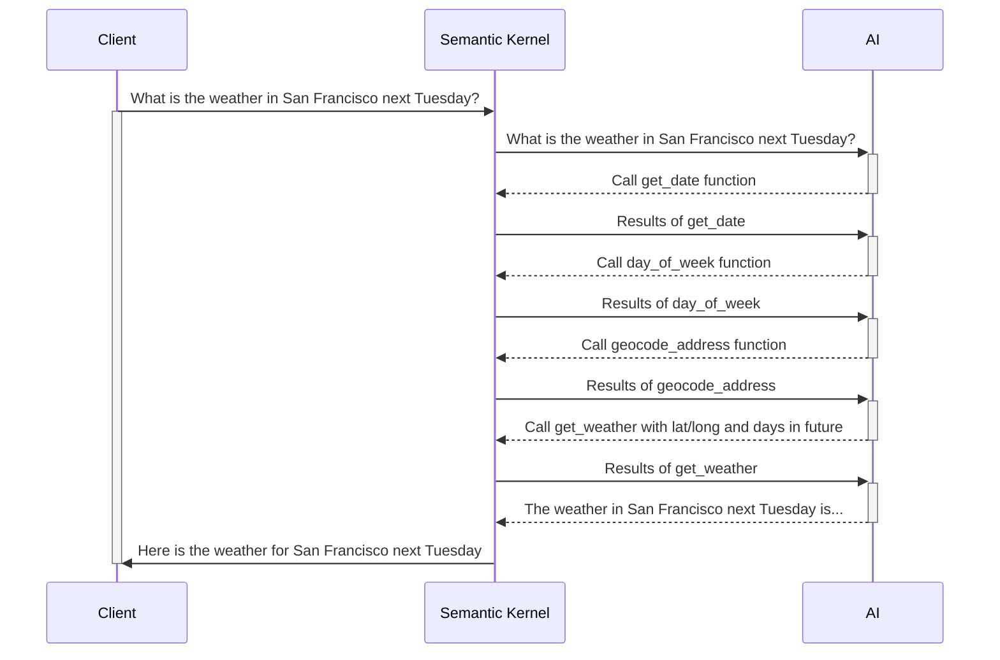

# **Exercise 3**: Semantic Kernel Plugins

### Estimated Duration: 60 minutes

Semantic Kernel truly shines in LLM development when you incorporate plugins. These plugins extend the AI's capabilities and provide access to additional knowledge that cannot be built directly into the model through training. Things such as time sensitive data, user specific information, and esoteric knowledge are all areas where the Plugin model can greatly improve the capabilities of your AI. In this challenge, you will implement a time plugin, and a plugin that retrieves the weather for a location to extend the capabilities of your chat bot.This challenge will introduce you to building Semantic Kernel Plugins in python, and how to chain plugins using the Auto Function Calling capabilities of Semantic Kernel.

## Objectives
In this exercise, you will be performing the following tasks:

## Task 1: Try the app without the Time Plugin

<details>
<summary><strong>Python</strong></summary>

1. Launch your AI Chat app, and submit the following prompt:
    ```
    What time is it?
    ```
2. Since the AI does not have the capability to provide real-time information, you will get a response similar to the following:
    ```
    I can't provide real-time information, including the current time. You can check the time on your device or through various online sources.
    ```

</details>

## Task 2: Create and import the Time Plugin
<details>
<summary><strong>Python</strong></summary>

1. Navigate to `Python>src>plugins` directory and create a new file named **time_plugin.py**.
1. Add the following code in the file:
    ```
    from datetime import datetime
    from typing import Annotated
    from semantic_kernel.functions import kernel_function


    class TimePlugin:
        @kernel_function()
        def current_time(self) -> str:
            return datetime.now().strftime("%Y-%m-%d %H:%M:%S")

        @kernel_function()
        def get_year(self, date_str: Annotated[str, "The date string in format YYYY-MM-DD"] = None) -> str:
            if date_str is None:
                return str(datetime.now().year)
            
            try:
                date_obj = datetime.strptime(date_str, "%Y-%m-%d")
                return str(date_obj.year)
            except ValueError:
                return "Invalid date format. Please use YYYY-MM-DD."

        @kernel_function()
        def get_month(self, date_str: Annotated[str, "The date string in format YYYY-MM-DD"] = None) -> str:
            if date_str is None:
                return datetime.now().strftime("%B")
            
            try:
                date_obj = datetime.strptime(date_str, "%Y-%m-%d")
                return date_obj.strftime("%B")  # Full month name
            except ValueError:
                return "Invalid date format. Please use YYYY-MM-DD."

        @kernel_function()
        def get_day_of_week(self, date_str: Annotated[str, "The date string in format YYYY-MM-DD"] = None) -> str:
            if date_str is None:
                return datetime.now().strftime("%A")
            
            try:
                date_obj = datetime.strptime(date_str, "%Y-%m-%d")
                return date_obj.strftime("%A")  # Full weekday name
            except ValueError:
                return "Invalid date format. Please use YYYY-MM-DD."
    ```
1. Save the file.
1. Navigate to `Python>src` directory and open **chat.py** file.
1. Add the following code in the `#Import Modules` section of the file.
    ```
    from semantic_kernel.connectors.ai.open_ai.prompt_execution_settings.azure_chat_prompt_execution_settings import (
        AzureChatPromptExecutionSettings,
    )
    from plugins.time_plugin import TimePlugin
    ```
1. Add the following code in the `#Challenge 03 - Create Prompt Execution Settings` section of the file.
    ```
    execution_settings = AzureChatPromptExecutionSettings()
    execution_settings.function_choice_behavior = FunctionChoiceBehavior.Auto()
    logger.info("Automatic function calling enabled")
    ```
1. Add the following code in the `# Placeholder for Time plugin` section of the file.
    ```
    time_plugin = TimePlugin()
    kernel.add_plugin(time_plugin, plugin_name="TimePlugin")
    logger.info("Time plugin loaded")
    ```
1. Add the following code in the `# Placeholder for Time plugin` section of the file.
    ```
    time_plugin = TimePlugin()
    kernel.add_plugin(time_plugin, plugin_name="TimePlugin")
    logger.info("Time plugin loaded")
    ```
1. Search (using Ctrl+F) and remove the following piece of code from the file as we will enable automatic function calling and this is no longer required:
    ```
    execution_settings = kernel.get_prompt_execution_settings_from_service_id("chat-service")
    ```
    >**Note**: You need to remove it from two code blocks, one will be inside **def initialize_kernel():** function and another will be in **global chat_history** code block.
1. In case you encounter any indentation error, use the below code:
    ```
    import asyncio
    import logging
    from dotenv import load_dotenv
    from semantic_kernel import Kernel
    from semantic_kernel.connectors.ai.open_ai import AzureChatCompletion, OpenAITextToImage
    from semantic_kernel.connectors.ai.function_choice_behavior import FunctionChoiceBehavior
    from semantic_kernel.connectors.openapi_plugin import OpenAPIFunctionExecutionParameters
    from semantic_kernel.contents.chat_history import ChatHistory
    from semantic_kernel.functions import KernelArguments
    #Import Modules
    from semantic_kernel.connectors.ai.chat_completion_client_base import ChatCompletionClientBase
    from semantic_kernel.connectors.ai.open_ai import OpenAIChatPromptExecutionSettings
    import os
    from semantic_kernel.connectors.ai.open_ai.prompt_execution_settings.azure_chat_prompt_execution_settings import (
        AzureChatPromptExecutionSettings,
    )
    from plugins.time_plugin import TimePlugin

    #Add Logger
    logger = logging.getLogger(__name__)

    load_dotenv(override=True)

    chat_history = ChatHistory()

    def initialize_kernel():
    #Challene 02 - Add Kernel
        kernel = Kernel()
        #Challenge 02 - Chat Completion Service
        chat_completion_service = AzureChatCompletion(
            deployment_name=os.getenv("AZURE_OPENAI_CHAT_DEPLOYMENT_NAME"),
            api_key=os.getenv("AZURE_OPENAI_API_KEY"),
            endpoint=os.getenv("AZURE_OPENAI_ENDPOINT"),
            service_id="chat-service",
        )
        kernel.add_service(chat_completion_service)
        chat_completion_service = kernel.get_service(type=ChatCompletionClientBase)
        return kernel


    async def process_message(user_input):
        kernel = initialize_kernel()

        #Challenge 03 and 04 - Services Required
        #Challenge 03 - Create Prompt Execution Settings
        execution_settings = AzureChatPromptExecutionSettings()
        execution_settings.function_choice_behavior = FunctionChoiceBehavior.Auto()
        logger.info("Automatic function calling enabled")


        # Challenge 03 - Add Time Plugin
        # Placeholder for Time plugin
        time_plugin = TimePlugin()
        kernel.add_plugin(time_plugin, plugin_name="TimePlugin")
        logger.info("Time plugin loaded")

        # Challenge 04 - Import OpenAPI Spec
        # Placeholder for OpenAPI plugin


        # Challenge 05 - Add Search Plugin


        # Challenge 06- Semantic kernel filters

        # Challenge 07 - Text To Image Plugin
        # Placeholder for Text To Image plugin

        # Start Challenge 02 - Sending a message to the chat completion service by invoking kernel
        global chat_history
        chat_history.add_user_message(user_input)
        chat_completion = kernel.get_service(type=ChatCompletionClientBase)
        response = await chat_completion.get_chat_message_content(
            chat_history=chat_history,
            settings=execution_settings,
            kernel=kernel
        )
        chat_history.add_assistant_message(str(response))

        #return result
        logger.info(f"Response: {response}")
        return response

    def reset_chat_history():
        global chat_history
        chat_history = ChatHistory()
    ```
1. Save the file.
1. Right click on `Python>src` in the left pane and select **Open in Integrated Terminal**.
1. Use the following command to run the app:
    ```
    streamlit run app.py
    ```
1. If the app does not open automatically in the browser, you can access it using the following **URL**:
    ```
    http://localhost:8501
    ```
1. Submit the following prompt:
    ```
    What time is it?
    ```
2. Since the AI have the **Time Plugin**, it will be able to provide real-time information, you will get a response similar to the following:
    ```
    The current time is 3:43 PM on January 23, 2025.
    ```
</details>

## Task 3: Create and import the Geocoding Plugin
1. Navigate to [Geocoding API](https://geocode.maps.co/) portal and click on **Free API key** button on the top.
1. Enter you details and click on **Create Account**.
    >**Note**: Use your personal or work e-mail ID to register.
1. You will recieve an e-mail, click on the link in the e-mail to verify your e-mail.
1. You will recieve your free **geocoding API key**, save it for further use.
<details>
<summary><strong>Python</strong></summary>

1. Navigate to `Python>src` directory and open **.env** file.
1. Paste the geocoding API key you recieved just now via e-mail besides `GEOCODING_API_KEY`.
    >Note:- Ensure that every value in the **.env** file is enclosed in **double quotes (")**.
1. Save the file.
1. Navigate to `Python>src` directory and open **chat.py** file.
1. Add the following code in the `#Import Modules` section of the file.
    ```
    from plugins.geo_coding_plugin import GeoPlugin
    ```
1. Add the following code in the `# Placeholder for Time plugin` section, after the **time plugin** in the file.
    ```
    kernel.add_plugin(
          GeoPlugin(),
          plugin_name="GeoLocation",
    )
    logger.info("GeoLocation plugin loaded")
    ```
1. In case you encounter any indentation error, use the below code:
    ```
    import asyncio
    import logging
    from dotenv import load_dotenv
    from semantic_kernel import Kernel
    from semantic_kernel.connectors.ai.open_ai import AzureChatCompletion, OpenAITextToImage
    from semantic_kernel.connectors.ai.function_choice_behavior import FunctionChoiceBehavior
    from semantic_kernel.connectors.openapi_plugin import OpenAPIFunctionExecutionParameters
    from semantic_kernel.contents.chat_history import ChatHistory
    from semantic_kernel.functions import KernelArguments
    #Import Modules
    from semantic_kernel.connectors.ai.chat_completion_client_base import ChatCompletionClientBase
    from semantic_kernel.connectors.ai.open_ai import OpenAIChatPromptExecutionSettings
    import os
    from semantic_kernel.connectors.ai.open_ai.prompt_execution_settings.azure_chat_prompt_execution_settings import (
        AzureChatPromptExecutionSettings,
    )
    from plugins.time_plugin import TimePlugin
    from plugins.geo_coding_plugin import GeoPlugin

    #Add Logger
    logger = logging.getLogger(__name__)

    load_dotenv(override=True)

    chat_history = ChatHistory()

    def initialize_kernel():
    #Challene 02 - Add Kernel
        kernel = Kernel()
        #Challenge 02 - Chat Completion Service
        chat_completion_service = AzureChatCompletion(
            deployment_name=os.getenv("AZURE_OPENAI_CHAT_DEPLOYMENT_NAME"),
            api_key=os.getenv("AZURE_OPENAI_API_KEY"),
            endpoint=os.getenv("AZURE_OPENAI_ENDPOINT"),
            service_id="chat-service",
        )
        kernel.add_service(chat_completion_service)
        chat_completion_service = kernel.get_service(type=ChatCompletionClientBase)
        return kernel


    async def process_message(user_input):
        kernel = initialize_kernel()

        #Challenge 03 and 04 - Services Required
        #Challenge 03 - Create Prompt Execution Settings
        execution_settings = AzureChatPromptExecutionSettings()
        execution_settings.function_choice_behavior = FunctionChoiceBehavior.Auto()
        logger.info("Automatic function calling enabled")


        # Challenge 03 - Add Time Plugin
        # Placeholder for Time plugin
        time_plugin = TimePlugin()
        kernel.add_plugin(time_plugin, plugin_name="TimePlugin")
        logger.info("Time plugin loaded")

        kernel.add_plugin(
            GeoPlugin(),
            plugin_name="GeoLocation",
        )
        logger.info("GeoLocation plugin loaded")

        # Challenge 04 - Import OpenAPI Spec
        # Placeholder for OpenAPI plugin


        # Challenge 05 - Add Search Plugin


        # Challenge 06- Semantic kernel filters

        # Challenge 07 - Text To Image Plugin
        # Placeholder for Text To Image plugin

        # Start Challenge 02 - Sending a message to the chat completion service by invoking kernel
        global chat_history
        chat_history.add_user_message(user_input)
        chat_completion = kernel.get_service(type=ChatCompletionClientBase)
        response = await chat_completion.get_chat_message_content(
            chat_history=chat_history,
            settings=execution_settings,
            kernel=kernel
        )
        chat_history.add_assistant_message(str(response))

        #return result
        logger.info(f"Response: {response}")
        return response

    def reset_chat_history():
        global chat_history
        chat_history = ChatHistory()
    ```
1. Save the file.
1. Right click on `Python>src` in the left pane and select **Open in Integrated Terminal**.
1. Use the following command to run the app:
    ```
    streamlit run app.py
    ```
1. If the app does not open automatically in the browser, you can access it using the following **URL**:
    ```
    http://localhost:8501
    ```
1. Submit the following prompt:
    ```
    What are the geo-coordinates for Tampa, FL
    ```
2. Since the AI have the **Geocoding Plugin**, it will be able to provide real-time information, you will get a response similar to the following:
    ```
    The geo-coordinates for Tampa, FL are:

    Latitude: 27.9477595
    Longitude: -82.458444 
    ```

</details>

## Task 4: Create and import the Weather Plugin
<details>
<summary><strong>Python</strong></summary>

1. Navigate to `Python>src>plugins` directory and create a new file named **weather_plugin.py**.
1. Add the following code in the file:
    ```
    from typing import Annotated
    import requests
    from semantic_kernel.functions import kernel_function
    import json
    from datetime import datetime, timedelta

    class WeatherPlugin:
        @kernel_function(description="Get weather forecast for a location up to 16 days in the future")
        def get_forecast_weather(self, 
                                latitude: Annotated[float, "Latitude of the location"],
                                longitude: Annotated[float, "Longitude of the location"],
                                days: Annotated[int, "Number of days to forecast (up to 16)"] = 16):
            
            # Ensure days is within valid range (API supports up to 16 days)
            if days > 16:
                days = 16
            
            url = (f"https://api.open-meteo.com/v1/forecast"
                f"?latitude={latitude}&longitude={longitude}"
                f"&daily=temperature_2m_max,temperature_2m_min,precipitation_sum,precipitation_probability_max,weather_code"
                f"&current=temperature_2m,relative_humidity_2m,apparent_temperature,precipitation,weather_code,wind_speed_10m"
                f"&temperature_unit=fahrenheit&wind_speed_unit=mph&precipitation_unit=inch"
                f"&forecast_days={days}&timezone=auto")
            
            try:
                response = requests.get(url)
                response.raise_for_status()
                data = response.json()
                
                daily = data.get('daily', {})
                times = daily.get('time', [])
                max_temps = daily.get('temperature_2m_max', [])
                min_temps = daily.get('temperature_2m_min', [])
                precip_sums = daily.get('precipitation_sum', [])
                precip_probs = daily.get('precipitation_probability_max', [])
                weather_codes = daily.get('weather_code', [])
                
                forecasts = []
                for i in range(len(times)):
                    # Convert date string to datetime object for day name
                    date_obj = datetime.strptime(times[i], "%Y-%m-%d")
                    day_name = date_obj.strftime("%A, %B %d")
                    
                    weather_desc = self._get_weather_description(weather_codes[i])
                    
                    forecast = {
                        "date": times[i],
                        "day": day_name,
                        "high_temp": f"{max_temps[i]}°F",
                        "low_temp": f"{min_temps[i]}°F",
                        "precipitation": f"{precip_sums[i]} inches",
                        "precipitation_probability": f"{precip_probs[i]}%",
                        "conditions": weather_desc
                    }
                    forecasts.append(forecast)
                
                result = {
                    "location_coords": f"{latitude}, {longitude}",
                    "forecast_days": len(forecasts),
                    "forecasts": forecasts
                }
                
                # For more concise output in chat
                return json.dumps(result, indent=2)
            except Exception as e:
                return f"Error fetching forecast weather: {str(e)}"
        
        def _get_weather_description(self, code):
            weather_codes = {
                0: "Clear sky",
                1: "Mainly clear", 2: "Partly cloudy", 3: "Overcast",
                45: "Fog", 48: "Depositing rime fog",
                51: "Light drizzle", 53: "Moderate drizzle", 55: "Dense drizzle",
                56: "Light freezing drizzle", 57: "Dense freezing drizzle",
                61: "Slight rain", 63: "Moderate rain", 65: "Heavy rain",
                66: "Light freezing rain", 67: "Heavy freezing rain",
                71: "Slight snow fall", 73: "Moderate snow fall", 75: "Heavy snow fall",
                77: "Snow grains",
                80: "Slight rain showers", 81: "Moderate rain showers", 82: "Violent rain showers",
                85: "Slight snow showers", 86: "Heavy snow showers",
                95: "Thunderstorm", 96: "Thunderstorm with slight hail", 99: "Thunderstorm with heavy hail"
            }
            return weather_codes.get(code, "Unknown")
    ```
1. Save the file.
1. Navigate to `Python>src` directory and open **chat.py** file.
1. Add the following code in the `#Import Modules` section of the file.
    ```
    from plugins.weather_plugin import WeatherPlugin
    ```
1. Add the following code in the `# Placeholder for Time plugin` section, after the **Geocoding plugin** in the file.
    ```
    kernel.add_plugin(
        WeatherPlugin(),
        plugin_name="Weather",
    )
    logger.info("Weather plugin loaded")
    ```
1. In case you encounter any indentation error, use the below code:
    ```
    import asyncio
    import logging
    from dotenv import load_dotenv
    from semantic_kernel import Kernel
    from semantic_kernel.connectors.ai.open_ai import AzureChatCompletion, OpenAITextToImage
    from semantic_kernel.connectors.ai.function_choice_behavior import FunctionChoiceBehavior
    from semantic_kernel.connectors.openapi_plugin import OpenAPIFunctionExecutionParameters
    from semantic_kernel.contents.chat_history import ChatHistory
    from semantic_kernel.functions import KernelArguments
    #Import Modules
    from semantic_kernel.connectors.ai.chat_completion_client_base import ChatCompletionClientBase
    from semantic_kernel.connectors.ai.open_ai import OpenAIChatPromptExecutionSettings
    import os
    from semantic_kernel.connectors.ai.open_ai.prompt_execution_settings.azure_chat_prompt_execution_settings import (
        AzureChatPromptExecutionSettings,
    )
    from plugins.time_plugin import TimePlugin
    from plugins.geo_coding_plugin import GeoPlugin
    from plugins.weather_plugin import WeatherPlugin

    #Add Logger
    logger = logging.getLogger(__name__)

    load_dotenv(override=True)

    chat_history = ChatHistory()

    def initialize_kernel():
    #Challene 02 - Add Kernel
        kernel = Kernel()
        #Challenge 02 - Chat Completion Service
        chat_completion_service = AzureChatCompletion(
            deployment_name=os.getenv("AZURE_OPENAI_CHAT_DEPLOYMENT_NAME"),
            api_key=os.getenv("AZURE_OPENAI_API_KEY"),
            endpoint=os.getenv("AZURE_OPENAI_ENDPOINT"),
            service_id="chat-service",
        )
        kernel.add_service(chat_completion_service)
        chat_completion_service = kernel.get_service(type=ChatCompletionClientBase)
        return kernel


    async def process_message(user_input):
        kernel = initialize_kernel()

        #Challenge 03 and 04 - Services Required
        #Challenge 03 - Create Prompt Execution Settings
        execution_settings = AzureChatPromptExecutionSettings()
        execution_settings.function_choice_behavior = FunctionChoiceBehavior.Auto()
        logger.info("Automatic function calling enabled")


        # Challenge 03 - Add Time Plugin
        # Placeholder for Time plugin
        time_plugin = TimePlugin()
        kernel.add_plugin(time_plugin, plugin_name="TimePlugin")
        logger.info("Time plugin loaded")

        kernel.add_plugin(
            GeoPlugin(),
            plugin_name="GeoLocation",
        )
        logger.info("GeoLocation plugin loaded")

        kernel.add_plugin(
            WeatherPlugin(),
            plugin_name="Weather",
        )
        logger.info("Weather plugin loaded")

        # Challenge 04 - Import OpenAPI Spec
        # Placeholder for OpenAPI plugin


        # Challenge 05 - Add Search Plugin


        # Challenge 06- Semantic kernel filters

        # Challenge 07 - Text To Image Plugin
        # Placeholder for Text To Image plugin

        # Start Challenge 02 - Sending a message to the chat completion service by invoking kernel
        global chat_history
        chat_history.add_user_message(user_input)
        chat_completion = kernel.get_service(type=ChatCompletionClientBase)
        response = await chat_completion.get_chat_message_content(
            chat_history=chat_history,
            settings=execution_settings,
            kernel=kernel
        )
        chat_history.add_assistant_message(str(response))

        #return result
        logger.info(f"Response: {response}")
        return response

    def reset_chat_history():
        global chat_history
        chat_history = ChatHistory()
    ```
1. Save the file.
1. Right click on `Python>src` in the left pane and select **Open in Integrated Terminal**.
1. Use the following command to run the app:
    ```
    streamlit run app.py
    ```
1. If the app does not open automatically in the browser, you can access it using the following **URL**:
    ```
    http://localhost:8501
    ```
1. Submit the following prompt:
    ```
    What is the weather in San Francisco next Tuesday?
    ```
The AI will perform the following plan to answer the question but may do so in a different order or different set of functions:

1️⃣ The AI should ask Semantic Kernel to call the GetDate function on the Time Plugin to get today's date in order to calculate the number of days until next Thursday

2️⃣ Because the Weather Forecast requires a Latitude and Longitude, the AI should instruct Semantic Kernel to call the GetLocation function on the Geocoding Plugin to get the coordinates for San Francisco

3️⃣ Finally, the AI should ask Semantic Kernel to call the GetWeatherForecast function on the Weather Plugin passing in the current date/time and Lat/Long to get the weather forecast for Next Thursday (expressed as the number of days in the future) at the coordinates for San Francisco

A simplified sequence diagram between Semantic Kernel and AI is shown below:



</details>
