# Exercise 5: Retrieval-Augmented Generation (RAG)

### Estimated Duration: 40 Minutes

This hands-on lab introduces you to the Retrieval-Augmented Generation (RAG) pattern—an AI architecture that enhances response quality by integrating relevant external knowledge into the generative process. Designed for those new to RAG, the lab guides you through how retrieval mechanisms work alongside generative models to deliver more accurate, informed, and context-aware outputs. You will also gain a clear understanding of data privacy and security prompts, completions, embeddings, and training data remaining fully isolated—they are not shared with other customers, OpenAI, Microsoft, or third parties, nor are they used to improve models automatically.

## Objectives
In this exercise, you will be performing the following tasks:
- Task 1: Deploy a Text Embedding model
- Task 2: Create a Semantic Search Plugin to query the AI Search Index

## Task 1: Deploy a Text Embedding model

In this task, you will explore different flow types in Azure AI Foundry by deploying a Text Embedding model to enable text representation and similarity analysis.

1. Navigate to the [Azure AI Foundry](https://ai.azure.com/) portal.
1. Click on **Models + endpoints (1)** under **My assets** in the left pane, then click on **+ Deploy model**, followed by **Deploy Base model (2)**.

    
1. Search for **text-embedding-ada-002**, select the model **(1)**, and click on **Confirm (2)**.

    

1. Click on **Deploy**.

1. Navigate back to **Models+endpoints (1)**, select **GPT-4o (2)**, and click on **Open in playground (3)**.

    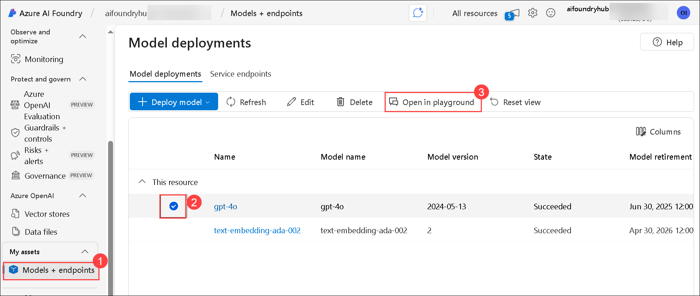

1. Click on **Add your data (1)** and select **+ Add a data source (2)**.

    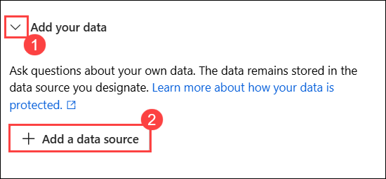

1. On the **Select or add data source**blade, provide the following details and then click on **Next (6)**:

    - Select **Upload files (Preview)** for `Data source`
    - Subscription: Leave the default one
    - Select Azure blob Azure Storage blob resouce: Select the storage account that starts with **aifoundryhubxxxxxx (1)**
    - Select Azure AI Search resource: Select **ai-search-<inject key="Deployment ID" enableCopy="false"></inject> (2)** 
    - Enter the index name: Enter **employeehandbook (3)** 
    - **Check the box** labeled Add vector search to enable this feature for the search resource **(4)**
    - Under Select an embedding model: choose **text-embedding-ada-002** **(5)** from the dropdown menu.
    - Click on **Next** **(6)**
 
      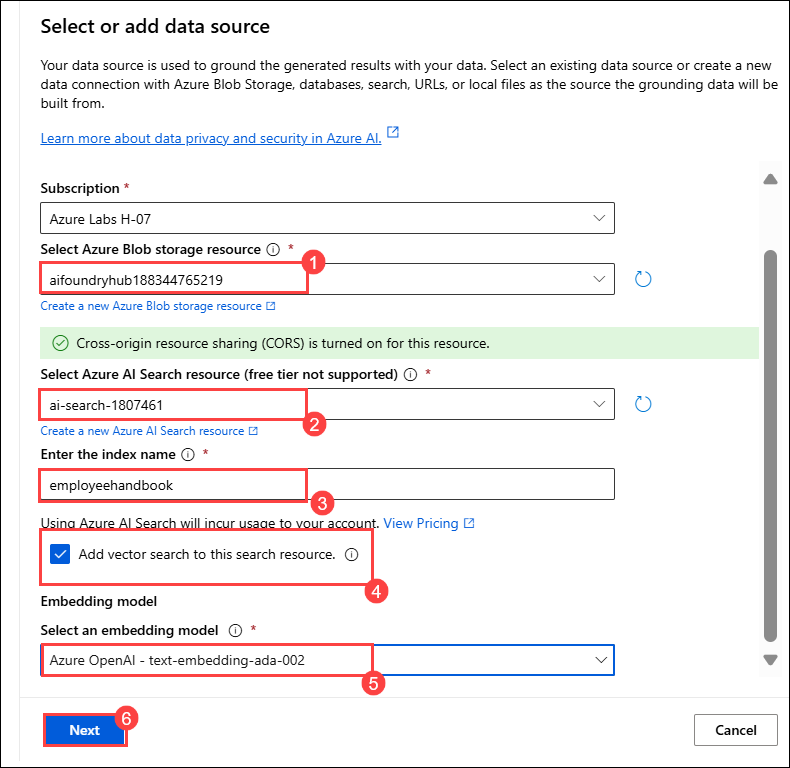

      >**Note:** If you receive a message prompting you to **Turn on CORS**, go ahead and click on it.

      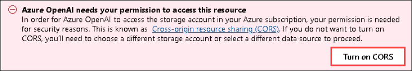      

1. Click on **Browse for files**.

    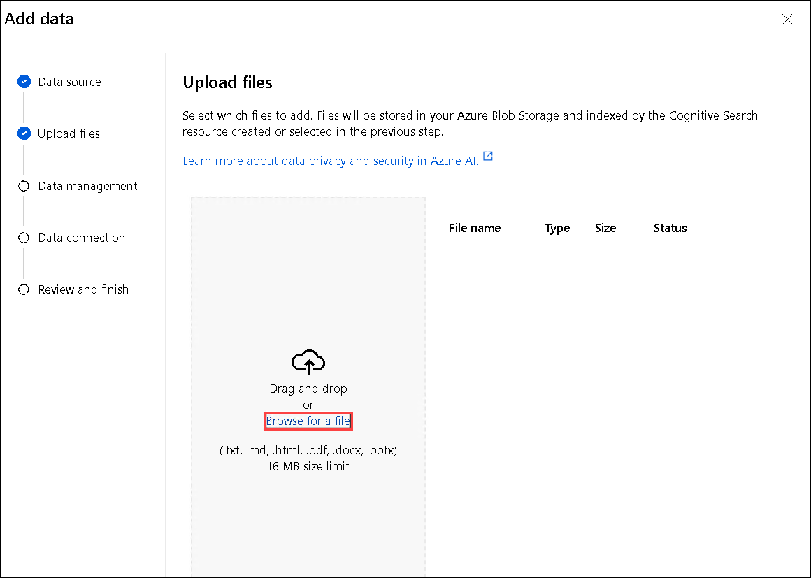
  
1. Navigate to `C:\LabFiles\ai-developer\Dotnet\src\BlazorAI\data\` and select **employee_handbook.pdf (1).** Click on **Open (2)**.

    

1. Click on **Upload files**.

    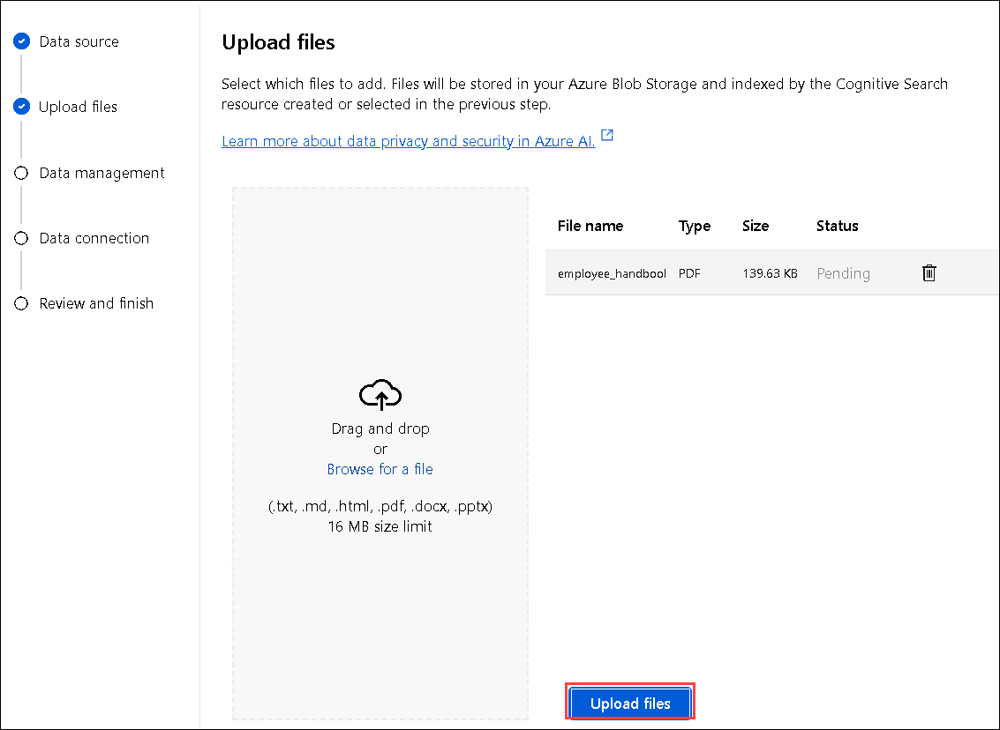

1. Click on **Next**.

1. On the **Data Management** page, click on **Next**.

    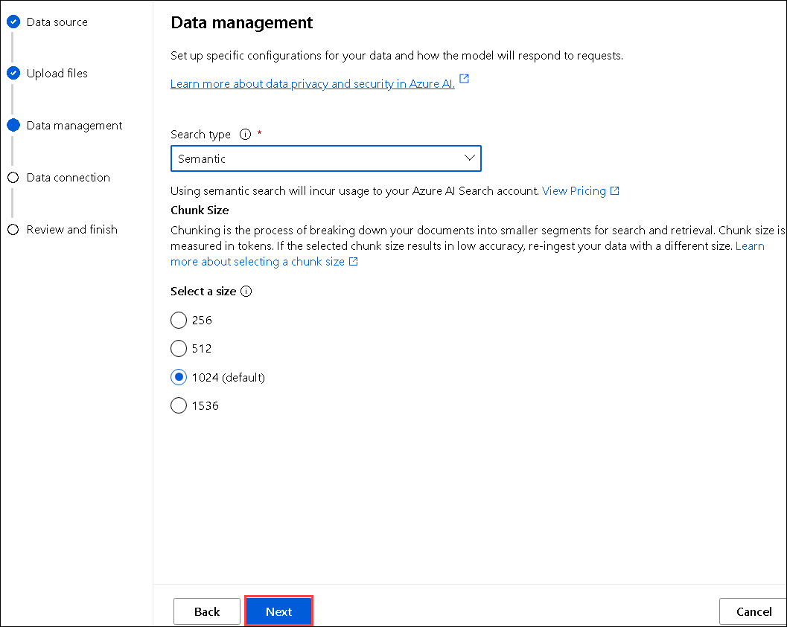

1. On the **Data Connection** blade, select **API Key (1)** for authenticatio and then click on **Next (2)**.    

    

1. Review the configuration and then click on **Save and close**.

    

1. The data injection might take around 5 minutes.

    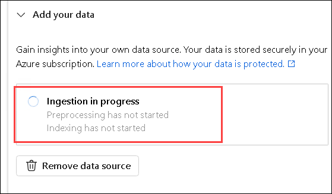

1. Navigate to the **Azure Portal** and search **AI Search (1).** Click on it and open the **AI Search (2)** resource located there.

    

1. Select **ai-search-<inject key="Deployment ID" enableCopy="false"></inject>**.    
    
    

1. On the **Overview (1)** page, copy the **URL (2)** and paste it into Notepad.

    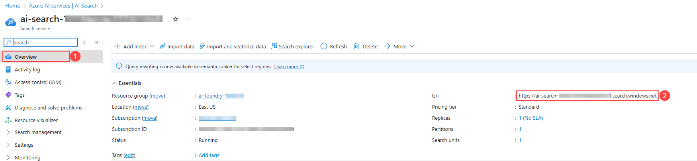

1. Navigate to **Keys (1)** under **Settings** in the left pane, copy the **Primary admin key (2)** from Azure Portal, and paste it into Notepad.

    

> **Congratulations** on completing the task! Now, it's time to validate it. Here are the steps:

- Hit the Validate button for the corresponding task. If you receive a success message, you can proceed to the next task. 
- If not, carefully read the error message and retry the step, following the instructions in the lab guide.
- If you need any assistance, please contact us at cloudlabs-support@spektrasystems.com. We are available 24/7 to help you out.

<validation step="aba3f1c2-bf55-4ca3-baf6-fcaa280552fa" />  

## Task 2: Create a Semantic Search Plugin to query the AI Search Index

In this task, you will explore different flow types in Azure AI Foundry by creating a Semantic Search Plugin to query the AI Search Index for enhanced retrieval capabilities.

<details>
<summary><strong>Python</strong></summary>

1. Navigate to `Python>src` directory and open **.env (1)** file.

      

1. Paste the **AI search URL** that you copied earlier in the exercise besides `AI_SEARCH_URL` in **.env** file.

      > **Note:** Ensure that every value in the **.env** file is enclosed in **double quotes (")**.

1. Paste the **Primary admin key** that you copied earlier in the exercise besides `AI_SEARCH_KEY`.

      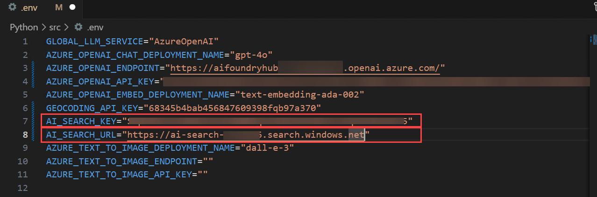

1. On the **Overview (1)** page, Go to **Azure AI services (2)** and Copy the **Azure AI services Endpoint (3)** and Copy the Key as well.

    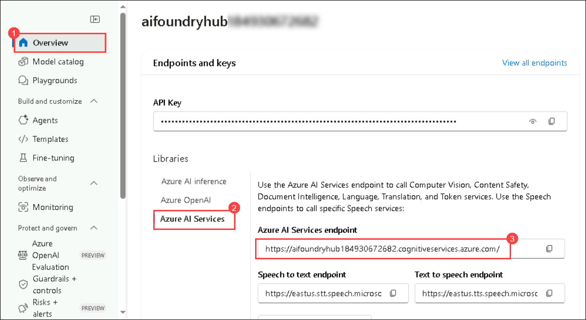

1. Paste the **Embed API key** you copied earlier into the .env file, next to the `AZURE_OPENAI_EMBED_API_KEY` entry.

1. Paste the **Embed Endpoint** you copied earlier into the .env file, next to the `AZURE_OPENAI_EMBED_ENDPOINT` entry.

      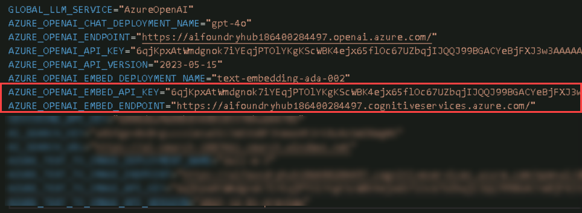

1. Save the file.

1. Navigate to `Python>src>plugins` directory and create a new file named **ContosoSearchPlugin.py (1)**.

      

1. Add the following code to the file:

    ```
    import json
    import os
    from typing import Dict, List, Any, Optional

    import requests
    from azure.core.credentials import AzureKeyCredential
    from azure.search.documents import SearchClient
    from azure.search.documents.models import VectorizedQuery
    from dotenv import load_dotenv

    class ContosoSearchPlugin:
    def __init__(self):
        load_dotenv()

        self.openai_endpoint = os.getenv("AZURE_OPENAI_ENDPOINT")
        self.openai_api_key = os.getenv("AZURE_OPENAI_API_KEY")
        self.embedding_deployment = os.getenv("AZURE_OPENAI_EMBED_DEPLOYMENT_NAME")
        self.embedding_api_version = os.getenv("AZURE_OPENAI_API_VERSION", "2023-05-15")
        # Get embedding endpoint from environment variable
        self.embedding_endpoint = os.getenv("AZURE_OPENAI_EMBED_ENDPOINT", self.openai_endpoint)

        self.search_endpoint = os.getenv("AI_SEARCH_URL")
        self.search_key = os.getenv("AI_SEARCH_KEY")
        self.search_index_name = os.getenv("AZURE_SEARCH_INDEX", "employeehandbook")

        self.search_client = SearchClient(
            endpoint=self.search_endpoint,
            index_name=self.search_index_name,
            credential=AzureKeyCredential(self.search_key)
        )

        
        # Chat completion endpoint for rephrasing
        self.chat_endpoint = self.openai_endpoint
        self.chat_deployment = os.getenv("AZURE_OPENAI_CHAT_DEPLOYMENT_NAME")
        self.chat_api_version = os.getenv("AZURE_OPENAI_API_VERSION", "2023-12-01-preview")

    def generate_embedding(self, text: str) -> List[float]:
        if not text:
            raise ValueError("Input text cannot be empty")
        
        url = f"{self.embedding_endpoint}/openai/deployments/{self.embedding_deployment}/embeddings?api-version={self.embedding_api_version}"
        headers = {
            "Content-Type": "application/json",
            "api-key": self.openai_api_key
        }
        payload = {
            "input": text
            # Remove dimensions parameter as it's not supported by this model
        }

        try:
            response = requests.post(url, headers=headers, json=payload)
            response.raise_for_status()
            embedding_data = response.json()
            return embedding_data["data"][0]["embedding"]
        except Exception as e:
            raise Exception(f"Failed to generate embedding: {str(e)}")

    def rephrase_with_chat_model(self, content: str, query: str) -> str:
        """
        Use the chat model to rephrase and improve the content from search results
        """
        try:
            url = f"{self.chat_endpoint}/openai/deployments/{self.chat_deployment}/chat/completions?api-version={self.chat_api_version}"
            
            headers = {
                "Content-Type": "application/json",
                "api-key": self.openai_api_key
            }
            
            # Create a prompt to rephrase the content
            system_prompt = """You are a helpful assistant that rephrases and improves content from an employee handbook. 
            Your task is to:
            1. Make the content clear and easy to understand
            2. Keep all important information intact
            3. Structure the response in a professional manner
            4. Focus on answering the specific question asked
            5. Remove any redundant or unclear text
            6. Provide a direct, specific answer to the question"""
            
            user_prompt = f"""Please rephrase and improve the following content from Contoso's employee handbook to directly answer this specific question: "{query}"

    Content from handbook:
    {content}

    Please provide a clear, professional, and direct response that specifically answers the question. Do not include generic information that doesn't address the question."""

            payload = {
                "messages": [
                    {"role": "system", "content": system_prompt},
                    {"role": "user", "content": user_prompt}
                ],
                "max_tokens": 1000,
                "temperature": 0.2,  # Lower temperature for more consistent responses
                "top_p": 0.9
            }
            
            response = requests.post(url, headers=headers, json=payload)
            response.raise_for_status()
            
            result = response.json()
            rephrased_content = result["choices"][0]["message"]["content"]
            
            return rephrased_content.strip()
            
        except Exception as e:
            # If rephrasing fails, return the original content
            return content

    def search_documents(self, query: str, top: int = 3) -> List[Dict[str, Any]]:
        try:
            # Generate embedding for the query
            query_embedding = self.generate_embedding(query)
        
            # Create a vectorized query
            vector_query = VectorizedQuery(
                vector=query_embedding,
                k_nearest_neighbors=top,
                fields="contentVector"
            )
        
            # Enhance search with filters for better relevance
            search_filter = None
            query_lower = query.lower()
            
            # Add search filters based on query type for better targeting
            if 'security' in query_lower or 'data' in query_lower:
                search_filter = "search.ismatch('security OR data OR confidential OR privacy', 'content')"
            elif 'vacation' in query_lower or 'pto' in query_lower:
                search_filter = "search.ismatch('vacation OR pto OR leave OR time off', 'content')"
            elif 'policy' in query_lower:
                search_filter = "search.ismatch('policy OR guideline OR procedure', 'content')"
        
            # Execute the search
            results = self.search_client.search(
                search_text=query,  # Also include text search for hybrid retrieval
                vector_queries=[vector_query],
                select="*",  # Select all fields
                filter=search_filter,
                top=top
            )
        
            # Format the results
            search_results = []
            for result in results:
                result_dict = {
                    "score": result["@search.score"]
                }
                
                # Add all other fields that exist
                for field in ["chunk_id", "content", "title", "url", "filepath", "parent_id"]:
                    if field in result:
                        result_dict[field] = result[field]
                
                search_results.append(result_dict)
        
            return search_results
        
        except Exception as e:
            # If filtered search fails, try without filter
            try:
                results = self.search_client.search(
                    search_text=query,
                    vector_queries=[vector_query],
                    select="*",
                    top=top
                )
                
                search_results = []
                for result in results:
                    result_dict = {
                        "score": result["@search.score"]
                    }
                    
                    for field in ["chunk_id", "content", "title", "url", "filepath", "parent_id"]:
                        if field in result:
                            result_dict[field] = result[field]
                    
                    search_results.append(result_dict)
                
                return search_results
            except Exception as e2:
                raise Exception(f"Search failed: {str(e2)}")

    def query_handbook(self, query: str, top: int = 3) -> str:
        try:
            results = self.search_documents(query, top)
        
            # Format the results into a nice response
            if not results:
                return "No relevant information found in the Contoso Handbook."
        
            # Analyze the query to provide more specific responses
            query_lower = query.lower()
            
            # Check if it's a specific policy question
            if any(keyword in query_lower for keyword in ['data security', 'security policy', 'information security']):
                response = f"**Contoso Data Security Policy Information:**\n\n"
            elif any(keyword in query_lower for keyword in ['vacation', 'pto', 'time off', 'leave']):
                response = f"**Contoso Vacation and Time Off Policy:**\n\n"
            elif any(keyword in query_lower for keyword in ['confidential', 'confidentiality']):
                response = f"**Contoso Confidentiality Guidelines:**\n\n"
            elif any(keyword in query_lower for keyword in ['remote work', 'work from home', 'telework']):
                response = f"**Contoso Remote Work Policy:**\n\n"
            elif any(keyword in query_lower for keyword in ['benefits', 'health', 'insurance']):
                response = f"**Contoso Employee Benefits:**\n\n"
            else:
                response = f"**Information from Contoso Employee Handbook regarding '{query}':**\n\n"
            
            # Process each result for more specific information
            all_content = []
            for i, result in enumerate(results, 1):
                content = result.get('content', 'No content available')
                
                # Extract key information based on query type
                if 'data security' in query_lower or 'security policy' in query_lower:
                    # Look for specific security-related information
                    security_keywords = ['password', 'encryption', 'access', 'confidential', 'protect', 'secure', 'data handling', 'classification']
                    relevant_sentences = self.extract_relevant_sentences(content, security_keywords)
                    if relevant_sentences:
                        content = relevant_sentences
                
                elif 'vacation' in query_lower or 'pto' in query_lower:
                    # Look for vacation-specific information
                    vacation_keywords = ['days', 'hours', 'request', 'approval', 'accrual', 'balance', 'holiday']
                    relevant_sentences = self.extract_relevant_sentences(content, vacation_keywords)
                    if relevant_sentences:
                        content = relevant_sentences
                
                all_content.append(content)
            
            # Combine all content and rephrase using chat model
            combined_content = "\n\n".join(all_content)
            rephrased_content = self.rephrase_with_chat_model(combined_content, query)
            
            response += rephrased_content
            
            # Add source information
            response += "\n\n**Sources:**\n"
            for i, result in enumerate(results, 1):
                if result.get('title'):
                    response += f"- {result['title']}\n"
                elif result.get('url'):
                    response += f"- {result['url']}\n"
                else:
                    response += f"- Employee Handbook Section {i}\n"
        
            return response
        
        except Exception as e:
            return f"Error querying the Contoso Handbook: {str(e)}"

    def extract_relevant_sentences(self, content: str, keywords: List[str]) -> str:
        """Extract sentences that contain relevant keywords"""
        sentences = content.split('.')
        relevant_sentences = []
        
        for sentence in sentences:
            sentence = sentence.strip()
            if any(keyword.lower() in sentence.lower() for keyword in keywords):
                relevant_sentences.append(sentence)
        
        if relevant_sentences:
            return '. '.join(relevant_sentences[:3]) + '.'  # Limit to 3 most relevant sentences
        
        return content  # Return original content if no specific matches found
    if __name__ == "__main__":
    search_plugin = ContosoSearchPlugin()
    query = "What is Contoso's vacation policy?"
    result = search_plugin.query_handbook(query)
    print(result)
    ```
1. Save the file.

1. Navigate to `Python>src` directory and open **chat.py (1)** file.

      

1. Add the following code in the `#Import Modules` section of the file.

   ```
    from semantic_kernel.connectors.ai.chat_completion_client_base import ChatCompletionClientBase
    from semantic_kernel.connectors.ai.open_ai import OpenAIChatPromptExecutionSettings
    import os
    from semantic_kernel.connectors.ai.open_ai.prompt_execution_settings.azure_chat_prompt_execution_settings import (
    AzureChatPromptExecutionSettings,
    )
    from plugins.time_plugin import TimePlugin
    from plugins.geo_coding_plugin import GeoPlugin
    from plugins.weather_plugin import WeatherPlugin
    from semantic_kernel.connectors.ai.open_ai import AzureTextEmbedding
    from plugins.ContosoSearchPlugin import ContosoSearchPlugin
   ```

      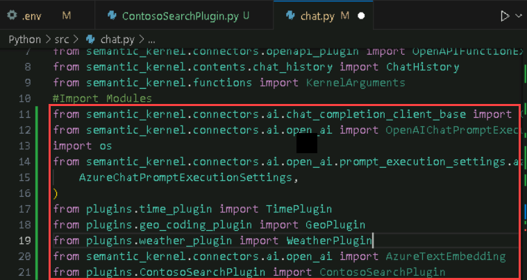

1. Add the following code in the `#Challenge 05 - Add Text Embedding service for semantic search` section of the file.

    ```
        text_embedding_service = AzureTextEmbedding(
        deployment_name=os.getenv("AZURE_OPENAI_EMBED_DEPLOYMENT_NAME"),
        api_key=os.getenv("AZURE_OPENAI_API_KEY"),
        endpoint=os.getenv("AZURE_OPENAI_ENDPOINT"),
        service_id="embedding-service"
    )
    kernel.add_service(text_embedding_service)
    logger.info("Text Embedding service added")
    #Challenge 07 - Add DALL-E image generation service
    chat_completion_service = kernel.get_service(type=ChatCompletionClientBase)
    return kernel
    async def process_message(user_input):
    global chat_history

    # Check if the query is related to Contoso to route to the handbook search
    if is_contoso_related(user_input):
        logger.info(f"Contoso-related query detected: {user_input}")
        
        # For Contoso queries, we want fresh responses without previous context
        # So we don't add to existing chat history, just get the fresh response
        result = await search_employee_handbook(user_input)
        
        # Clear existing chat history for Contoso queries to avoid context contamination
        chat_history = ChatHistory()
        
        # Add only the current interaction
        chat_history.add_user_message(user_input)
        chat_history.add_assistant_message(result)
        return result
        
        kernel = initialize_kernel()
    ```

    

    > **Note**: Please refer the screenshots to locate the code in proper position that helps you to avoid indentation error.

1. Add the following code in the `# Challenge 05 - Add Search Plugin` section of the file.

   ```
    kernel.add_plugin(
    ContosoSearchPlugin(),
    plugin_name="ContosoSearch",
    )
    logger.info("Contoso Handbook Search plugin loaded")
   ```

       

     > **Note**: Please refer the screenshots to locate the code in proper position that helps you to avoid indentation error.    

1. Refer to the code provided at the following URL. Please verify that your code matches the one below and correct any indentation errors if present

   - Open the provided link in your browser, press Ctrl + A to select all the content, then copy and paste it into Visual Studio Code

    ```
    https://raw.githubusercontent.com/CloudLabsAI-Azure/ai-developer/refs/heads/prod/CodeBase/python/lab-05.py
    ```

1. Save the file.

1. Right click on `Python>src` **(1)** in the left pane and select **Open in Integrated Terminal (2)**.

      

1. Use the following command to run the app:

    ```
    streamlit run app.py
    ```

1. If the app does not open automatically in the browser, you can access it using the following **URL**:

    ```
    http://localhost:8501
    ```

1. Submit the following prompt and see how the AI responds:

    ```
    What are the steps for the Contoso Performance Reviews?
    ```

    ```
    What is Contoso's policy on Data Security?
    ```

    ```
    Who do I contact at Contoso for questions regarding workplace safety?
    ```

1. You will receive a response similar to the one shown below:

      

      

      

</details>

<details>
<summary><strong>C Sharp(C#)</strong></summary>

1. Navigate to `Dotnet>src>BlazorAI` directory and open **appsettings.json (1)** file.

      

1. Paste the **AI search URL** that you copied earlier in the exercise besides `AI_SEARCH_URL` in **appsettings.json** file.

      > **Note:** Ensure that every value in the **appsettings.json** file is enclosed in **double quotes (")**.

1. Paste the **Primary admin key (1)** that you copied earlier in the exercise besides `AI_SEARCH_KEY` **(2)**.

      

1. Save the file.

1. Navigate to `Dotnet>src>BlazorAI>Plugins` directory and create a new file named **ContosoSearchPlugin.cs (1)**.

      

1. Add the following code to the file:

   ```
    using System.ComponentModel;
    using System.Text.Json.Serialization;
    using Azure;
    using Azure.Search.Documents;
    using Azure.Search.Documents.Indexes;
    using Azure.Search.Documents.Models;
    using Microsoft.SemanticKernel;
    using Microsoft.SemanticKernel.Embeddings;
    using System.Text;

    namespace BlazorAI.Plugins
    {
        public class ContosoSearchPlugin
        {
            private readonly ITextEmbeddingGenerationService _textEmbeddingGenerationService;
            private readonly SearchIndexClient _indexClient;

            public ContosoSearchPlugin(IConfiguration configuration)
            {
                // Create the search index client
                _indexClient = new SearchIndexClient(
                    new Uri(configuration["AI_SEARCH_URL"]),
                    new AzureKeyCredential(configuration["AI_SEARCH_KEY"]));

                // Get the embedding service from the kernel
                var kernelBuilder = Kernel.CreateBuilder();
                kernelBuilder.AddAzureOpenAITextEmbeddingGeneration(
                    configuration["EMBEDDINGS_DEPLOYMODEL"],
                    configuration["AOI_ENDPOINT"],
                    configuration["AOI_API_KEY"]);
                var kernel = kernelBuilder.Build();
                _textEmbeddingGenerationService = kernel.GetRequiredService<ITextEmbeddingGenerationService>();
            }

            [KernelFunction("SearchHandbook")]
            [Description("Searches the Contoso employee handbook for information about company policies, benefits, procedures, or other employee-related questions. Use this when the user asks about company policies, employee benefits, work procedures, or any information that might be in an employee handbook.")]
            public async Task<string> Search(
                [Description("The user's question about company policies, benefits, procedures or other handbook-related information")] string query)
            {
                try
                {
                    // Convert string query to vector embedding
                    ReadOnlyMemory<float> embedding = await _textEmbeddingGenerationService.GenerateEmbeddingAsync(query);

                    // Get client for search operations
                    SearchClient searchClient = _indexClient.GetSearchClient("employeehandbook");

                    // Configure request parameters
                    VectorizedQuery vectorQuery = new(embedding);
                    vectorQuery.Fields.Add("contentVector");  // The vector field in your index
                    vectorQuery.KNearestNeighborsCount = 3;   // Get top 3 matches

                    SearchOptions searchOptions = new()
                    {
                        VectorSearch = new() { Queries = { vectorQuery } },
                        Size = 3  // Return top 3 results
                    };

                    // Perform search request
                    Response<SearchResults<IndexSchema>> response = await searchClient.SearchAsync<IndexSchema>(searchOptions);

                    // Collect search results
                    StringBuilder results = new StringBuilder();
                    await foreach (SearchResult<IndexSchema> result in response.Value.GetResultsAsync())
                    {
                        if (!string.IsNullOrEmpty(result.Document.Content))
                        {
                            results.AppendLine($"Title: {result.Document.Title}");
                            results.AppendLine($"Content: {result.Document.Content}");
                            results.AppendLine();
                        }
                    }

                    return results.Length > 0 
                        ? results.ToString()
                        : "No relevant information found in the employee handbook.";
                }
                catch (Exception ex)
                {
                    return $"Search error: {ex.Message}";
                }
            }

            private sealed class IndexSchema
            {
                [JsonPropertyName("content")]
                public string Content { get; set; }

                [JsonPropertyName("title")]
                public string Title { get; set; }

                [JsonPropertyName("url")]
                public string Url { get; set; }
            }
        }
    }
   ```

1. Save the file.

1. Navigate to `Dotnet>src>BlazorAI>Components>Pages` directory and open **Chat.razor.cs (1)** file.

      

1. Add the following code in the `// Import Models` section of the file.

    ```
    using Microsoft.SemanticKernel.Connectors.AzureAISearch;
    using Azure;
    using Azure.Search.Documents.Indexes;
    using Microsoft.Extensions.DependencyInjection;
    ```

      

1. Add the following code in the `// Challenge 05 - Register Azure AI Foundry Text Embeddings Generation` section of the file.

    ```
    kernelBuilder.AddAzureOpenAITextEmbeddingGeneration(
        Configuration["EMBEDDINGS_DEPLOYMODEL"]!,
        Configuration["AOI_ENDPOINT"]!,
        Configuration["AOI_API_KEY"]!);
    ```

      

      > **Note**: Please refer the screenshots to locate the code in proper position that helps you to avoid indentation error.

1. Add the following code in the `// Challenge 05 - Register Search Index` section of the file.

    ```
    kernelBuilder.Services.AddSingleton<SearchIndexClient>(sp => 
        new SearchIndexClient(
            new Uri(Configuration["AI_SEARCH_URL"]!), 
            new AzureKeyCredential(Configuration["AI_SEARCH_KEY"]!)
        )
    );
    
    kernelBuilder.Services.AddSingleton<AzureAISearchVectorStoreRecordCollection<Dictionary<string, object>>>(sp =>
    {
        var searchIndexClient = sp.GetRequiredService<SearchIndexClient>();
        return new AzureAISearchVectorStoreRecordCollection<Dictionary<string, object>>(
            searchIndexClient,
            "employeehandbook"
        );
    });
    
    kernelBuilder.AddAzureAISearchVectorStore();
    ```

      

      > **Note**: Please refer the screenshots to locate the code in proper position that helps you to avoid indentation error.

1. Add the following code in the `// Challenge 05 - Add Search Plugin` section of the file.

     ```
     var searchPlugin = new ContosoSearchPlugin(Configuration);
     kernel.ImportPluginFromObject(searchPlugin, "HandbookPlugin");
     ```

      

1. Refer to the code provided at the following URL. Please verify that your code matches the one below and correct any indentation errors if present

    - Open the provided link in your browser, press Ctrl + A to select all the content, then copy and paste it into Visual Studio Code

         ```
         https://raw.githubusercontent.com/CloudLabsAI-Azure/ai-developer/refs/heads/prod/CodeBase/c%23/lab-05.cs
         ```
1. Save the file.

1. Right-click on `Dotnet>src>Aspire>Aspire.AppHost` **(1)** in the left pane and select **Open in Integrated Terminal (2)**.

      

1. Use the following command to run the app:

     ```
     dotnet run
     ```

1. Open a new tab in the browser and navigate to the link for **blazor-aichat**, i.e. **https://localhost:7118/**.

1. Submit the following prompt and see how the AI responds:

     ```
     What are the steps for the Contoso Performance Reviews?
     ```
     ```
     What is Contoso's policy on Data Security?
     ```
     ```
     Who do I contact at Contoso for questions regarding workplace safety?
     ```

1. You will receive a response similar to the one shown below:

      

      

      

1. Once you receive the response, navigate back to the Visual Studio Code terminal and then press **Ctrl+C** to stop the build process.

</details>

## Review

In this exercise, we explored the **Retrieval-Augmented Generation (RAG) pattern** to enhance AI responses by integrating external knowledge into the generative process. We examined how retrieval mechanisms work alongside generative models to produce accurate, context-aware outputs. This enhanced our proficiency in building secure, knowledge-enriched AI solutions using the RAG architecture.

You have successfully completed the below tasks for **Retrieval-Augmented Generation (RAG) implementation**:  

- Integrated the **RAG pattern** to enhance AI-generated responses with external knowledge retrieval.  
- Utilized **Azure AI Search** to fetch relevant contextual data for more accurate outputs.  
- Configured **Semantic Kernel** to orchestrate retrieval and generative workflows seamlessly.  

### Congratulations on successfully completing the lab! Click Next >> to continue to the next lab.
