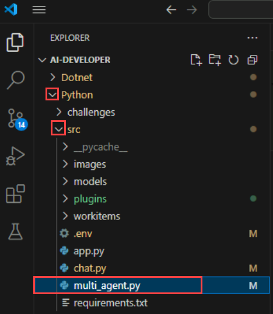

# Exercise 8: Multi-Agent Systems

### Estimated Duration: 30 Minutes

This hands-on lab introduces **multi-agent system development**, where a user request is processed by multiple agents, each with a distinct **persona and responsibility**. Designed for those new to **AI-driven automation**, the lab guides you through integrating agents that collaborate to generate a well-rounded response. Whether handling specialized tasks or combining expertise, this system ensures comprehensive context-aware outputs. By the end of this lab, you will understand how to **orchestrate multi-agent interactions** to enhance AI-driven decision-making and user experiences.

## Objectives
In this exercise, you will be performing the following tasks:
- Task 1: Create a Multi-agent chat system

## Task 1: Create a Multi-agent chat system

In this task, you will explore different flow types in Azure AI Foundry by creating a Multi-Agent Chat System to enable collaborative AI interactions.

<details>
<summary><strong>Python</strong></summary>

1. Navigate to `Python>src` directory and open **multi_agent.py** file.

    

1. Remove the existing code and add the code from the following URL in the file.

    - Open the provided link in your browser, press Ctrl + A to select all the content, then copy and paste it into Visual Studio Code

        ```
        https://raw.githubusercontent.com/CloudLabsAI-Azure/ai-developer/refs/heads/prod/CodeBase/python/lab-08.py
        ```
1. Save the file.
1. Right click on `Python>src` **(1)** in the left pane and select **Open in Integrated Terminal (2)**.

    
1. Use the following command to run the app:
    ```
    streamlit run app.py
    ```
1. If the app does not open automatically in the browser, you can access it using the following **URL**:
    ```
    http://localhost:8501
    ```
1. Select **Multi-Agent (1)** on the left-hand side pane.

    
1. Submit the following prompt and see how the AI responds:
    ```
    Build a Calculator app.
    ```
1. You will receive a response similar to the one shown below:

    
</details>

<details>
<summary><strong>C Sharp(C#)</strong></summary>

1. Navigate to `Dotnet>src>BlazorAI>Components>Pages` directory and open **MultiAgent.razor.cs (1)** file.

    

1. Remove the existing code and add the code from the following URL in the file.

    - Open the provided link in your browser, press Ctrl + A to select all the content, then copy and paste it into Visual Studio Code

        ```
        https://raw.githubusercontent.com/CloudLabsAI-Azure/ai-developer/refs/heads/prod/CodeBase/c%23/lab-08.cs
        ```
1. Save the file.
1. Right click on `Dotnet>src>Aspire>Aspire.AppHost` **(1)** in the left pane and select **Open in Integrated Terminal (2)**.

    
1. Use the following command to run the app:
    ```
    dotnet run
    ```
1. Open a new tab in the browser and navigate to the link for **blazor-aichat**, i.e. **https://localhost:7118/**.

    >**Note**: If you receive security warnings in the browser, close the browser and follow the link again.
1. Select **Multi-Agent (1)** on the left-hand side pane.

    
1. Submit the following prompt and see how the AI responds:
    ```
    Build a Calculator app.
    ```
1. You will receive a response similar to the one shown below:

    
</details>

## Review

In this exercise, we integrated a **multi-agent system** into an AI application to process user requests through multiple specialized agents. We explored how each agent, with its own **persona and responsibility**, contributed expertise to generate a comprehensive response. This enhanced our proficiency in **orchestrating multi-agent interactions** to create intelligent, context-aware AI solutions.

 You have successfully completed the below tasks for **multi-agent system development**:  

- Designed a **multi-agent system** to process user requests through specialized agents.  
- Assigned **distinct personas and responsibilities** to each agent for task-specific expertise.  
- Integrated **agent's responses** into a unified, context-aware output.  
- Explored **AI-driven decision-making** by coordinating multiple agents efficiently.

## Congratulations, you have successfully finished the lab!
