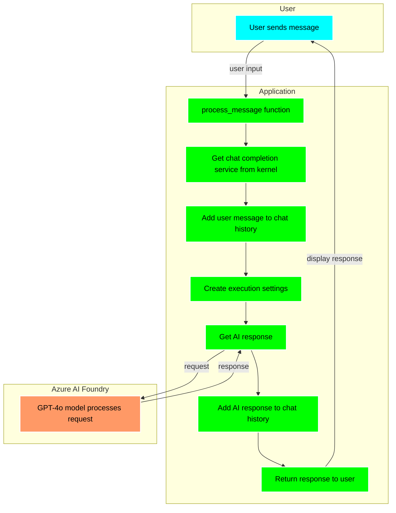

### [< Previous Challenge](./Challenge-01.md) - [**Home**](../README.md) - [Next Challenge >](./Challenge-03.md)

# Challenge-02 - Semantic Kernel Fundamentals

## Introduction

The first step in understanding Semantic Kernel is to become familiar with the basics. Semantic Kernel is a lightweight, open-source development kit designed to help developers build AI-infused applications using the latest AI models. It supports languages like C#, Python, and Java, making it versatile for various development environments. Semantic Kernel provides a simple and consistent API for developers to interact with several different AI models, including GPT-3.5, GPT-4, Meta-Llama, DALL·E, and many more. You can use Semantic Kernel to build applications that can generate text, images, sound, and even code. Models can be hosted locally or in the cloud, and you can use the same API to interact with them.

## Description

In this challenge, you will be working with a starter application that requires you to complete the implementation of the chat feature using Semantic Kernel and the Azure AI Foundry GPT-4o model. The application has the basic structure set up, and you'll need to implement key parts of the chat functionality to allow users to interact with the AI model.

## Prerequisites

1. Complete the [Getting Familiar With the Reference Application](../challenges/Resources/Supporting%20Challenges/Challenge-02-Reference-App.md) beginner guide.

## Challenges

### Implementation Steps

> [!IMPORTANT]
> **Install Python Dependencies First!**
> 
> Before you can run the application, you **must** install the required Python packages. The application will not work without these dependencies.
>
> It is **highly recommended** that you create a Python virtual environment for your packages.
>
> **Creating your Python virtual environment**
> 1. Open your terminal or command prompt
> 2. Navigate to the `src` directory in your terminal/command prompt
> 3. Run the following command to create the virtual environment: `python -m venv <virtual environment name>`
> 4. Then activate the virtual environment: `.\<name of your virtual environment>\Scripts\activate`
> 5. Proceed with installing your requirements
> 6. To deactivate your virtual environment: `.\<name of your virtual environment>\Scripts\deactivate`
>
> **Using VS Code (Recommended):**
> 1. Open the integrated terminal in VS Code (`Terminal` → `New Terminal` or `` Ctrl+` ``)
> 2. Make sure you're in the `src` directory: `cd src`
> 3. Install the requirements: `pip install -r requirements.txt`
>
> **Using Command Line:**
> 1. Navigate to the `src` directory in your terminal/command prompt
> 2. Run: `pip install -r requirements.txt`
>
> **Troubleshooting:**
> - If you see permission errors, you may need to activate your virtual environment first
> - On Windows, you might need to use `python -m pip install -r requirements.txt`
> - The installation may take a few minutes as it downloads Semantic Kernel and other dependencies

1. Deploy a GTP-4o model using [Azure AI Foundry](https://ai.azure.com) `https://ai.azure.com`. The **Deployment name** should be something similar to ``` gpt-4o ```. This name will be needed next when configuring Semantic Kernel. :exclamation: Deployment type should be **Standard**. :exclamation:

2. Create a new `.env` file in the `src` directory with the Azure AI Foundry configuration values:

    ```
    AZURE_OPENAI_CHAT_DEPLOYMENT_NAME="your-deployment-name"
    AZURE_OPENAI_ENDPOINT="your-endpoint-url"
    AZURE_OPENAI_API_KEY="your-api-key"
    AZURE_OPENAI_API_VERSION="your-api-version"
    ```

    > **Note:** For the endpoint URL, only include up to the `.com` part as the SDK will build the full URL.
    
    > **Important:** According to the [Semantic Kernel documentation](https://github.com/microsoft/semantic-kernel/blob/main/python/samples/concepts/setup/ALL_SETTINGS.md), these environment variables are specifically required for the AzureChatCompletion service. Semantic Kernel will automatically look for these variables when initializing the service. As you work through subsequent challenges, you'll add more environment variables to this same `.env` file to support additional AI services.

3. In the `chat.py` file, locate the `initialize_kernel()` function and implement the code to create and add the Azure AI Foundry Chat Completion service to the kernel:

    * Find the comment: `#Challenge 02 - Chat Completion Service`
    * Create a chat completion service that uses the environment variables from your `.env` file
    * Add the service to the kernel

    :bulb: Review the [Semantic Kernel documentation on chat completion services](https://learn.microsoft.com/en-us/semantic-kernel/concepts/ai-services/chat-completion/?tabs=csharp-AzureOpenAI%2Cpython-AzureOpenAI%2Cjava-AzureOpenAI&pivots=programming-language-python#creating-a-chat-completion-service) to understand how to properly initialize the service.

### Implement Chat

1. In the `process_message()` function, find the comment `# Start Challenge 02 - Sending a message to the chat completion service by invoking kernel` and implement the following steps:

    * Retrieve the chat completion service from the kernel
    * Use the global chat history variable rather than creating a new one
    * Add the user's message to the chat history
    * Create appropriate execution settings for the chat request
    * Call the chat completion service with the chat history
    * Add the AI's response to the chat history
    * Return the AI response

    :bulb: The [Chat Completion documentation](https://learn.microsoft.com/en-us/semantic-kernel/concepts/ai-services/chat-completion/?tabs=python-AzureOpenAI%2Cpython-AzureOpenAI%2Cjava-AzureOpenAI&pivots=programming-language-python#using-chat-completion-services) provides examples of how to properly call the service.

    :bulb: Review the [Chat History documentation](https://learn.microsoft.com/en-us/semantic-kernel/concepts/ai-services/chat-completion/chat-history?pivots=programming-language-python#creating-a-chat-history-object) to understand how to properly manage the conversation context.

### Testing

1. **Start the application** using the recommended VS Code launch profile "Python: Streamlit App" (as covered in the [reference application guide](../challenges/Resources/Supporting%20Challenges/Challenge-02-Reference-App.md#getting-started-with-vs-code-launch-profiles)), then test the chat completion by submitting the prompt:

    ```text
    Why is the sky blue?
    ```

    The response should be similar to the following:

    

2. Test the Chat History by submitting the following prompt without refreshing the browser window:

    ```text
    Why is it red?
    ```

    If the chat history is working correctly, the AI will understand the context from the previous question and provide a relevant response about why the sky appears red at certain times.

3. Test the application with a variety of prompts to ensure it responds appropriately.

## Understanding Semantic Kernel Chat Flow

The diagram below illustrates the basic flow of the chat completion process using Semantic Kernel:



This diagram shows how a user's message travels through your application, gets processed by the Azure AI Foundry service via Semantic Kernel, and how the response is returned to the user. The key components are:

1. Your application receives user input
2. The Semantic Kernel retrieves the appropriate service
3. Chat history maintains context between interactions
4. The Azure AI Foundry GPT-4o model processes the request
5. The response is added to chat history and returned to the user

## Success Criteria

- **Setup & Configuration**
  - [ ] **Installed Python dependencies** using `pip install -r requirements.txt`
  - [ ] Deployed GPT model in Azure AI Foundry
  - [ ] Created a new `.env` file with deployment name, endpoint URL, and API key
- Kernel Setup
  - [ ] Implemented the chat completion service in `initialize_kernel()`
  - [ ] Added the service to the kernel instance
- Message Handling
  - [ ] Used the global chat history variable correctly
  - [ ] Implemented adding user messages to chat history
  - [ ] Successfully calling chat completion service
  - [ ] Added AI responses to chat history
- Testing
  - [ ] "Why is the sky blue?" returns a coherent response
  - [ ] "Why is it red?" demonstrates chat history is working
  - [ ] AI responds appropriately to various prompts

## Learning Resources

[Understanding the kernel](https://learn.microsoft.com/en-us/semantic-kernel/concepts/kernel?pivots=programming-language-python)

[Chat completion](https://learn.microsoft.com/en-us/semantic-kernel/concepts/ai-services/chat-completion/?tabs=python-AzureOpenAI%2Cpython-AzureOpenAI%2Cjava-AzureOpenAI&pivots=programming-language-python)

[Chat history](https://learn.microsoft.com/en-us/semantic-kernel/concepts/ai-services/chat-completion/chat-history?pivots=programming-language-python)

[What is a Planner?](https://learn.microsoft.com/en-us/semantic-kernel/concepts/planning?pivots=programming-language-python)

[Semantic Kernel Environment Variables Reference](https://github.com/microsoft/semantic-kernel/blob/main/python/samples/concepts/setup/ALL_SETTINGS.md)

### [< Previous Challenge](./Challenge-01.md) - **[Home](../README.md)** - [Next Challenge >](./Challenge-03.md)
