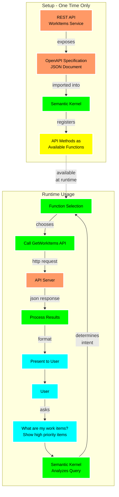

### [< Previous Challenge](./Challenge-03.md) - **[Home](../README.md)** - [Next Challenge >](./Challenge-05.md)

# Challenge 04 -  Import Plugin using OpenAPI

## Introduction

OpenAPI is a widely adopted standard for describing RESTful APIs in a way that is both human-readable and machine-friendly. It streamlines API integration by providing automatic documentation, client SDK generation, and reduced manual coding efforts. By leveraging OpenAPI specifications, Semantic Kernel can dynamically load external services as plugins, letting your AI-driven apps discover, invoke, and orchestrate these APIs more effectively.

As developers, we can enrich our applications by integrating various APIs through OpenAPI specifications. In this challenge, you will learn how to import the provided **WorkItems API** as an OpenAPI plugin in Semantic Kernel and interact with it through AI-driven prompts.

>NOTE: You have an existing OpenAPI spec for the WorkItems API. Make sure to locate it and use it when configuring your Semantic Kernel plugin.

### Description

This challenge will introduce you to how to import OpenAPI API as Semantic Kernels Plugins in Python, and how to chain plugins using the Auto Function Calling capabilities of Semantic Kernel.

1. Launch your AI Chat app, and ask the bot `What are my work items?`
    - Test the prompt "What are my work items?" see how it responds.
1. You will be adding a new plugin to your Semantic Kernel using the API provided in the workshop. The WorkItems API is part of the codebase in the `src/workitems` folder.
    - Option 1: Start both services using the VS Code launch profile
      - Open the Run and Debug panel in VS Code (Ctrl+Shift+D)
        - >NOTE: Make sure you are in the `python` directory, otherwise the launch profiles will not appear. 
      - Select "Challenge 4: Run WorkItems API and App" from the dropdown
      - Click the green play button or press F5 to start both services in the correct order
    - Option 2: Start the uvicorn app manually
      - Go to `src/workitems` folder
      - Run `python api.py` on command prompt
      - Find the OpenAPI spec in following path `http://127.0.0.1:8000/openapi.json`
      - Swagger page can be found in `http://127.0.0.1:8000/docs`
    - Import the API into Semantic Kernel.

        :bulb: [Adding the OpenAPI plugin](https://learn.microsoft.com/en-us/semantic-kernel/concepts/plugins/adding-openapi-plugins?pivots=programming-language-python#adding-the-openapi-plugin)

        :exclamation: Semantic Kernel SDK for OpenAPI's - your plugin name must be 64 characters or less.

    - Test the prompt "What are my work items?" see how it responds.
1. _(Optional)_ Do you have another API you would like to integrate with? Try importing it as a plugin.

## Understanding OpenAPI Plugin Integration

The following diagram illustrates how Semantic Kernel integrates and uses an external API through its OpenAPI specification:

This diagram shows how Semantic Kernel works with OpenAPI:

**Top Section: One-Time Setup**
- Your REST API exposes an OpenAPI specification (JSON document)
- This specification is imported into Semantic Kernel
- Semantic Kernel registers all API methods as available functions

**Bottom Section: Runtime Usage**
- When a user asks a question like "What are my work items?"
- Semantic Kernel analyzes the query to determine user intent
- Based on the intent, it selects the appropriate function (e.g., GetWorkItems)
- It makes the API call with appropriate parameters
- When it receives the response, it processes and formats the data
- The information is presented to the user in a natural language format

The dashed line shows how the functions registered during setup become available at runtime for the function selection process. This enables the AI to automatically call the right API endpoints without any additional code.

## Success Criteria

1. Your chat bot should be able to answer the question "What are my work items?" with a list of work items from the API.
1. You can ask the bot to filter, sort, group, or change the display format of the work items.
1. _(Optional)_ Test other CRUD operations on the WorkItems API and try chaining multiple operations together.

## Additional Learning Resources

[Add Logic Apps as plugins](https://learn.microsoft.com/en-us/semantic-kernel/concepts/plugins/adding-logic-apps-as-plugins)

[OpenApiFunctionExecutionParameters](https://learn.microsoft.com/en-us/python/api/semantic-kernel/semantic_kernel.connectors.openapi_plugin.openapi_function_execution_parameters.openapifunctionexecutionparameters?view=semantic-kernel-python)

### [< Previous Challenge](./Challenge-03.md) - **[Home](../README.md)** - [Next Challenge >](./Challenge-05.md)