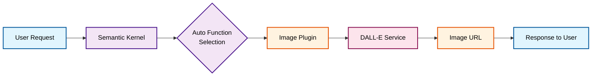
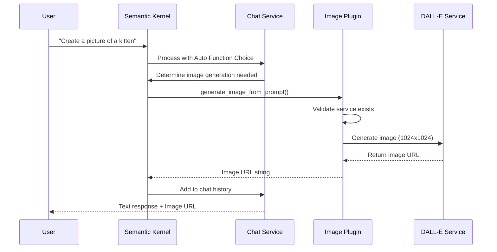
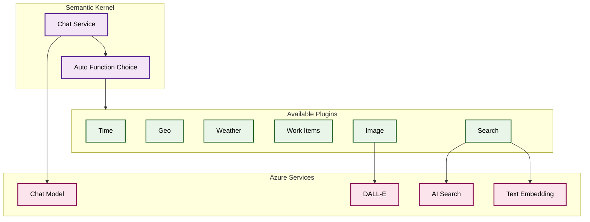
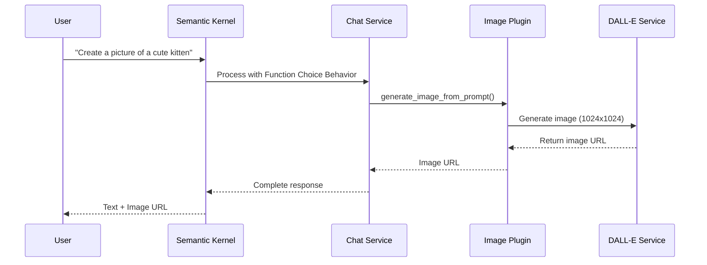

### [< Previous Challenge](./Challenge-06.md) - **[Home](./README.md)** - [Next Challenge >](./Challenge-08.md)

---

# Challenge 07 - Image Generation using DALL-E

## Introduction

Now it's time to introduce Image generation to the reference application using DALL-E. DALL-E is an artificial intelligence (AI) model that generates images from textual descriptions. DALL-E can create images of objects, scenes, and even abstract concepts based on the descriptive text provided to it. This capability allows for a wide range of creative possibilities, from illustrating ideas to creating entirely new visual concepts that might not exist in the real world. 

## Description

In this challenge, you will deploy an Azure AI Foundry service capable of hosting DALL-E models and integrate it with the Semantic Kernel. You will also create a plugin to generate images using DALL-E from a text prompt.

### Challenges

1. Create an Azure AI Foundry Deployment for DALL-E in a region capable of hosting DALL-E models.

   ### Environment Setup

   Now that you've deployed the DALL-E model, update the `.env` file you created in Challenge-02:

   ```
   # Add this to your existing .env file for the DALL-E model
   AZURE_OPENAI_TEXT_TO_IMAGE_DEPLOYMENT_NAME="your-dalle-deployment-name"
   ```

   > **Note:** According to the [Semantic Kernel documentation](https://github.com/microsoft/semantic-kernel/blob/main/python/samples/concepts/setup/ALL_SETTINGS.md), when using Azure AI Foundry's DALL-E model, you can use the same API key and endpoint you've already configured, but you'll need to specify the deployment name for the text-to-image model.

1. Update the reference application by adding the DALL-E model to Semantic Kernel

    >NOTE: We are using Azure Open AI so the service name is [AzureTextToImage](https://learn.microsoft.com/en-us/python/api/semantic-kernel/semantic_kernel.connectors.ai.open_ai.azuretexttoimage?view=semantic-kernel-python) and the base class is [OpenAITextToImageBase](https://learn.microsoft.com/en-us/python/api/semantic-kernel/semantic_kernel.connectors.ai.open_ai.services.open_ai_text_to_image_base.openaitexttoimagebase?view=semantic-kernel-python#methods) any examples that use OpenAITextToImage also works with AzureTextToImage
    >
    > The Semantic Kernel Documentation [In-Depth Samples](https://learn.microsoft.com/en-us/semantic-kernel/get-started/detailed-samples?pivots=programming-language-python) provides examples of using Text-to-Image models like DALL-E. Be sure to modify the sample to use an **Azure AI Foundry** model instead of an **OpenAI**.

1. Create a Semantic Kernel plugin to generate an image
    using DALL-E from a text prompt. The plugin should accept a text prompt and return the URL string for the image generated by DALL-E.

    >NOTE: We are using Azure Open AI so the service name is [AzureTextToImage](https://learn.microsoft.com/en-us/python/api/semantic-kernel/semantic_kernel.connectors.ai.open_ai.azuretexttoimage?view=semantic-kernel-python) and the base class is [OpenAITextToImageBase](https://learn.microsoft.com/en-us/python/api/semantic-kernel/semantic_kernel.connectors.ai.open_ai.services.open_ai_text_to_image_base.openaitexttoimagebase?view=semantic-kernel-python#methods)

1. A simple prompt to test the plugin

    ```text
    create a picture of a cute kitten wearing a hat
    ```

1. Working with chat history to generate images

    :exclamation: ***Refresh** browser to clear chat history before entering the next prompt*

    >NOTE: Feel free to change the details of the story to make it your own.

    ```text
    Generate a detailed children's story about a dragon and a little girl that go on an adventure together
    ```

    :x: Without clearing the chat history, create an image from a scene in the story.  

    ```text
    randomly choose a major scene from the story and create a cartoon style image
    ```

    :bulb: Set a breakpoint in the image plugin to view the generated prompt sent to the DALL-E model. Notice how the LLM summarized a scene from the story to generate a prompt for the text-to-image model.

    :exclamation:***Refresh** browser to clear chat history before entering the next set of prompts*

1. Write a prompt to call multiple plugins.

    Create a prompt that calls the image plugin and at least one other plugin written in the previous challenges. Try to use as many plugins as you can in a single prompt.

1. Finally, Let's do some product design.

    >NOTE: Feel free to change the details of the product

    In this final task, have the AI generate a product name, description and an image for a handheld teleporting device **using a single prompt**. This will require the AI to construct a multi-step plan that will:

    ```markdown
    1. Generate a product name 
    2. Generate a product description
    3. Create a prompt from the name and description suitable for a text-to-image AI model
    4. Call the image plugin with the generated prompt
    5. Generate a prompt that will create a logo for the product
    6. Call the image plugin again with the Logo prompt
    ```

    :bulb: Set a breakpoint in the image plugin to view the generated prompt sent to the DALL-E model. Notice how the LLM summarized the product name and description to generate a prompt for the text-to-image model.

## Understanding Text-to-Image Generation with Semantic Kernel

### High-Level Process Flow

Here's a simplified view of how image generation works in your Semantic Kernel application:



### Detailed Interaction Sequence

For a clearer understanding of the step-by-step process:



### Plugin Architecture Overview

Your implementation showcases the modular plugin system:



### Key Implementation Details

Your implementation demonstrates several important patterns:

#### 1. **Service Integration & Validation**
```python
# Your ImagePlugin constructor ensures the service is available
if not kernel.get_service(type=AzureTextToImage):
    raise Exception("Missing text-to-image service")
self.dalle3 = kernel.get_service(type=AzureTextToImage)
```

#### 2. **Automatic Function Discovery**
The `FunctionChoiceBehavior.Auto()` setting in your chat completion allows the AI to automatically:
- Analyze user requests
- Determine when image generation is needed
- Call the appropriate plugin function
- Orchestrate multi-step workflows

#### 3. **Plugin Architecture Benefits**
Your current setup provides:
- **Modularity**: Each plugin (Time, Geo, Weather, Image, etc.) operates independently
- **Composability**: Multiple plugins can be called in a single conversation turn
- **Extensibility**: New plugins can be added without modifying existing code
- **Service Abstraction**: Plugins interact with Azure services through Semantic Kernel's service layer

#### 4. **Multi-Modal Conversation Flow**


#### 5. **Complex Workflow Handling**
When you request a product concept with both description and images, your implementation:

1. **Text Generation Phase**: Uses the chat completion service to generate product name and description
2. **Prompt Optimization**: The AI automatically creates DALL-E-optimized prompts from the product details
3. **Image Generation**: Calls your Image Plugin multiple times (product image + logo)
4. **Response Integration**: Combines all outputs into a cohesive response

#### 6. **Chat History Integration**
Your `chat_history.add_message(result)` approach ensures:
- Context is maintained across turns
- Previous images can be referenced
- Follow-up image requests can build on prior conversation

This architecture showcases how Semantic Kernel's plugin system enables sophisticated AI workflows where language understanding, planning, and multi-modal generation work together seamlessly.

## Success Criteria

1. Verify that your Image plugin can generate images from simple text prompts.
1. Verify that your Image plugin can work with chat history to generate relevant images.
1. Verify that your Image plugin can be called from a prompt that also calls other plugins.

## Learning Resources

[Create and deploy an Azure AI Foundry Service resource](https://learn.microsoft.com/en-us/azure/ai-services/openai/how-to/create-resource?pivots=web-portal
)

[Semantic Kernel Samples](https://learn.microsoft.com/en-us/semantic-kernel/get-started/detailed-samples?pivots=programming-language-python)

[Add native code as a plugin to Semantic Kernel](https://learn.microsoft.com/en-us/semantic-kernel/concepts/plugins/adding-native-plugins?pivots=programming-language-python)

### [< Previous Challenge](./Challenge-06.md) - **[Home](./README.md)** - [Next Challenge >](./Challenge-08.md)
