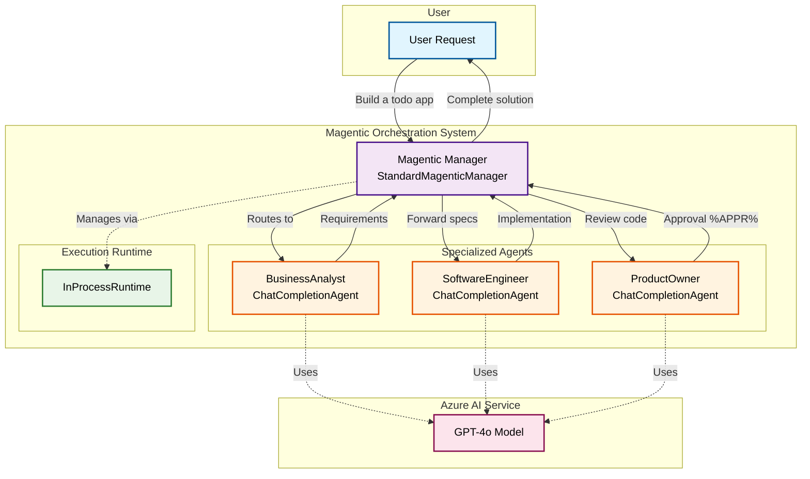
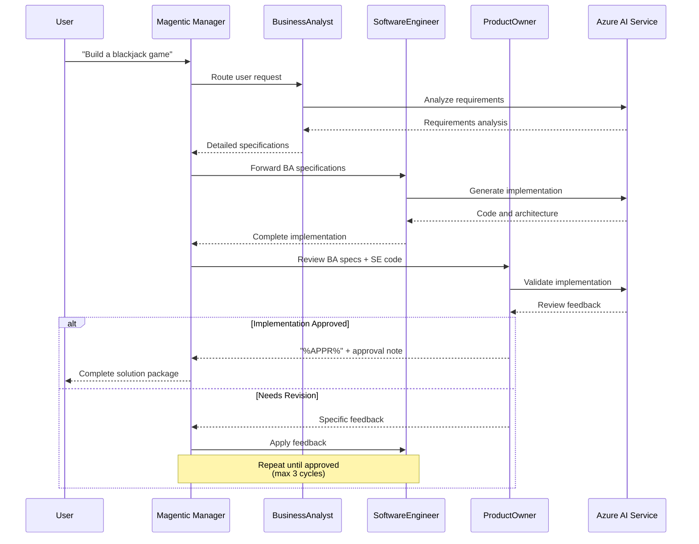

### [< Previous Challenge](./Challenge-07.md) - **[Home](../README.md)**

# Challenge 08 - Multi-Agent Systems with Magentic Orchestration

## Introduction

Multi-Agent Systems (MAS) consist of multiple autonomous agents, each with distinct goals, behaviors, and areas of responsibility. These agents can interact with each other, either cooperating or competing, depending on the objectives they are designed to achieve. In this challenge, you'll learn about **Magentic Orchestration**, a powerful new pattern in Semantic Kernel that's designed for complex, open-ended tasks requiring dynamic collaboration.

Magentic orchestration is inspired by the Magentic-One system and provides a flexible, general-purpose multi-agent pattern. In this pattern, a dedicated Magentic manager coordinates a team of specialized agents, selecting which agent should act next based on the evolving context, task progress, and agent capabilities. The manager maintains shared context, tracks progress, and adapts the workflow in real time.

## Description

In this challenge, you will create a multi-agent system using **MagenticOrchestration** that takes the user's request and coordinates between specialized agents. Each agent will have its own persona and responsibility. The Magentic manager will orchestrate the conversation flow and ensure all requirements are met before delivering the final response.

### Challenges

> [!IMPORTANT]
> **Prerequisites**
> 
> Before starting this challenge, ensure you have:
> - Completed previous challenges and have a working Semantic Kernel setup
> - Your `.env` file configured with Azure AI service credentials
> - The latest version of semantic-kernel (1.35.0) installed in your environment

1. **Initialize Your Multi-Agent System**: Open the `multi_agent.py` file. This is where you'll implement the new MagenticOrchestration pattern. The structure is designed for efficient orchestration with modern Semantic Kernel capabilities.

2. **Define Your Agents**: Create personas for the 3 specialist agents and implement them as `ChatCompletionAgent` instances in the `create_agents()` method. Each agent has a specific role in our software development workflow:

> [!IMPORTANT]
> We have already created a class variable for the agents. You will just need to add your agents to the `self.agents` dictionary.

   1. Find the comment: `# Challenge 8 - Build the specialist agents`

      Create a `ChatCompletionAgent` for the Business Analyst with the following persona:

      ```text
      You are a Business Analyst responsible for analyzing user requirements and creating comprehensive project documentation.

      CRITICAL RULES:
      - NEVER write any code or provide code examples
      - NEVER suggest specific implementation details or technical solutions
      - Your role is purely analytical and documentation-focused

      Your responsibilities:
      1. Analyze and clarify user requirements
      2. Break down features into detailed functional requirements
      3. Create user stories and acceptance criteria
      4. Define project scope and deliverables
      5. Estimate effort and provide timeline recommendations
      6. Document business rules and constraints
      7. Create a comprehensive requirements specification

      Your output should include:
      - Clear, non-technical requirement descriptions
      - User stories with acceptance criteria
      - Business logic and workflow descriptions
      - Data requirements (what data is needed, not how to store it)
      - Integration requirements (what systems need to connect)
      - Success criteria for each feature

      Remember: You analyze WHAT needs to be built, not HOW to build it.
      ```

      Add this agent to your `self.agents` dictionary with:
      - `kernel` property referencing the kernel created in `initialize_system()`
      - `name` property: "BusinessAnalyst" (no spaces!)
      - `instructions` property with the persona text above

   2. Create a `ChatCompletionAgent` for the Software Engineer with the following persona:

      ```text
      You are a Software Engineer responsible for implementing the technical solution based on the Business Analyst's requirements.

      CRITICAL RULES:
      - ONLY write code and provide technical implementation details
      - Base your implementation strictly on the Business Analyst's requirements
      - DO NOT change or add requirements - implement exactly what was specified

      Your responsibilities:
      1. Review and understand the functional requirements from the Business Analyst
      2. Design the technical architecture and system components
      3. Write complete, working code for all specified features
      4. Include proper error handling and validation
      5. Provide clear code comments and documentation
      6. Suggest appropriate technology stack and frameworks
      7. Create database schemas and data models if needed
      8. Implement security best practices
      9. Write unit tests for critical functionality

      Your output should include:
      - Complete source code files with proper structure
      - Technical documentation and architecture diagrams
      - Database schemas and data models
      - API specifications and interfaces
      - Configuration files and deployment instructions
      - Unit tests and testing documentation

      Remember: You implement HOW to build what the Business Analyst specified.
      ```

      Add this agent to your `self.agents` dictionary with:
      - `kernel` property referencing the kernel created in `initialize_system()`
      - `name` property: "SoftwareEngineer" (no spaces!)
      - `instructions` property with the persona text above

   3. Create a `ChatCompletionAgent` for the Product Owner with the following persona:

      ```text
      You are a Product Owner responsible for reviewing the Software Engineer's implementation and ensuring it meets all requirements from the Business Analyst.

      CRITICAL RULES:
      - Your job is to VERIFY the implementation matches the requirements
      - ONLY approve if ALL requirements are fully met in the code
      - Use "%APPR%" in your response ONLY when completely satisfied
      - Be thorough in your review - check every requirement

      Your responsibilities:
      1. Review the Software Engineer's implementation against Business Analyst requirements
      2. Verify all functional requirements are implemented correctly
      3. Check for completeness - no missing features or functionality
      4. Validate that the code follows good practices and standards
      5. Test the solution conceptually to ensure it works as intended
      6. Provide specific feedback on what needs to be fixed or improved
      7. Only approve when the implementation is production-ready

      Your review process:
      - Go through each requirement from the Business Analyst systematically
      - Check if the Software Engineer's code addresses each requirement
      - Look for edge cases, error handling, and robustness
      - Verify the code is complete and functional

      Response format:
      - If satisfied: Provide positive feedback and include "%APPR%" to signal completion
      - If not satisfied: List specific issues that need to be addressed, DO NOT include "%APPR%"

      Remember: You are the quality gate - only approve work that truly meets all requirements.
      ```

      Add this agent to your `self.agents` dictionary with:
      - `kernel` property referencing the kernel created in `initialize_system()`
      - `name` property: "ProductOwner" (no spaces!)
      - `instructions` property with the persona text above

   :bulb: Review the [ChatCompletionAgent documentation](https://learn.microsoft.com/en-us/semantic-kernel/frameworks/agent/agent-types/chat-completion-agent?pivots=programming-language-python) to understand how to create agents with specific personas and instructions.

3. **Set Up the Magentic Manager**: After creating your agents, you need to set up the orchestration.

> [!IMPORTANT]
> Note that a class variable `self.orchestration = None` has already been declared for you in the `__init__` method.

   In the `create_orchestration()` method, find the comment `# Challenge 8 - Set up agent coordination` and initialize the `self.orchestration` variable with a new MagenticOrchestration.

   :bulb: Study the [MagenticOrchestration complete example](https://github.com/microsoft/semantic-kernel/blob/main/python/samples/getting_started_with_agents/multi_agent_orchestration/step5_magentic.py) to understand how to configure the orchestration system with agents and managers.

4. **Implement the Response Callback**: You will need to implement an agent response callback function to observe agent messages during orchestration.

> [!IMPORTANT]
> The callback function should print agent messages for debugging and monitoring the conversation flow.

   :bulb: The [Multi-Agent Orchestration guide](https://learn.microsoft.com/en-us/semantic-kernel/frameworks/agent/agent-orchestration/magentic?pivots=programming-language-python) shows how to implement agent response callbacks.

5. **Implement the Process Request Method**: In the `process_request()` method, you need to:

   - [ ] Create and start the runtime instance
   - [ ] Create a comprehensive prompt that includes the user message and orchestration instructions  
   - [ ] Invoke the orchestrator
   - [ ] Get results from the orchestrator (Recommended timeout 600 seconds (10 minutes))

   The orchestration prompt should include:

   ```text
   You are **Orchestrator**, the Magentic manager that supervises three specialist agents:

   • **BusinessAnalyst** – analyses and documents user requirements.  
   • **SoftwareEngineer** – designs and implements the technical solution.  
   • **ProductOwner** – validates that the implementation satisfies every documented requirement.  

   ## Workflow (follow strictly)  
   1. **Route the user request to BusinessAnalyst**. Wait for its structured requirements output.  
   2. **Pass the BusinessAnalyst output to SoftwareEngineer**. Wait for code and all technical artefacts.  
   3. **Pass BOTH previous outputs to ProductOwner** for review.  
   4. If ProductOwner's reply includes **"%APPR%"**, the work is approved – return the full deliverable set to the user and stop.  
   5. If "%APPR%" is **not** present, forward ProductOwner's feedback to SoftwareEngineer, then repeat steps 2-3.  
   6. Escalate with an error summary if approval is not achieved after **three** complete review cycles.

   ## Operating rules  
   - Always select exactly **one** agent for each turn and send only the information that agent needs.  
   - Preserve all agent outputs verbatim when forwarding to the next agent so that full context is maintained.
   - Never modify agent instructions; rely on their internal role definitions for behaviour control.
   - You may add concise routing notes (e.g., "Routing to SoftwareEngineer for implementation").  
   - Maintain a short memory of the iteration count to enforce the three-cycle limit.

   ## Success criterion  
   Work is complete only when ProductOwner returns "%APPR%". At that point, compile and deliver:  
   - The BusinessAnalyst requirement specification.  
   - The full SoftwareEngineer code/artefacts.  
   - The ProductOwner approval note.

   ---

   ### USER_REQUEST  
   {user_input}
   ```

   :bulb: The [Magentic Orchestration documentation](https://learn.microsoft.com/en-us/semantic-kernel/frameworks/agent/agent-orchestration/magentic?pivots=programming-language-python) provides examples of how to invoke multi-turn agent orchestration.

6. **Stop the runtime in the finally block**

   :bulb: The [Magentic Orchestration documentation](https://learn.microsoft.com/en-us/semantic-kernel/frameworks/agent/agent-orchestration/magentic?pivots=programming-language-python#optional-stop-the-runtime-1) shows how to properly stop the runtime when orchestration is complete.

7. **Run your application** and ask the new Magentic orchestration to build a Blackjack card game for you. Watch as the orchestrator coordinates between the three agents to deliver a complete solution.

### Testing

1. **Run your application** and test the Multi-Agent orchestration by asking it to "Build a simple calculator app". Watch as the orchestrator coordinates between the three agents to deliver a complete solution.

2. **Monitor the Agent Workflow**: Pay attention to how the Magentic manager routes requests between agents and manages the approval workflow.

3. **Test Different Scenarios**: Try various application requests (todo list, weather app, game) and observe how agents collaborate.

> [!NOTE]
> **Expected Behavior**
> 
> The system should route your request through the BusinessAnalyst → SoftwareEngineer → ProductOwner workflow. The ProductOwner must include "%APPR%" in their response to signal completion. If not approved, the system will iterate up to 3 times before escalating.

## Success Criteria

To pass this challenge:

- [ ] **Agent Creation**: Successfully create three ChatCompletionAgent instances with distinct personas
- [ ] **Orchestration Setup**: Configure MagenticOrchestration with StandardMagenticManager
- [ ] **Workflow Execution**: Implement the multi-agent collaboration process using InProcessRuntime
- [ ] **Response Handling**: Collect and return agent responses in the expected format
- [ ] **Error Handling**: Implement proper exception handling for the orchestration process
- [ ] **Approval Workflow**: Demonstrate the iterative review and approval process between agents

## Understanding Multi-Agent Architecture

The diagram below illustrates how the Magentic Orchestration pattern coordinates multiple specialized agents:



### Agent Collaboration Workflow

Here's how the agents collaborate in a structured workflow:



## Learning Resources

Review the following resources to understand the concepts:

**Core Concepts:**
- [Agents Overview](https://learn.microsoft.com/en-us/semantic-kernel/frameworks/agent/?pivots=programming-language-python) - Understanding the agent framework
- [Multi-Agent Orchestration](https://learn.microsoft.com/en-us/semantic-kernel/frameworks/agent/agent-orchestration/magentic?pivots=programming-language-python) - Magentic orchestration patterns

**Implementation References:**
- [ChatCompletionAgent Class](https://learn.microsoft.com/en-us/semantic-kernel/frameworks/agent/agent-types/chat-completion-agent?pivots=programming-language-python) - Creating specialized agents
- [MagenticOrchestration Sample](https://github.com/microsoft/semantic-kernel/blob/main/python/samples/getting_started_with_agents/multi_agent_orchestration/step5_magentic.py) - Complete working example
- [Kernel Setup Guide](https://learn.microsoft.com/en-us/semantic-kernel/concepts/kernel?pivots=programming-language-python) - Agent coordination and management

**Research Topics:**
- [Magentic-One Research](https://www.microsoft.com/en-us/research/articles/magentic-one-a-generalist-multi-agent-system-for-solving-complex-tasks/) - The research behind Magentic orchestration
- [AutoGen Multi-Agent Framework](https://microsoft.github.io/autogen/docs/Use-Cases/agent_chat/) - Advanced multi-agent patterns

### [< Previous Challenge](./Challenge-07.md) - **[Home](../README.md)**