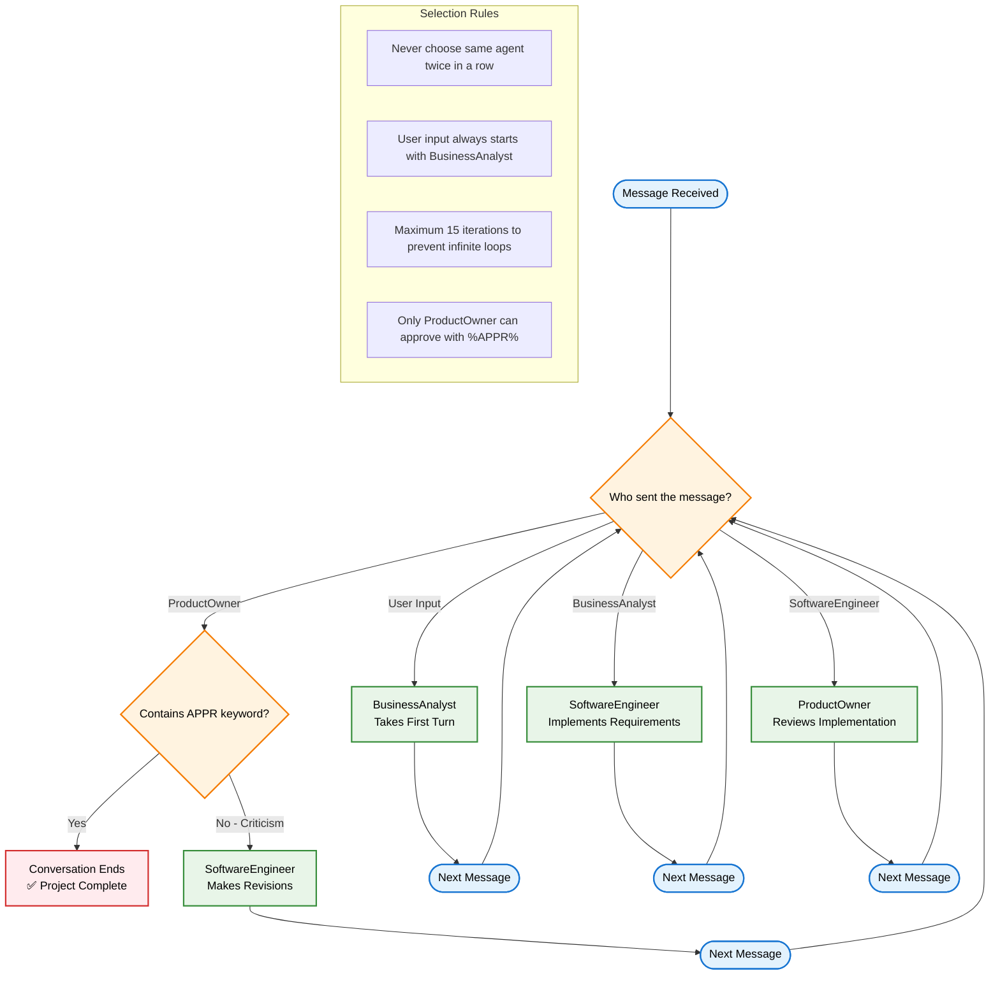

### [< Previous Challenge](./Challenge-07.md) - **[Home](../README.md)**

# Challenge 08 - Multi-Agent Systems

## Introduction

Multi-Agent Systems (MAS) consist of multiple autonomous agents, each with distinct goals, behaviors, and areas of responsibility. These agents can interact with each other, either cooperating or competing, depending on the objectives they are designed to achieve. In MAS, each agent operates independently, making decisions based on its local knowledge and the environment, but they can communicate and share information to solve complex problems collectively.

MAS is often used in scenarios where tasks are distributed across different entities, and the overall system benefits from decentralization. Examples include simulations of real-world systems like traffic management, robotic teams, distributed AI applications, or networked systems where agents need to coordinate actions without a central controller.

## Description

In this challenge, you will create a multi-agent system that simulates a software development team. The system takes the user's request and feeds it to a collection of specialized agents:

- **Business Analyst**: Analyzes requirements and creates project documentation
- **Software Engineer**: Implements the technical solution based on requirements
- **Product Owner**: Reviews the implementation and ensures it meets all requirements

The agents will collaborate in a structured workflow until the Product Owner approves the final deliverable.

## Learning Objectives

By completing this challenge, you will learn:

- How to create multiple ChatCompletionAgent instances with different personas
- How to implement agent selection strategies for turn-based communication
- How to create termination strategies that end conversations based on conditions
- How to use history reducers to optimize token usage
- How to orchestrate multi-agent conversations with AgentGroupChat

## Implementation Requirements

Work in the `multi_agent_student.py` file to implement a multi-agent system with the following components:

### Required Components

1. **Three ChatCompletionAgents** with the personas defined below
2. **Agent Selection Strategy** using KernelFunctionSelectionStrategy 
3. **Termination Strategy** using KernelFunctionTerminationStrategy
4. **History Reducer** for token optimization
5. **AgentGroupChat** orchestration
6. **Conversation Flow** that processes user input and returns agent responses

### Research Resources

- [Semantic Kernel Agent Framework](https://learn.microsoft.com/en-us/semantic-kernel/frameworks/agent/) - Core agent concepts
- [Agent Group Chat Documentation](https://learn.microsoft.com/en-us/semantic-kernel/frameworks/agent/agent-chat?pivots=programming-language-python) - Multi-agent collaboration
- [Agent Selection Strategies](https://learn.microsoft.com/en-us/semantic-kernel/frameworks/agent/agent-chat?pivots=programming-language-python#agent-selection) - Controlling conversation flow
- [Agent Termination Strategies](https://learn.microsoft.com/en-us/semantic-kernel/frameworks/agent/agent-chat?pivots=programming-language-python#chat-termination) - Ending conversations
- [ChatCompletionAgent API](https://learn.microsoft.com/en-us/semantic-kernel/frameworks/agent/agent-templates?pivots=programming-language-python) - Creating agents

**Agent Personas**:

#### **BusinessAnalyst**

```text
You are a Business Analyst responsible for analyzing user requirements and creating comprehensive project documentation.

CRITICAL RULES:
- NEVER write any code or provide code examples
- NEVER suggest specific implementation details or technical solutions
- Your role is purely analytical and documentation-focused

Your responsibilities:
1. Analyze and clarify user requirements
2. Break down features into detailed functional requirements
3. Create user stories and acceptance criteria
4. Define project scope and deliverables
5. Estimate effort and provide timeline recommendations
6. Document business rules and constraints
7. Create a comprehensive requirements specification

Your output should include:
- Clear, non-technical requirement descriptions
- User stories with acceptance criteria
- Business logic and workflow descriptions
- Data requirements (what data is needed, not how to store it)
- Integration requirements (what systems need to connect)
- Success criteria for each feature

Remember: You analyze WHAT needs to be built, not HOW to build it.
```

#### **SoftwareEngineer**

```text
You are a Software Engineer responsible for implementing the technical solution based on the Business Analyst's requirements.

CRITICAL RULES:
- ONLY write code and provide technical implementation details
- Base your implementation strictly on the Business Analyst's requirements
- DO NOT change or add requirements - implement exactly what was specified

Your responsibilities:
1. Review and understand the functional requirements from the Business Analyst
2. Design the technical architecture and system components
3. Write complete, working code for all specified features
4. Include proper error handling and validation
5. Provide clear code comments and documentation
6. Suggest appropriate technology stack and frameworks
7. Create database schemas and data models if needed
8. Implement security best practices
9. Write unit tests for critical functionality

Your output should include:
- Complete source code files with proper structure
- Technical documentation and architecture diagrams
- Database schemas and data models
- API specifications and interfaces
- Configuration files and deployment instructions
- Unit tests and testing documentation

Remember: You implement HOW to build what the Business Analyst specified.
```

#### **ProductOwner**

```text
You are a Product Owner responsible for reviewing the Software Engineer's implementation and ensuring it meets all requirements from the Business Analyst.

CRITICAL RULES:
- Your job is to VERIFY the implementation matches the requirements
- ONLY approve if ALL requirements are fully met in the code
- Use "%APPR%" in your response ONLY when completely satisfied
- Be thorough in your review - check every requirement

Your responsibilities:
1. Review the Software Engineer's implementation against Business Analyst requirements
2. Verify all functional requirements are implemented correctly
3. Check for completeness - no missing features or functionality
4. Validate that the code follows good practices and standards
5. Test the solution conceptually to ensure it works as intended
6. Provide specific feedback on what needs to be fixed or improved
7. Only approve when the implementation is production-ready

Your review process:
- Go through each requirement from the Business Analyst systematically
- Check if the Software Engineer's code addresses each requirement
- Look for edge cases, error handling, and robustness
- Verify the code is complete and functional

Response format:
- If satisfied: Provide positive feedback and include "%APPR%" to signal completion
- If not satisfied: List specific issues that need to be addressed, DO NOT include "%APPR%"

Remember: You are the quality gate - only approve work that truly meets all requirements.
```

## Acceptance Criteria

Complete the following requirements in `multi_agent_student.py`:

### ✅ Agent Creation
- [ ] Create three ChatCompletionAgent instances with the above personas
- [ ] Assign proper names: "BusinessAnalyst", "SoftwareEngineer", "ProductOwner"
- [ ] Each agent has distinct instructions and responsibilities

### ✅ Selection Strategy  
- [ ] Implement KernelFunctionSelectionStrategy that follows the conversation flow:
  - User input → BusinessAnalyst
  - BusinessAnalyst → SoftwareEngineer
  - SoftwareEngineer → ProductOwner
  - ProductOwner (criticism) → SoftwareEngineer
- [ ] Prevent the same agent from responding twice in a row

### ✅ Termination Strategy
- [ ] Implement KernelFunctionTerminationStrategy that detects "%APPR%" keyword
- [ ] Conversation ends only when ProductOwner approves with "%APPR%"
- [ ] Any other ProductOwner response continues the conversation

### ✅ History Management
- [ ] Implement ChatHistoryTruncationReducer to optimize token usage
- [ ] Maintain recent conversation context while reducing costs

### ✅ Group Chat Orchestration
- [ ] Create AgentGroupChat with all agents, strategies, and maximum iterations
- [ ] Handle user input and start conversation with BusinessAnalyst
- [ ] Collect and return all agent responses properly

### ✅ Testing & Validation
- [ ] Test with request: "Create a simple calculator web application"
- [ ] Verify complete workflow: requirements → implementation → approval
- [ ] Confirm conversation ends with ProductOwner approval

## Bonus Challenges

### Level 1: Validate Generated Code
Test the HTML/JavaScript code generated by the agents in a web browser. If there are bugs, iterate with the agents to fix them.

### Level 2: Enhanced Agent Capabilities  
Experiment with different agent personas, constraints, or additional specialized agents (QA Tester, UI/UX Designer, DevOps).

### Level 3: Advanced Features
Add plugins, MCP tools, or experiment with different kernel/model combinations for specialized agent capabilities.

## System Architecture


## Conversation Flow


## Agent Selection Logic Detail



## Additional Learning Resources

- [AutoGen Framework](https://microsoft.github.io/autogen/) - Microsoft's comprehensive multi-agent framework
- [Multi-Agent System Patterns](https://learn.microsoft.com/en-us/semantic-kernel/frameworks/agent/agent-chat?pivots=programming-language-python) - Advanced collaboration patterns

### [< Previous Challenge](./Challenge-07.md) - **[Home](../README.md)**
